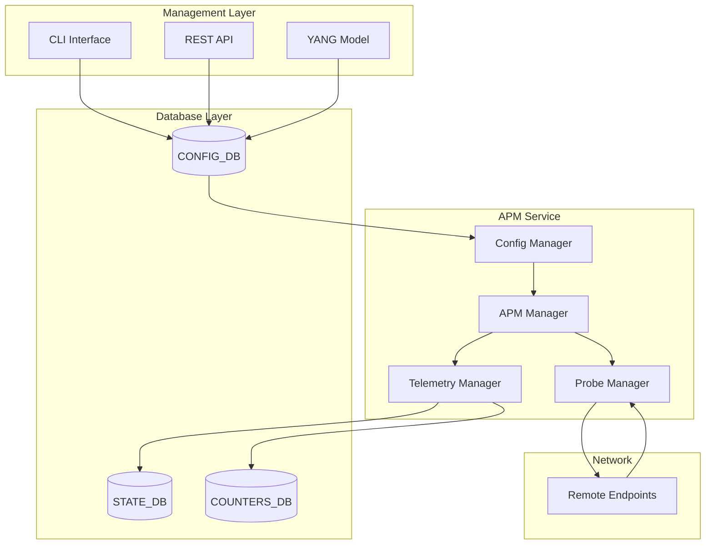
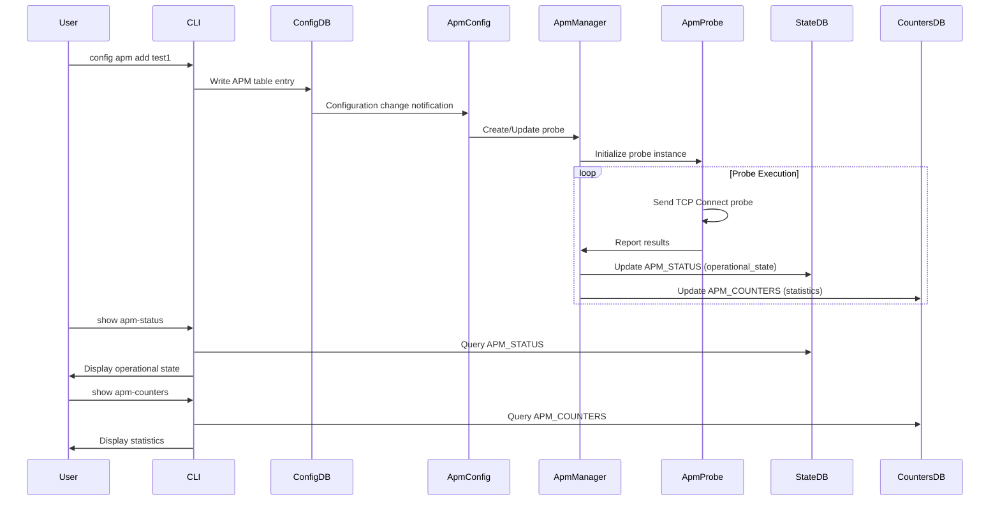

# SONiC High Level Design Document: APM (Active Performance Monitoring)

## Table of Contents

- [SONiC High Level Design Document: APM (Active Performance Monitoring)](#sonic-high-level-design-document-apm-active-performance-monitoring)
  - [Table of Contents](#table-of-contents)
  - [1. Introduction](#1-introduction)
  - [2. Revision History](#2-revision-history)
  - [3. Definitions/Abbreviations](#3-definitionsabbreviations)
  - [4. Overview](#4-overview)
  - [5. Requirements](#5-requirements)
  - [6. Use Cases](#6-use-cases)
  - [7. Architecture Design](#7-architecture-design)
    - [7.1. High-Level Overview](#71-high-level-overview)
    - [7.2. Key Components](#72-key-components)
    - [7.3. Data Flow](#73-data-flow)
      - [STATE\_DB Tables](#state_db-tables)
      - [COUNTERS\_DB Tables](#counters_db-tables)
    - [7.5. Implementation Details](#75-implementation-details)
      - [Core Components](#core-components)
      - [Database Integration](#database-integration)
      - [Threading Model](#threading-model)
  - [10. Configuration and Management](#10-configuration-and-management)
    - [10.1. YANG Model](#101-yang-model)
    - [10.2. Configuration Details](#102-configuration-details)
    - [10.3. CLI Commands](#103-cli-commands)
      - [Global Configuration Commands](#global-configuration-commands)
      - [Probe Configuration Commands](#probe-configuration-commands)
      - [Show Commands](#show-commands)
  - [11. SAI Requirements](#11-sai-requirements)
  - [12. Warmboot/Fastboot Impact](#12-warmbootfastboot-impact)
  - [13. Testing Requirements](#13-testing-requirements)
  - [14. Restrictions/Limitations](#14-restrictionslimitations)
  - [15. Open/Action Items](#15-openaction-items)
  - [16. References](#16-references)

## 1. Introduction

This document describes the High-Level Design (HLD) for Active Performance Monitoring (APM) feature in SONiC. APM provides real-time assessment of network performance characteristics such as latency, jitter, and packet loss through synthetic traffic generation and continuous monitoring.


## 2. Revision History

| Version | Date | Author | Description |
|---------|------|--------|-------------|
| 1.0 | Sep 8th 2025 | Ashutosh Agrawal | Initial version |
| 1.1 | Oct 16th 2025 | Ashutosh Agrawal | Updated to reflect 2-state model, corrected database table names, updated CLI commands |

## 3. Definitions/Abbreviations

| Term | Definition |
|------|------------|
| APM | Active Performance Monitoring |
| RTT | Round Trip Time |
| TWAMP | Two-Way Active Measurement Protocol |
| SLA | Service Level Agreement |

## 4. Overview

Active Performance Monitoring (APM) in SONiC is a proactive framework for monitoring network performance using synthetic probes. APM enables real-time measurement of critical metrics such as reachability, service availability, round-trip latency, jitter, and packet loss across network paths.

APM operates by periodically sending test packets (probes) between SONiC switches or between a switch and a remote endpoint (defined by an IP address and optional Layer 4 port). These probes simulate real network traffic, allowing operators to assess the health and performance of network links without relying solely on passive monitoring or waiting for user-reported issues.

Operators can configure APM to target specific paths, endpoints, or services, and set thresholds for acceptable performance. For example, you can specify maximum allowable latency or packet loss rates. If measurements exceed these thresholds, APM can trigger corrective actions—such as updating static routes, modifying Policy-Based Routing (PBR) nexthops, or rerouting traffic to healthier paths. Additionally, APM can generate alerts to notify operators of degraded performance, enabling faster troubleshooting and resolution.

By providing continuous, automated visibility into network conditions, APM helps maintain high service availability, optimize traffic flows, and reduce downtime. This proactive approach is especially valuable in large-scale, mission-critical environments where manual monitoring is impractical.


## 5. Requirements
Following is a list of requirements for the APM feature in SONiC:

- Enable active performance monitoring in SONiC using synthetic probes
- Measure comprehensive performance metrics, including response time, latency, jitter, and packet loss
- Support multiple probe types:
  - TCP Connect: Measures connection setup time and application availability for a specific remote IP and port
  - ICMP Echo: Measures round-trip time and packet loss (Future)
  - [Future] UDP Jitter: Measures per-direction jitter, packet-loss and one-way delay (Future)
  - [Future] HTTP, DNS, TWAMP: Additional protocol support (Future)
- Support both IPv4 and IPv6 addressing
- Track either application endpoints (IP address and L4 port) or network paths (IP address only)
- Support automated corrective actions based on performance results (e.g., updating static routes or PBR nexthops)
- Integrate seamlessly with SONiC management, telemetry, and orchestration frameworks
- Provide modular architecture to facilitate extension to new probe types and integration points
- [Future] Scale to hundreds of probes per switch with software implementation
- Support configurable probe intervals, timeouts, and multipliers
- [Future] Maintain historical statistics and provide trend analysis for SLA verification
- Support threshold-based alarming and notification mechanisms
- Support probe sources configuration including specific interfaces or VRFs
- Provide detailed logging and diagnostics for troubleshooting
- Support warmboot/fastboot to preserve probe state across reboots

## 6. Use Cases

APM enables several critical network monitoring and automation scenarios:

- **Dual ISP Failover**: Continuously probe both primary and secondary ISP links to detect outages or performance degradation, enabling automated failover and ensuring uninterrupted connectivity
- **Validating Redundant Path Health**: Continuously test backup or redundant network paths to ensure they are operational and ready for failover
- **Monitoring Application Endpoints**: Track reachability and response time to critical servers or services (e.g., DNS, web servers) from network devices
- **Policy-Based Routing (PBR) and Object Tracking**: Attach APM probes to monitor the health of a primary path for certain traffic and redirect the traffic to an alternative path if issues are reported
- **Track nexthops for static routes**: Monitor the health of nexthops associated with a static route and automatically withdraw or update routes based on probe results
- **Supporting Change Management**: After network changes (e.g., firmware upgrades, topology updates), use probes to validate that connectivity and performance remain within acceptable thresholds
- **Troubleshooting Intermittent Connectivity Issues**: Schedule targeted probes to endpoints experiencing sporadic failures to collect diagnostic data for root cause analysis
- **Alerting on Performance Threshold Breaches**: Automatically generate alerts when latency, jitter, or loss exceeds configured limits, supporting proactive incident response

## 7. Architecture Design

### 7.1. High-Level Overview

APM operates as a SONiC service providing active network performance monitoring capabilities. The system continuously generates synthetic probes to measure network performance characteristics and reports results through SONiC's database infrastructure.



The APM service monitors configuration changes, manages probe lifecycle, and publishes performance metrics for consumption by other SONiC components and external systems.

### 7.2. Key Components

APM operates as a user-space service within its own `apm` container, orchestrating the end-to-end lifecycle of active probes. The architecture consists of several key components:

**ApmManager**: The central controller responsible for managing the lifecycle of all probes. It coordinates between different managers to ensure timely and accurate monitoring operations.

**ApmConfig**: Monitors `CONFIG_DB` for configuration changes such as new probes, updates to probe parameters, or probe deletions. It ensures that the running probe set always reflects the latest configuration from the APM_GLOBAL and APM tables.

**ApmProbe**: Responsible for constructing, sending, and receiving probe packets. It supports multiple probe types (currently TCP Connect) and handles low-level networking details including measuring performance metrics.

**ApmTelemetry**: Aggregates probe results and publishes operational status and statistics to `STATE_DB` and `COUNTERS_DB`. This enables real-time visibility via CLI, REST API, and telemetry systems. Operational state is published to STATE_DB in the `APM_STATUS` table, while detailed statistics are published to COUNTERS_DB in the `APM_COUNTERS` table.


### 7.3. Data Flow


```

The data flow shows how configuration changes trigger probe lifecycle management and how results are published for consumption.

### 7.4. Database Schema


### 7.3. Database Schema

APM leverages SONiC's database infrastructure with the following schema as defined in the YANG model:

#### CONFIG_DB Tables

**APM_GLOBAL|global**: Global configuration parameters
```json
{
    "APM_GLOBAL|global": {
        "telemetry_interval": 5,
        "max_probes": 50,
        "rtt_averaging_weight": 0.125
    }
}
```

**APM**: Individual probe configurations (key: apm_id)
```json
{
    "APM|<apm_id>": {
        "type": "tcp-connect",
        "enable": true,
        "frequency": 5000,
        "timeout": 100,
        "multiplier": 3,
        "dst_ip": "10.1.1.1",
        "dst_port": 80,
        "src_ip": "10.1.1.100",
        "src_port": 12345,
        "src_intf": "Loopback0",
        "vrf": "default",
        "tos": 0,
        "ttl": 64,
        "pkt_size": 64,
        "pkt_count": 10
    }
}
```

#### STATE_DB Tables

**APM_STATUS**: Operational state information
```json
{
    "APM_STATUS|<apm_id>": {
        "operational_state": "up"
    }
}
```

**Note**: STATE_DB uses pipe (|) as the key separator following SONiC convention.

#### COUNTERS_DB Tables

**APM_COUNTERS**: Performance statistics and metrics
```json
{
    "APM_COUNTERS:<apm_id>": {
        "latest_operation_return_code": "ok",
        "success_count": 98,
        "failure_count": 2,
        "total_operations": 100,
        "consecutive_failures": 0,
        "latest_rtt_ms": 15,
        "min_rtt_ms": 10,
        "max_rtt_ms": 25,
        "avg_rtt_ms": 15,
        "last_success_time": 1693392000000,
        "last_failure_time": 1693391900000
    }
}
```

**Note**: COUNTERS_DB uses colon (:) as the key separator following SONiC convention for counters tables.

### 7.5. Implementation Details

APM is implemented as a modern C++ service with the following architecture:

#### Core Components

**ApmManager**: Central orchestrator class that manages all APM operations

- Initializes and coordinates all component managers
- Handles graceful startup and shutdown sequences
- Manages inter-component communication

**ApmConfig**: Configuration management component

- Monitors CONFIG_DB for APM_GLOBAL and APM table changes
- Validates configuration parameters against YANG model constraints
- Triggers probe lifecycle operations based on config changes

**ApmProbe**: Probe execution engine

- Implements various probe types (TCP Connect currently supported)
- Handles network socket operations and timing measurements
- Manages probe state machine and result collection

**ApmTelemetry**: Data publication component

- Aggregates probe results and publishes to STATE_DB and COUNTERS_DB
- Manages telemetry intervals and data formatting
- Handles database transaction management

#### Database Integration

APM leverages SONiC's Redis-based database infrastructure:

- Uses swss-common library for database operations
- Implements proper transaction handling for data consistency
- Provides efficient bulk operations for high-scale deployments

#### Threading Model

APM uses an asynchronous, event-driven architecture:

- Single-threaded event loop using boost::asio
- Non-blocking I/O operations for network probes
- Timer-based scheduling for probe execution


## 10. Configuration and Management

### 10.1. YANG Model

APM configuration is managed through a comprehensive YANG model (`sonic-apm.yang`) located at `src/sonic-yang-models/yang-models/sonic-apm.yang`. The model defines four main containers:

**Key Types**:
- `apm-operation-type`: Enumeration of probe types (icmp-echo, tcp-connect, udp-jitter)
- `apm-state`: Operational state enumeration (up, down)

**YANG Containers**:

1. **APM_GLOBAL** (Configuration Data):
   - Global settings for the APM service
   - Key: `global`
   - Parameters: telemetry_interval, max_probes, rtt_averaging_weight

2. **APM** (Configuration Data):
   - Individual probe configurations
   - Key: `apm_id` (unique probe identifier)
   - Mandatory fields: type, dst_ip, dst_port (for L4 probes)
   - Optional fields: enable, frequency, timeout, multiplier, src_ip, src_intf, vrf, tos, ttl, src_port, pkt_size, pkt_count

3. **APM_STATUS** (Operational State Data - STATE_DB):
   - Read-only operational state per probe
   - Key: `apm_id`
   - Field: operational_state (up/down)

4. **APM_COUNTERS** (Statistics Data - COUNTERS_DB):
   - Read-only performance metrics per probe
   - Key: `apm_id`
   - Fields: latest_operation_return_code, success_count, failure_count, total_operations, consecutive_failures, RTT metrics (latest/min/max/avg), timestamps

**Field Constraints Summary**:
- apm_id: 1-256 characters
- frequency: 1000-3600000 ms (default: 5000)
- timeout: 100-30000 ms (default: 100)
- multiplier: 1-255 (default: 3)
- telemetry_interval: 1-300 seconds (default: 5)
- max_probes: 1-1000 (default: 50)
- rtt_averaging_weight: 0.001-1.000 (default: 0.125)
- tos: 0-255 (default: 0)
- ttl: 1-255 (default: 64)
- enable: boolean (default: false)

**YANG Model Reference**: For complete YANG model details, see `src/sonic-yang-models/yang-models/sonic-apm.yang`

### 10.2. Configuration Details

The YANG model enforces the following configuration structure and constraints:

**VRF Support**: APM fully supports VRF-aware probing. When a VRF is specified:
- The probe socket is bound to the specified VRF using SO_BINDTODEVICE
- Source IP addresses must be reachable within the specified VRF context
- Source interfaces (if specified) must be bound to the same VRF
- After VRF configuration changes, a `config reload` may be required to properly instantiate loopback interfaces in the kernel

**Operational State Model**: APM uses a simplified 2-state model (up/down) rather than a multi-state model:
- `up`: When enabled and successfully connecting to the target
- `down`: When disabled, experiencing failures, or unable to reach the target

The `multiplier` configuration parameter determines how many consecutive failures must occur before the probe transitions from `up` to `down` state. This approach provides clear operational status while detailed failure information and consecutive failure counts are available in the APM_COUNTERS table.

**Return Codes**: The `latest_operation_return_code` field in APM_COUNTERS indicates the result of the most recent probe:
- `ok`: Operation completed successfully
- `timeout`: Operation timed out
- `connection-refused`: Connection was refused by the target

### 10.3. CLI Commands

APM provides comprehensive CLI interface for configuration and monitoring:

#### Global Configuration Commands

```bash
# Configure global APM settings
config apm-global global telemetry-interval 60
config apm-global global max-probes 1000
config apm-global global rtt-averaging-weight 0.250

# Show global configuration
show apm-global global
```

#### Probe Configuration Commands

```bash
# Add a TCP probe (minimum required parameters)
config apm add tcp_probe_1 --type tcp-connect --dst-ip 10.1.1.1 --dst-port 80

# Add a TCP probe with all optional parameters
config apm add web_server --type tcp-connect \
    --dst-ip 192.168.1.100 \
    --dst-port 443 \
    --frequency 30000 \
    --timeout 5000 \
    --multiplier 3 \
    --src-ip 192.168.1.10 \
    --src-intf Ethernet0 \
    --vrf default \
    --tos 0 \
    --ttl 64 \
    --enable true

# Add an ICMP echo probe
config apm add icmp_probe_1 --type icmp-echo \
    --dst-ip 8.8.8.8 \
    --frequency 5000 \
    --enable true

# Update existing probe (enable/disable or modify parameters)
config apm update tcp_probe_1 --enable true
config apm update tcp_probe_1 --frequency 5000 --timeout 10000

# Delete probe
config apm delete tcp_probe_1
```

**Note on probe naming**: The `apm_id` parameter is the probe identifier and must be unique. It supports alphanumeric characters, underscores, and hyphens (1-256 characters).

**Note on probe state**: When a probe is added with `--enable false` (default), it is created in CONFIG_DB but not actively running. Use `config apm update <probe_id> --enable true` to activate the probe. The operational state can be monitored via `show apm-status`.

#### Show Commands

```bash
# Show all probes configuration
show apm

# Show probe operational status (state: up or down)
show apm-status

# Show probe statistics and counters
show apm-counters

# JSON output format
show apm -j
show apm-status -j
show apm-counters -j
```

**Example Outputs**:

1. **Configuration Display** (`show apm`):
```
APM ID        TYPE          ENABLE  FREQUENCY  TIMEOUT  MULTIPLIER  SRC IP       SRC INTF   VRF      TOS  TTL  DST IP       DST PORT  SRC PORT  PKT SIZE  PKT COUNT
------------  ------------  ------  ---------  -------  ----------  -----------  ---------  -------  ---  ---  -----------  --------  --------  --------  ---------
web_server    tcp-connect   true    5000       100      3           10.10.10.10  Loopback1  Vrf1     0    64   172.16.1.2   8080      N/A       N/A       N/A
```

2. **Operational Status** (`show apm-status`):
```
APM ID        OPERATIONAL STATE
------------  -----------------
web_server    up
```

3. **Statistics and Counters** (`show apm-counters`):
```
APM ID        SUCCESS COUNT  FAILURE COUNT  TOTAL OPERATIONS  CONSECUTIVE FAILURES  LATEST RTT MS  MIN RTT MS  MAX RTT MS  AVG RTT MS  LAST SUCCESS TIME  LAST FAILURE TIME
------------  -------------  -------------  ----------------  --------------------  -------------  ----------  ----------  ----------  -----------------  -----------------
web_server    145            0              145               0                     2              1           5           2           1729094567000      0
```

4. **Global Configuration** (`show apm-global global`):
```
TELEMETRY INTERVAL  MAX PROBES  RTT AVERAGING WEIGHT
------------------  ----------  --------------------
5                   50          0.125
```


## 11. SAI Requirements

APM primarily operates at the application layer and does not require specific SAI API extensions. However, future enhancements may leverage:

- **SAI TAM (Telemetry and Monitoring)**: For hardware-assisted probe generation
- **SAI ACL**: For probe packet identification and marking
- **SAI Policer**: For rate limiting probe traffic

## 12. Warmboot/Fastboot Impact

**Configuration Persistence**:
- Probe configurations are fully preserved in CONFIG_DB across reboots
- APM_GLOBAL configuration persists across reboots
- Both warmboot and config reload maintain all probe configurations

**State Recovery**:
- Probe operational state is reconstructed from configuration upon service restart
- Active probes automatically resume execution based on configured intervals after restart
- Statistics counters are reset upon service restart (counters stored in COUNTERS_DB are volatile)
- Probes re-evaluate their state after restart and update APM_STATUS accordingly

**Behavior During Reload**:
- During `config reload`, the APM service is stopped and restarted
- All probes are reinitialized from CONFIG_DB
- VRF bindings and loopback interfaces are properly reinstantiated
- Probe execution resumes within seconds of service restart

**Limitations**:
- Historical statistics (counters, RTT metrics) are not persisted and will be reset
- Current operational state at the time of restart is not preserved
- Probes will need to re-establish connectivity and update their state after restart

## 13. Testing Requirements

**Unit Testing**: Component-level testing for all manager classes with mock implementations for database and network interfaces

**Integration Testing**:
- End-to-end probe execution testing
- Multi-VRF probe configuration and execution

**Functional Testing**:
- Process restart (APM daemon restart via supervisord)
- Docker container restart (full container lifecycle)
- Configuration reload (config reload -y)
- Dynamic probe configuration updates (add/update/delete operations)
- State transition testing (up/down transitions based on target availability)
- VRF functionality (multiple VRFs with multiple probes)

**Performance Testing**:
- Scale testing with maximum probe count (up to max_probes limit)
- Minimum frequency values (1000ms)
- Concurrent probe execution across multiple VRFs

## 14. Restrictions/Limitations

**Current Implementation**:
- TCP Connect probe type is fully implemented and tested
- ICMP Echo probe support is planned as a future enhancement
- UDP Jitter probe support is planned for future releases
- No hardware acceleration support in initial implementation
- Loopback interfaces used as source interfaces require a `config reload` after VRF binding to be properly instantiated in the kernel
- Maximum of 1000 concurrent probes supported (configurable via `max_probes` in APM_GLOBAL)
- Probe frequency range: 1000ms to 3600000ms (1 second to 1 hour)
- Probe timeout range: 100ms to 30000ms (0.1 to 30 seconds)

## 15. Open/Action Items

**Phase 1 (Current - Completed)**:
- [x] Basic TCP Connect probe implementation
- [x] CONFIG_DB integration and YANG model
- [x] CLI interface for configuration and show commands
- [x] Process and container restart support

**Phase 2 (Future)**:
- [ ] ICMP Echo probe support
- [ ] UDP Jitter probe implementation
- [ ] Hardware acceleration support
- [ ] Advanced alerting mechanisms
- [ ] REST API support via SONiC management framework

**Phase 3 (Future)**:
- [ ] HTTP/HTTPS probe support
- [ ] DNS probe implementation
- [ ] TWAMP protocol support
- [ ] Multi-vendor interoperability
- [ ] Historical data and trend analysis

## 16. References

- [SONiC Architecture](https://github.com/sonic-net/SONiC/wiki/Architecture)
- [SONiC Configuration Management](https://github.com/sonic-net/sonic-utilities)
- [RFC 2544: Benchmarking Methodology for Network Interconnect Devices](https://tools.ietf.org/html/rfc2544)
- [RFC 5357: A Two-Way Active Measurement Protocol (TWAMP)](https://tools.ietf.org/html/rfc5357)
- [SONiC YANG Models](https://github.com/sonic-net/sonic-buildimage/tree/master/src/sonic-yang-models)
