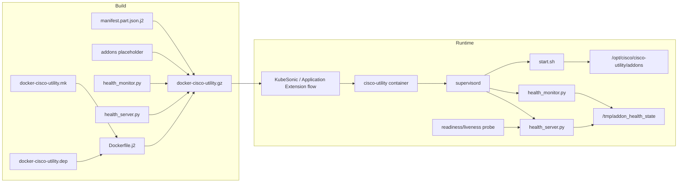

# Cisco Utility Docker Infrastructure HLD

## Table of Content

- [Revision](#revision)
- [Scope](#scope)
- [Definitions/Abbreviations](#definitionsabbreviations)
- [Overview](#overview)
- [Requirements](#requirements)
- [Architecture Design](#architecture-design)
- [High-Level Design](#high-level-design)
- [Health Contract](#health-contract)
- [Configuration and Management](#configuration-and-management)
- [Warmboot and Fastboot Design Impact](#warmboot-and-fastboot-design-impact)
- [Rules for New Scripts/Processes](#rules-for-new-scriptsprocesses)
- [Restrictions/Limitations](#restrictionslimitations)
- [Testing Requirements/Design](#testing-requirementsdesign)
- [Open/Action Items](#openaction-items)

## Revision

| Rev | Date | Author | Change Description |
|-----|------|--------|--------------------|
| 0.1 | Mar 01, 2026 | Anand Mehra (anamehra) | Initial HLD for Cisco Utility Docker as SONiC Application Extension |
| 0.2 | May 13, 2026 | Anand Mehra (anamehra) | Updated scope to generic add-on framework; removed diagnostic-specific behavior; added placeholder health monitor/server contract |

## Scope

This document describes the high-level design of the **Cisco Utility Docker
infrastructure** for Cisco 8000 platforms. The implementation provides the
container framework only:

- SONiC build and manifest integration for `docker-cisco-utility`.
- A supervised lifecycle entrypoint.
- A placeholder add-on payload directory for future services.
- A generic health monitor and health server.
- A minimal, extensible JSON health contract.

This implementation **does not add diagnostic scripts, diagnostic monitors, or
service-specific business logic**. Future capabilities such as DPHM,
serviceability, data collection, online diagnostics, or repair workflows must be
added as separate payloads with their own design and must follow the baseline
rules in this document.

The framework conforms to the [SONiC Application Extension Infrastructure HLD](https://github.com/sonic-net/SONiC/blob/master/doc/sonic-application-extension/sonic-application-extention-hld.md).
The image is built on demand and is not packaged into the base SONiC installer.
Deployment can be performed by KubeSonic or by an Application Extension install
flow, depending on the platform runbook.

## Definitions/Abbreviations

| Abbreviation | Definition |
|--------------|------------|
| HLD | High-Level Design |
| DPHM | Data Plane Health Monitor; a future possible use case for this container |
| SONiC | Software for Open Networking in the Cloud |
| SAE | SONiC Application Extension |
| CONFIG_DB | SONiC configuration database |
| KubeSonic | Platform Kubernetes workflow used to load, start, and monitor add-on workloads |
| CX | Customer / external user with no direct container shell access |

## Overview

The Cisco Utility Docker is a reusable container framework for Cisco 8000
utility services. It gives platform teams a controlled place to deliver future
scripts or daemons without rebuilding the base SONiC image.

The current framework provides:

- `docker-cisco-utility.mk` and dependency wiring for `make target/docker-cisco-utility.gz`.
- `Dockerfile.j2` based on `docker-config-engine-bookworm`.
- `start.sh` to install placeholder payload files to a host-visible directory
  and run optional future hooks.
- `supervisord.conf` to run lifecycle, health publisher, and health server
  processes.
- `health_monitor.py` to publish a placeholder health document and aggregate
  future health check fragments.
- `health_server.py` to serve `/health` for probes.
- `health_status.schema.json` to document the minimal health JSON contract.
- `addons/` as the placeholder payload directory for future services.

No current payload is tied to online diagnostics, syncd, ASIC SDK behavior, or
traffic generation.

## Requirements

### Core Requirements

These requirements apply to the framework and to future scripts/processes added
to this docker.

- **Buildable on demand**: The image must build with
  `make target/docker-cisco-utility.gz`.
- **Not in base installer**: The image must not be added to the platform
  installer; `_INSTALL = n`.
- **Application Extension compatible**: The image must carry a valid manifest
  and package name (`cisco-utility`) for Application Extension workflows.
- **KubeSonic compatible**: The image must be loadable and runnable by the
  platform Kubernetes workflow with the same mount and privilege assumptions.
- **Generic add-on framework**: The base image must not include
  service-specific payload logic. Future services are added under `addons/` or
  as additional supervised programs with their own design.
- **Safe default behavior**: With no add-on payload configured, the container
  must stay running and publish a healthy framework status.
- **Health endpoint**: The container must expose a reusable HTTP `/health`
  endpoint for readiness/liveness probes and future services.
- **Extensible health contract**: The health JSON must define only the stable
  fields required by the server while allowing future fields.
- **Host-visible payload path**: The container must be able to copy future
  payload files to a host-visible path for use by host-side or other
  container-side workflows.
- **Backward compatibility**: New payloads and health fields must not break
  existing deployments or existing health consumers.

### Non-Goals

- No diagnostic scripts in this implementation.
- No diagnostic-specific health monitoring in this implementation.
- No CONFIG_DB, APP_DB, ASIC_DB, STATE_DB, or YANG schema changes.
- No new SONiC CLI commands in this implementation; manifest CLI arrays remain
  empty.

## Architecture Design

The Cisco Utility Docker fits into the SONiC Application Extension model. The
platform repository provides:

- The image makefile and dependency file.
- The Dockerfile and runtime scripts.
- The manifest fragment.
- The placeholder add-on directory.

The image is built independently from the base SONiC installer. At runtime,
KubeSonic or the Application Extension install flow starts the container with
host access required for future add-on services.



## High-Level Design

### Is It Built-in or Application Extension?

The Cisco Utility Docker is a **SONiC Application Extension-style add-on**. It
is not shipped in the platform installer. The build produces
`target/docker-cisco-utility.gz`; deployment is performed by KubeSonic or by an
Application Extension package/install workflow.

### Repository and Code References

| Component | Path | Purpose |
|-----------|------|---------|
| Image makefile | `platform/cisco-8000/docker-cisco-utility.mk` | Defines image name, package name, install policy, volumes, tmpfs, runtime options, and build registration. |
| Dependency file | `platform/cisco-8000/docker-cisco-utility.dep` | Adds the image to build dependency tracking and cache hashing. |
| Dockerfile | `platform/cisco-8000/docker-cisco-utility/Dockerfile.j2` | Builds from `docker-config-engine-bookworm`; installs Python/procps; copies lifecycle, health, schema, add-on placeholder, and supervisord config. |
| Standalone Dockerfile | `platform/cisco-8000/docker-cisco-utility/Dockerfile.standalone` | Optional lab build path outside sonic-buildimage. |
| Lifecycle script | `platform/cisco-8000/docker-cisco-utility/start.sh` | Copies `/app/addons` to `/opt/cisco/cisco-utility/addons` on the host and runs optional future `start.sh`/`stop.sh` hooks. |
| Health monitor | `platform/cisco-8000/docker-cisco-utility/health_monitor.py` | Publishes `/tmp/addon_health_state`; aggregates future check fragments from `/tmp/cisco_utility_health.d/*.json`. |
| Health server | `platform/cisco-8000/docker-cisco-utility/health_server.py` | Serves `/health` and `/` on port `50200`; returns HTTP 200 only when overall state is healthy. |
| Health schema | `platform/cisco-8000/docker-cisco-utility/health_status.schema.json` | Minimal JSON contract for health documents. Additional fields are allowed. |
| Add-on placeholder | `platform/cisco-8000/docker-cisco-utility/addons/` | Empty framework directory where future service payloads can be added. |
| Supervisord config | `platform/cisco-8000/docker-cisco-utility/supervisord.conf` | Runs lifecycle, health monitor, and health server processes. |
| Manifest part | `platform/cisco-8000/docker-cisco-utility/manifest.part.json.j2` | Supplies host-service/asic-service and empty CLI arrays. |

### Build Integration

The image is registered as a Bookworm Docker image:

```makefile
DOCKER_CISCO_UTILITY_STEM = docker-cisco-utility
DOCKER_CISCO_UTILITY = $(DOCKER_CISCO_UTILITY_STEM).gz

$(DOCKER_CISCO_UTILITY)_PACKAGE_NAME = cisco-utility
$(DOCKER_CISCO_UTILITY)_INSTALL = n

SONIC_DOCKER_IMAGES += $(DOCKER_CISCO_UTILITY)
SONIC_BOOKWORM_DOCKERS += $(DOCKER_CISCO_UTILITY)
```

The image is intentionally excluded from the installer and built only when
requested.

### Runtime Mounts and Privileges

The framework keeps host access available for future utility services:

```makefile
$(DOCKER_CISCO_UTILITY)_CONTAINER_VOLUMES += /opt/cisco:/opt/cisco
$(DOCKER_CISCO_UTILITY)_CONTAINER_VOLUMES += /:/hostroot
$(DOCKER_CISCO_UTILITY)_CONTAINER_TMPFS += /tmp/

$(DOCKER_CISCO_UTILITY)_RUN_OPT += -t --privileged --pid=host
$(DOCKER_CISCO_UTILITY)_RUN_OPT += -v /:/hostroot:rw
$(DOCKER_CISCO_UTILITY)_RUN_OPT += -v /opt/cisco:/opt/cisco
$(DOCKER_CISCO_UTILITY)_RUN_OPT += --log-opt max-size=2M --log-opt max-file=5
```

The host root mount enables future host-aware workflows. Because the container
is privileged and has host PID/root access, only trusted images and payloads
should be deployed.

### Container Process Model

`supervisord` runs three framework processes:

| Program | Command | Purpose |
|---------|---------|---------|
| `start` | `/usr/bin/start.sh` | Installs add-on placeholder files to the host-visible path, runs optional future start hook, and keeps the lifecycle process alive. |
| `health-monitor` | `/usr/bin/health_monitor.py --continuous` | Publishes the health status file periodically. |
| `health-server` | `/usr/bin/health_server.py --port 50200 --bind 0.0.0.0` | Serves `/health` for probes and future consumers. |

The health monitor and server start after the lifecycle process is running.

### Add-on Payload Flow

At startup, `start.sh` copies image payload files from:

```text
/app/addons
```

to the host-visible path:

```text
/opt/cisco/cisco-utility/addons
```

If a future payload provides executable hooks, they are invoked as follows:

| Hook | When it runs |
|------|--------------|
| `/opt/cisco/cisco-utility/addons/start.sh` | Container startup after payload copy |
| `/opt/cisco/cisco-utility/addons/stop.sh` | `SIGTERM`, `SIGINT`, or explicit `start.sh --stop` |

With no hooks, the container remains running and the health monitor publishes a
placeholder healthy framework status.

## Health Contract

`health_monitor.py` owns the status file:

```text
/tmp/addon_health_state
```

`health_server.py` reads that file and serves:

```text
http://<device>:50200/health
```

The minimal stable JSON contract is:

```json
{
  "schema_version": "1.0",
  "overall": {
    "state": "healthy",
    "message": "optional summary"
  },
  "checks": {
    "framework": {
      "state": "healthy",
      "message": "optional check detail"
    }
  }
}
```

Stable fields:

- `schema_version`: health document format version.
- `overall.state`: required health state consumed by `health_server.py`.
- `overall.message`: optional human-readable summary.
- `checks`: optional per-component details.

Supported states:

- `healthy`
- `degraded`
- `unhealthy`
- `unknown`

`health_server.py` returns:

| Condition | HTTP |
|-----------|------|
| `overall.state == healthy` | 200 |
| Missing status file, unreadable file, invalid JSON, or any non-healthy overall state | 500 |
| Unknown path | 404 |

Future services may add extra top-level fields, fields under `overall`, or
fields under each check entry. The schema intentionally allows additional
fields so the base framework does not need to change for every future service.

Future add-on checks can write fragments into:

```text
/tmp/cisco_utility_health.d/*.json
```

The only stable required field in a fragment is `state`:

```json
{
  "state": "healthy",
  "message": "optional detail"
}
```

`health_monitor.py` aggregates these fragments into the canonical health
document. It may publish additional informational fields such as generation
time, producer, per-check timestamps, metadata, and summary counts; consumers
should depend only on the stable fields above unless a future service explicitly
defines more.

## Configuration and Management

### Build

```bash
make target/docker-cisco-utility.gz
```

### Deployment

Primary deployment follows the platform runbook. KubeSonic can load/install the
image, start the `cisco-utility` container with the required mounts and
privileges, and monitor the `/health` endpoint.

Application Extension package-manager flow can also be used where supported by
the platform:

| Action | Command |
|--------|---------|
| Install from tarball | `sonic-package-manager install --from-tarball /tmp/docker-cisco-utility.gz -y` |
| Install and enable | `sonic-package-manager install --from-tarball /tmp/docker-cisco-utility.gz -y --enable` |
| Install from image | `docker load -i /tmp/docker-cisco-utility.gz` then `sonic-package-manager install cisco-utility --from-image <name>:<tag>` |
| Enable feature | `config feature state cisco-utility enabled` then `config save` |
| Disable feature | `config feature state cisco-utility disabled` then `config save` |
| Uninstall | Disable first, then `sonic-package-manager uninstall cisco-utility` |

Manual `docker run` may be used for lab or break-glass debugging:

```bash
sudo docker load -i /tmp/docker-cisco-utility.gz
sudo docker run -d -t --privileged --pid=host \
  -v /:/hostroot:rw -v /opt/cisco:/opt/cisco --tmpfs /tmp/ --net=host \
  --log-opt max-size=2M --log-opt max-file=5 --name cisco-utility \
  docker-cisco-utility:<tag>
```

### Manifest

The manifest is produced by merging:

1. Build-generated manifest content derived from `docker-cisco-utility.mk`.
2. `manifest.part.json.j2` from the platform directory.

Current manifest fragment:

```json
{
  "service": {
    "host-service": true,
    "asic-service": false
  },
  "container": {
    "environment": {}
  },
  "cli": {
    "config": [],
    "show": [],
    "clear": []
  }
}
```

No CLI extensions are added by this framework.

### Validation Commands

| Check | Command / Signal | Expected |
|-------|------------------|----------|
| Image build | `make target/docker-cisco-utility.gz` | Image artifact is generated |
| Container | `docker ps -a | grep cisco-utility` | Container is up when deployed |
| Health endpoint | `curl -s http://localhost:50200/health` | HTTP 200 and JSON when framework is healthy |
| Payload install path | `ls /opt/cisco/cisco-utility/addons` | Placeholder or future payload files are present |

## Warmboot and Fastboot Design Impact

- The Cisco Utility container is optional and is not in the critical boot path
  of the base image.
- The framework has no warmboot/fastboot-specific logic.
- Future payloads must document their own warmboot and fastboot impact.

## Rules for New Scripts/Processes

Any new scripts or processes added to the Cisco Utility Docker must follow
these baseline rules. Additions must have their own design note or HLD that
references and complies with this document.

| Rule | Requirement |
|------|-------------|
| Safety | Scripts/processes must be safe to run in production. Serviceability and health-check payloads should be read-only by default. |
| Write operations | Writes to CONFIG_DB, host state, ASIC/service state, or traffic-generating workflows require explicit design, scope, rollback, and operational approval. |
| Design alignment | Each new functionality must reference this HLD and describe how it uses lifecycle hooks, supervisord, health checks, and host access. |
| Backward compatibility | New payloads must not break the empty-framework behavior or existing health consumers. |
| Host-side execution | Production use must not depend on ad hoc `docker exec`; any operator-facing workflow should have a defined host-side or orchestration path. |
| Data access | Use of SONiC DBs, syncd, ASIC SDK, host files, or other containers must be documented by the payload-specific design. |
| Health and observability | Long-running payloads should publish health fragments under `/tmp/cisco_utility_health.d/` or define an equivalent integration with `health_monitor.py`. |

## Restrictions/Limitations

- Not shipped in the platform installer.
- No diagnostic payload is included.
- No CLI extensions are included.
- `/health` is unauthenticated and intended for trusted probe networks.
- The container is privileged, uses host PID namespace, and mounts host root
  read-write. Only trusted images and payloads should be deployed.

## Testing Requirements/Design

- **Build**: `make target/docker-cisco-utility.gz` completes.
- **Manifest**: Image label contains valid manifest JSON with package name
  `cisco-utility`, host-service enabled, and expected volume/tmpfs settings.
- **Startup**: Container starts under `supervisord`; `start`,
  `health-monitor`, and `health-server` processes are running.
- **Empty framework health**: With no add-on payload, `/health` returns HTTP
  200 and JSON with `overall.state: healthy`.
- **Health fragment aggregation**: A future check fragment under
  `/tmp/cisco_utility_health.d/*.json` is reflected in
  `/tmp/addon_health_state`.
- **Unhealthy behavior**: A non-healthy fragment causes `overall.state` to be
  non-healthy and `/health` to return HTTP 500.
- **Stop behavior**: Container stop invokes the optional add-on `stop.sh` hook
  if present.

## Open/Action Items

- Define the platform runbook for KubeSonic install/start/monitor/remove.
- Define any future host-side command interface required by operator-facing
  utilities.
- Each future payload, including DPHM or diagnostics, must provide its own
  design and test plan.
