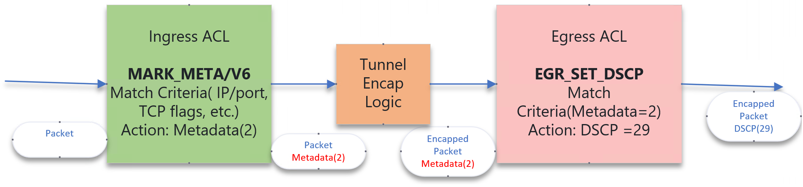

# Egress Outer DSCP  Rewrite Feature Validation and Testing
[Notes: This document covers functional testing of the Egress Outer DSCP rewrite feature only. Related HLD/configuration/code is already in upstream SONiC]

## Table of Contents

- [Egress Outer DSCP Rewrite Feature Validation and Testing](#egress-outer-dscp-rewrite-feature-validation-and-testing)
  - [Table of Contents](#table-of-contents)
  - [1. Revision](#1-revision)
  - [2. Scope](#2-scope)
  - [3. Terminology](#3-terminology)
  - [4. Overview](#4-overview)
    - [4.1 Requirements](#41-requirements)
    - [4.2 Example Configuration](#42-example-configuration)
    - [4.3 sairedis.rec example](#43-sairedisrec-example)
  - [5. Test Structure](#5-test-structure)
    - [5.1 Setup Configuration](#51-setup-configuration)
    - [5.2 General Test Flow](#52-general-test-flow)
    - [5.3 Packet Structure](#53-packet-structure)
    - [5.4 Test Cases](#54-test-cases)
  - [6. Limitations](#6-limitations)
  - [7. Related PRs](#7-related-prs)
  - [8. Open/Action items](#8-openaction-items)

---

## 1. Revision

| Version | Date       | Author                      | Description      |
|---------|------------|-----------------------------|------------------|
| 0.1     | 2026-03-16 | Manasa Mananjaya (mmananja) | Initial version  |

---

## 2. Scope

This document outlines the functional testing for the Egress Outer DSCP Rewrite feature in SONiC. The feature enables modification of outer DSCP fields in encapsulated packets based on inner L3 header information using ACL table types UNDERLAY_SET_DSCP and UNDERLAY_SET_DSCPV6.

---

## 3. Terminology

| SONiC User ACL Table Types     | Description |
|---------------|--------------------|
| Underlay DSCP | The DSCP value of the outer packet header after the packet has been encapsulated.|
| Overlay DSCP  | The DSCP value of the original unencapsulated packet. |
| Metadata attribute| A SAI ACL match attribute which allows packet matching based on the metadata value set by previous stage ACL. |
| Metadata action | A SAI ACL action which allows setting the metadata value associated with a packet. The metadata is not part of the packet itself but is kept along with the packet by the pipeline.|
|  MARK_META/V6 | This term is used to represent both MARK_META and MARK_METAV6 tables.|
| UNDERLAY_SET_DSCP/V6 | This term is used to represent both UNDERLAY_SET_DSCP and UNDERLAY_SET_DSCPV6 tables.|

---

## 4. Overview

The Egress Outer DSCP Rewrite feature enables modification of the outer DSCP field in encapsulated packets based on the inner (original) L3 header fields. This addresses a gap in existing SONiC ACL capabilities where:
- Ingress L3 ACL tables can modify the original packet's DSCP but don't preserve it after encapsulation
- Egress L3 ACL tables can modify encapsulated packet DSCP but cannot match on inner L3 fields

The feature introduces two new user-facing ACL table types: **UNDERLAY_SET_DSCP** (for IPv4) and **UNDERLAY_SET_DSCPV6** (for IPv6). These tables allow users to set the outer DSCP value of encapsulated packets based on match criteria from the original unencapsulated packet.

**Internal Table Translation:**
The orchagent translates the two user-facing tables into three internal tables:

1. **MARK_META (Ingress Table):** Created from UNDERLAY_SET_DSCP table. Bound to the same ports as the user-configured table. Supports IPv4 match fields (SRC_IP, DST_IP, IP_PROTOCOL, L4 ports, TCP_FLAGS, DSCP) with SET_METADATA action.

2. **MARK_METAV6 (Ingress Table):** Created from UNDERLAY_SET_DSCPV6 table. Bound to the same ports as the user-configured table. Supports IPv6 match fields (SRC_IPV6, DST_IPV6, IPV6_NEXT_HEADER, L4 ports, DSCP) with SET_METADATA action.

3. **EGR_SET_DSCP (Egress Table):** A single shared table created upon the first UNDERLAY_SET_DSCP/V6 table creation. Bound to a superset of all interfaces associated with any UNDERLAY_SET_DSCP/V6 table. Matches on MATCH_METADATA field with SET_DSCP action.

**Internal Rule Translation:**
The orchagent translates each user-configured rule into two internal rules operating at different pipeline stages:

1. **Ingress Stage Rule (MARK_META/V6):** Created in the corresponding MARK_META or MARK_METAV6 table to match on the original packet's L3 header fields (SRC_IP, DST_IP, L4 ports, DSCP, etc.). When a match occurs, it sets a metadata value associated with the packet. The metadata is allocated based on the DSCP action value specified by the user and is reused across multiple rules with the same DSCP action.

2. **Egress Stage Rule (EGR_SET_DSCP):** Created in the shared EGR_SET_DSCP table to match on the metadata value set by the ingress rule. When matched, it modifies the outer DSCP field of the encapsulated packet to the desired value. 

This two-stage approach ensures that DSCP modifications occur after encapsulation while still allowing matching based on the original packet headers.

<p align=center>

</p>

### 4.1 Requirements

- Device property "enable_tunnel_encap_egress_acl": true 
- Egress key profile 
```
    {
        "profile_name": "user_meta_table",
        "sai_attributes": ["SAI_ACL_TABLE_ATTR_FIELD_ACL_USER_META"]                
    }
```

### 4.2 Example Configuration
```
{
    "ACL_TABLE": {
        "MARK_META": {
            "policy_desc": "OVERLAY_SET_DSCP_TEST_V4",
            "ports": [
                "PortChannel102",
                "PortChannel105",
                "PortChannel108",
                "PortChannel1011",
                "PortChannel1014",
                "PortChannel1017",
                "PortChannel1020",
                "PortChannel1023",
                "Ethernet64",
                "Ethernet68",
                "Ethernet72",
                "Ethernet76",
                "Ethernet80",
                "Ethernet84",
                "Ethernet88",
                "Ethernet92",
                "Ethernet96",
                "Ethernet100",
                "Ethernet104",
                "Ethernet108",
                "Ethernet112",
                "Ethernet116",
                "Ethernet120",
                "Ethernet124"
            ],
            "stage": "ingress",
            "type": "UNDERLAY_SET_DSCP"
        },
        "MARK_METAV6": {
            "policy_desc": "OVERLAY_SET_DSCP_TEST_V6",
            "ports": [
                "PortChannel102",
                "PortChannel105",
                "PortChannel108",
                "PortChannel1011",
                "PortChannel1014",
                "PortChannel1017",
                "PortChannel1020",
                "PortChannel1023",
                "Ethernet64",
                "Ethernet68",
                "Ethernet72",
                "Ethernet76",
                "Ethernet80",
                "Ethernet84",
                "Ethernet88",
                "Ethernet92",
                "Ethernet96",
                "Ethernet100",
                "Ethernet104",
                "Ethernet108",
                "Ethernet112",
                "Ethernet116",
                "Ethernet120",
                "Ethernet124"
            ],
            "stage": "ingress",
            "type": "UNDERLAY_SET_DSCPV6"
        }		
    }
}
{   "ACL_RULE": {
        "OVERLAY_SET_DSCP_TEST|RULE0": {
            "PRIORITY": "100",
            "DSCP_ACTION": "40",
            "SRC_IP": "1.1.1.1/32"
        }
		"OVERLAY_SET_DSCP_TESTV6|RULE0": {
            "PRIORITY": "200",
            "DSCP_ACTION": "41",
			"SRC_IPV6": "2777::0/64",
            "DST_IPV6": "2788::0/64"
        }
        
    }
}
```

### 4.3 sairedis.rec Example

MARK_META Table ->
```
|c|SAI_0BJECT_TYPE_ACL_TABLE:oid:0x700000000092|SAI_ACL_TABLE_ATTR_ACL_BIND_POINT_TYPE_LIST=2:SAI_ACL_BIND_POINT_TYPE_PORT,SAI_ACL_BIND_POINT_TYPE_LAG|
SAI_ACL_TABLE_ATTR_FIELD_SRC_IP=true|SAI_ACL_TABLE_ATTR_FIELD_DST_IP=true|SAI_ACL_TABLE_ATTR_FIELD_L4_SRC_PORT=true|
SAI_ACL_TABLE_ATTR_FIELD_L4_DST_PORT=true|SAI_ACL_TABLE_ATTR_FIELD_IP_PROTOCOL=true|SAI_ACL_TABLE_ATTR_FIELD_DSCP=true|SAI_ACL_TABLE_ATTR_FIELD_TCP_FLAGS=true|SAI_ACL_TABLE_ATTR_ACL_STAGE=SAI_ACL_STAGE_INGRESS
```

MARK_METAV6 Table -> 

```
|c|SAI_0BJECT_TYPE_ACL_TABLE:oid:0x7000000000947|SAI_ACL_TABLE_ATTR_ACL_BIND_POINT_TYPE_LIST=2:SAI_ACL_BIND_POINT_TYPE_PORT,SAI_ACL_BIND_POINT_TYPE_LAG|
SAI_ACL_TABLE_ATTR_FIELD_SRC_IPV6=true|SAI_ACL_TABLE_ATTR_FIELD_DST_IPV6=true|SAI_ACL_TABLE_ATTR_FIELD_L4_SRC_PORT=true|
SAI_ACL_TABLE_ATTR_FIELD_L4_DST_PORT=true|SAI_ACL_TABLE_ATTR_FIELD_DSCP=true|SAI_ACL_TABLE_ATTR_FIELD_TCP_FLAGS=true|SAI_ACL_TABLE_ATTR_FIELD_IPV6_NEXT_HEADER=true|SAI_ACL_TABLE_ATTR_ACL_STAGE-SAI_ACL_STAGE_INGRESS
```

EGR_SET_DSCP Table -> 
```
|c|SAI_0BJECT_TYPE_ACL_TABLE:oid:0x70000000012c3|SAI_ACL_TABLE_ATTR_ACL_BIND_P0INT_TYPE_LIST=2:SAI_ACL_BIND_P0INT_TYPE_PORT, SAI_ACL_BIND_POINT_TYPE_LAG|
SAI_ACL_TABLE_ATTR_FIELD_ACL_USER_META=true|SAI_ACL_TABLE_ATTR_ACL_STAGE-SAI_ACL_STAGE_EGRESS
```


Egress Rule ->
```
|c|SAI_0BJECT_TYPE_ACL_ENTRY:oid:0x8000000000703|SAI_ACL_ENTRY_ATTR_TABLE_ID=oid:0x700000000069f|
SAI_ACL_ENTRY_ATTR_PRIORITY=0|SAI_ACL_ENTRY_ATTR_ADMIN_STATE=true|
SAI_ACL_ENTRY_ATTR_ACTION_COUNTER=oid:0x9000000000702|SAI_ACL_ENTRY_ATTR_FIELD_ACL_USER_META=1&mask:@xffffffff|SAI_ACL_ENTRY_ATTR_ACTION_SET_DSCP=40
```

Ingress Rule ->
```
|c|SAI_0BJECT_TYPE_ACL_ENTRY:oid:@x8000000000705|SAI_ACL_ENTRY_ATTR_TABLE_ID=oid:0x70000000006d0|
SAI_ACL_ENTRY_ATTR_PRIORITY=100|SAI_ACL_ENTRY_ATTR_ADMIN_STATE=true|
SAI_ACL_ENTRY_ATTR_ACTION_COUNTER=oid:0x9000000000704|SAI_ACL_ENTRY_ATTR_FIELD_DST_IP=150.0.4.1&mask:255.255.255.255|SAI_ACL_ENTRY_ATTR_ACTION_SET_ACL_META_DATA=1
```

---

## 5. Test Structure

### 5.1 Setup Configuration

These tests require Vxlan tunnel configuration along with ACL configuration. It uses the existing infrastructure of ACL and
Vxlan ECMP tests to perform the required configuration on the device.
The setup performs the following tasks
1) Select Vxlan encapsulation: The test runs all the cases with the following Vxlan encapsulation scenarios

    a) 'v4_in_v4'

    b) 'v6_in_v4'
    
    c) 'v4_in_v6'
    
    d) 'v6_in_v6'

2) Selection of ports: The test selects the ports from the upstream devices connected to the DUT in the testbed. These ports are used for sending to and receiving the packets from the DUT.
3) Vxlan ECMP routes setup: Using the Vxlan ECMP REST libraries, this test sets up the following configuration.

   a) Vxlan Tunnel with src IP set to the DUT loopback address and Vxlan source port=4789.
   
   b) VNET setup with VNI=10000
   
   c) Setup VNET routes with ECMP nexthops. This setup part allocates a route prefix and 4 nexthop addresses based on the Vxlan encapsulation type parameters.
    It then creates a vxlan tunnel route with 4 nexthops

### 5.2 General Test Flow

Each test case executes the following sets of actions in the given order:
1) Apply ACL configuration based on the test case.
2) Generate a single packet to match each of the configured rules.
3) Verify that the packet indeed hit the ACL rule and it resulted in outer header DSCP change after VxLAN encapsulation.

### 5.3 Packet Structure

The packet sent to the DUT has the following format.
<pre>
###[ Ethernet ]###
  dst = [auto]
  src = [auto]
  type = 0x800
###[ IP/IPv6 ]###
    version = 4/6
    ttl/hlim = 121
    proto = udp
    tos/tc= configured by the test
    chksum = None
    src = 170.170.170.170 / 9999:AAAA:BBBB:CCCC:DDDD:EEEE:EEEE:7777
    dst = VNET route prefix
###[ UDP ]###
    sport = any
    dport = any
</pre>

#### Received Packet
The packet received has the following format.
<pre>
###[ Ethernet ]###
  dst = [auto]
  src = [auto]
  type = 0x800
###[ IP/IPv6 ]###
    version = 4/6
    ttl/hlim = 128
    proto = udp
    tos/tc= Set by ACL rule based on the configuration by the test.
    chksum = None
    src = DUT Loopback IPv4/IPv6
    dst = one of the 4 next hops configured by the test in the VNET route.
###[ UDP ]###
    sport = any
    dport = 4789
###[ Vxlan ]###
    vni = 10000
###[ payload ]###
    Original packet sent to the DUT.
    ###[ Ethernet  ]###
    ###[ IP/IPv6 ]###
    ###[ UDP ]###
</pre>

### 5.4 Test Cases

#### Basic Functionality Tests

- Basic ACL table and rule creation verification

- Multiple match fields (SRC_IP, DST_IP, L4 ports) with DSCP rewrite
```
Rule: RULE1
  Priority: 100
  DSCP_ACTION: 48
  SRC_IP: 10.20.30.40/32
  DST_IP: 150.0.4.1/32
```

- Match on inner DSCP value for outer DSCP rewrites
```
Rule: RULE1 (Priority: 100, DSCP: 8, DSCP_ACTION: 48, DST_IP: 150.0.4.1/32)
Rule: RULE2 (Priority: 200, DSCP: 16, DSCP_ACTION: 46, DST_IP: 150.0.4.1/32)
Rule: RULE3 (Priority: 300, DSCP: 24, DSCP_ACTION: 34, DST_IP: 150.0.4.1/32)
Rule: RULE4 (Priority: 400, DSCP: 32, DSCP_ACTION: 26, DST_IP: 150.0.4.1/32)
Rule: RULE5 (Priority: 500, DSCP: 40, DSCP_ACTION: 18, DST_IP: 150.0.4.1/32)
```

- Different match criteria with different DSCP rewrites
```
Rule: RULE1 (Priority: 100, DSCP_ACTION: 15, SRC_IP: 192.168.1.1/32)
Rule: RULE2 (Priority: 200, DSCP_ACTION: 25, SRC_IP: 192.168.1.2/32)
Rule: RULE3 (Priority: 300, DSCP_ACTION: 35, SRC_IP: 192.168.1.3/32)
Rule: RULE4 (Priority: 400, DSCP_ACTION: 45, SRC_IP: 192.168.1.4/32)
```

- Same DSCP action with different match criteria
```
Rule: RULE1 (Priority: 100, DSCP_ACTION: 24, SRC_IP: 10.0.0.1/32)
Rule: RULE2 (Priority: 200, DSCP_ACTION: 24, SRC_IP: 10.0.0.2/32)
Rule: RULE3 (Priority: 300, DSCP_ACTION: 24, SRC_IP: 10.0.0.3/32)
Rule: RULE4 (Priority: 400, DSCP_ACTION: 24, SRC_IP: 10.0.0.4/32)
Rule: RULE5 (Priority: 500, DSCP_ACTION: 24, SRC_IP: 10.0.0.5/32)
```

- No-match scenario
```
###[ IP ]###
     version   = 4
     ihl       = 5
     tos       = 0x84
     len       = 136
     id        = 0
     flags     = DF
     frag      = 0
     ttl       = 128
     proto     = udp
     chksum    = 0x8bbf
     src       = 10.1.0.32
     dst       = 100.0.0.1
     \options   \
.
.
.
###[ IP ]###
                 version   = 4
                 ihl       = 5
                 tos       = 0x84
                 len       = 86
                 id        = 0
                 flags     =
                 frag      = 0
                 ttl       = 120
                 proto     = udp
                 chksum    = 0x7fd6
                 src       = 10.20.30.40
                 dst       = 150.0.4.1

```

- Verify DSCP rewrite for non-tunneled packets
```
Table: OVERLAY_MARK_META_TEST
Rule: RULE1
  Priority: 100
  DSCP_ACTION: 48
  DST_IP: 200.0.0.1/32
```
```
###[ IP ]###
     version   = 4
     ihl       = 5
     tos       = 0xc0
     len       = 86
     id        = 1
     flags     =
     frag      = 0
     ttl       = 63
     proto     = tcp
     chksum    = 0xf0d3
     src       = 192.168.1.100
     dst       = 200.0.0.1

```
- Default DSCP behavior when no rules are configured


- Rule deletion and verification of DSCP behavior post-deletion
```
Step 1: Create rule with DSCP_ACTION: 48, DST_IP: 150.0.4.1/32
Step 2: Delete the rule
Step 3: Verify packets preserve original DSCP (no rewrite)
```

#### Metadata Management Tests

- Verify metadata allocation and deallocation


- Verify single EGR_SET_DSCP entry creation per unique DSCP action value
```
Table: OVERLAY_MARK_META_TEST
Rule: RULE1 (Priority: 100, DSCP_ACTION: 48, DST_IP: 150.0.1.1/32)
Rule: RULE2 (Priority: 99, DSCP_ACTION: 48, DST_IP: 150.0.2.1/32)
Rule: RULE3 (Priority: 98, DSCP_ACTION: 48, DST_IP: 150.0.3.1/32)

Table: OVERLAY_MARK_META_TESTV6
Rule: RULE1 (Priority: 100, DSCP_ACTION: 48, DST_IPV6: 2001:db8:1::1/128)
Rule: RULE2 (Priority: 99, DSCP_ACTION: 48, DST_IPV6: 2001:db8:2::1/128)

Table: EGR_SET_DSCP
Rule: RULE1 (SET_DSCP: 48, METADATA 1)
```

- Scale testing with multiple DSCP values


#### Multi-Table and Multi-Flow Tests
- Multiple UNDERLAY_SET_DSCP tables, each with their own ACL rules
- Multiple flows with selective source packet matching and DSCP marking

#### Dynamic Configuration Tests
- Add-delete-add acl rule filter sequence verification with ongoing traffic

---

## 6. Limitations

1. **Rule Update Restriction:** In-place updates to DSCP_ACTION values or match fields are not supported. Rules must be deleted and recreated to modify these fields, as metadata is allocated during rule creation and cannot be reallocated through updates.

2. **Egress Port Binding Constraint:** The internally created EGR_SET_DSCP table is bound to a superset of all ports specified in the user-configured UNDERLAY_SET_DSCP/V6 tables. Consequently, if encapsulated packets egress through interfaces that were not included in any UNDERLAY_SET_DSCP/V6 table binding, the outer DSCP rewrite will not occur. For comprehensive coverage, it is recommended to bind UNDERLAY_SET_DSCP/V6 tables to all data plane interfaces where encapsulated traffic is expected to egress.

3. **Automatic Metadata Reallocation:** Automatic reallocation of freed metadata values is not supported. If all available metadata values (typically 7) are exhausted and an additional rule is created, it remains inactive. Even if one of the allocated metadata values is subsequently freed, it will not be automatically reassigned to the inactive rule. The rule must be explicitly deleted and recreated to utilize the freed metadata. 

---

## 7. Related PRs

| Description | PR Link |
|-------------|---------|
| Egress Outer DSCP Feature HLD | https://github.com/sonic-net/SONiC/pull/1743 |
| Orchagent support for UNDERLAY_SET_DSCP and UNDERLAY_SET_DSCPV6 | https://github.com/sonic-net/sonic-swss/pull/3307 |
| "enable_tunnel_encap_egress_acl" device property support | https://cto-github.cisco.com/Leaba/sdk/pull/53937 |
| S1INTAKE-353: SDK Support | https://cto-github.cisco.com/Leaba/sdk/pull/37824<br>https://cto-github.cisco.com/Leaba/sdk/pull/46762<br>https://cto-github.cisco.com/Leaba/sdk/pull/47324<br>https://cto-github.cisco.com/Leaba/sdk/pull/49357<br>https://cto-github.cisco.com/Leaba/sdk/pull/65562 |
| Sonic-mgmt Automation Script | https://wwwin-github.cisco.com/whitebox/sonic-test/pull/2487 |

---

## 8. Open/Action items

- Create Spytest script for testcases not included in sonic-mgmt automation script test_acl_dscp_rewrite.py
- Test the impact of addition of UNDERLAY_SET_DSCP/V6 tables on maximum number of acl rules that can be configured 
- Confirm if dscp rewrite in non-tunneled packets is expected or a limitation 

