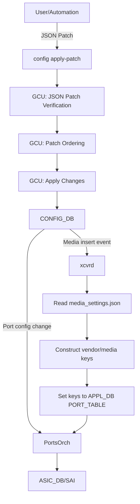
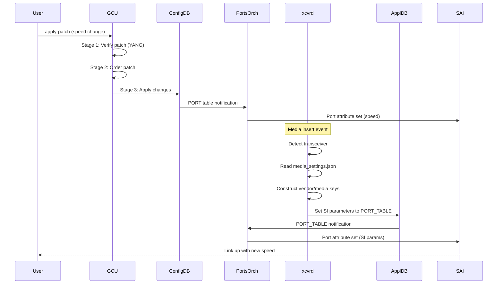

# SONiC GCU Support for Cisco-8000 Chassis

## Table of Content

1. [Revision](#revision)
2. [Scope](#scope)
3. [Definitions/Abbreviations](#definitionsabbreviations)
4. [Overview](#overview)
5. [Requirements](#requirements)
6. [Architecture Design](#architecture-design)
7. [High-Level Design](#high-level-design)
8. [SAI API](#sai-api)
9. [Configuration and management](#configuration-and-management)
10. [Testing Requirements](#testing-requirements)

## Revision

| Rev |     Date    |       Author       | Change Description                |
|:---:|:-----------:|:------------------:|-----------------------------------|
| 0.1 | 12/08/2024  |   Anand Mehra    | Initial version                   |

## Scope

This document provides a high-level design for enabling Generic Config Updater (GCU) support on Cisco-8000 chassis platforms, specifically for 88-LC0-36FH (Lancer) line cards. The design covers dynamic link speed changes, media settings infrastructure for SI parameter selection, test validation, and community coordination.

### In Scope
- GCU support for 88-LC0-36FH (Lancer) line cards
- Dynamic link speed changes (400G ↔ 100G)
- Media settings infrastructure for runtime SI parameter selection
- Validation of existing sonic-mgmt GCU test cases on Cisco chassis
- New test cases for speed change and SI parameter validation
- Configuration changes via JSON patches for:
  - `PORT` (speed, admin_status)
  - `PORTCHANNEL`, `PORTCHANNEL_INTERFACE`, `PORTCHANNEL_MEMBER`
  - `QUEUE` scheduler
  - `PORT_QOS_MAP`
  - `EVERFLOW`
  - `PFC_WD`
  - `BUFFER_QUEUE` lossy profiles
  - `BUFFER_PG` lossy profiles (lossless created dynamically)
  - `CABLE_LENGTH' configuration

### Out of Scope
- 88-LC0-36FH-M (Vanguard) line card support (requires dynamic gbsyncd parameter support)
- 100G → 400G transitions (software issues, future effort)
- Uplink line cards (current requirement is downlink cards only)

### Existing Sonic Feature used
- Generic Config updater - Config apply and rollback
- Media based port settings

Check References for HLD details of existing features

## Definitions/Abbreviations

| **Term**                 | **Meaning**                         |
|--------------------------|-------------------------------------|
| GCU                      | Generic Config Updater              |
| SI                       | Signal Integrity                    |
| DUT                      | Device Under Test                   |
| QoS                      | Quality of Service                  |
| ConfigDB                 | Configuration Database              |
| ASIC                     | Application-Specific Integrated Circuit |
| PFC                      | Priority Flow Control               |
| YANG                     | Yet Another Next Generation (data modeling language) |

## Overview

### Generic Config Updater (GCU)

GCU is a SONiC component that applies configuration changes to CONFIG_DB using JSON patch format without requiring system restart. It validates changes, generates appropriate operations, and applies them in dependency order.

Key capabilities:
- Validates JSON patches against SONiC YANG models
- Resolves configuration dependencies
- Applies atomic changes to CONFIG_DB
- Triggers appropriate service updates via ConfigDB subscribers

Patch format:
```json
[
  {
    "op": "add/remove/replace",
    "path": "/namespace/TABLE_NAME/key/field",
    "value": "new_value"
  }
]
```

Command:
```bash
config apply-patch <patch_file.json>
```

### Media Settings Infrastructure

`media_settings.json` provides platform-specific transceiver parameters including SI (Signal Integrity) settings for different speeds and media types. The infrastructure reads this file at runtime and applies appropriate settings based on detected transceiver when link initializes.

File location: `/usr/share/sonic/device/<platform>/media_settings.json`

Structure:
```json
{
    "GLOBAL_MEDIA_SETTINGS": {
        "1-32": {
            "AMPHENOL-2250": {
                "preemphasis": {
                    "lane0":"0x001234",
                    "lane1":"0x001234"
                },
                "idriver": {
                    "lane0":"0x2",
                    "lane1":"0x2"
                }
            }
    }
    }
}
```

Refer to Media based Port Settings in SONiC HLD to more details on Media settings for port.

## Requirements

### Functional Requirements

* **R0**: **Dynamic Speed Change**: The system must support dynamic port speed changes from 400G to 100G without requiring system reboot or service restart. Only use add operations in patch. GCU infrastructure figures out if any remove or replace operation(s) need to be done.

* **R1**: **Media Settings Support**: The platform must provide `media_settings.json` with SI parameters for all supported media and transreciver types.

* **R2**: **GCU Patch Support**: The system must support JSON patch operations for:
   - `PORT` table (speed, admin_status)
   - `PORTCHANNEL`, `PORTCHANNEL_INTERFACE`,`PORTCHANNEL_MEMBER` table (creation, modification)
   - `QUEUE` scheduler configuration
   - `PORT_QOS_MAP` configuration
   - `EVERFLOW` mirror session configuration
   - `PFC_WD` configuration
   - `BUFFER_QUEUE` lossy profiles
   - `BUFFER_PG` lossy profiles
   - `CABLE_LENGTH` configuration

* **R3**: **Production Scenarios**: Support the following link bring-up scenarios:
   - 400G admin down, unconfigured → 400G admin up, configured
   - 400G admin down, unconfigured → 100G configured
   - Partial port configuration (some ports configured, others unconfigured)
   - All ports unconfigured (default QoS generated by minigraph)

* **R4**: **Test Validation**: Validate existing sonic-mgmt GCU test cases and add new test cases for:
   - Speed change validation
   - SI parameter verification
   - Partial and full port configuration scenarios

* **R5**: **Community Coordination**: Coordinate with chassis community to:
   - Review and validate community test contributions on Cisco platform
   - Discuss design of new chassis-specific tests
   - Share feedback on multi-ASIC chassis scenarios

### Limitations

1. **Platform limitation**: 88-LC0-36FH (Lancer) line cards only. 88-LC0-36FH-M (Vanguard) requires dynamic gbsyncd parameter support not yet available.

2. **Speed transition limitation**: 100G → 400G not supported in initial release due to software issues. Will be addressed in future effort.

3. **Downlink cards only**: Current production requirement focuses on downlink ports. Uplink card support deferred.

4. **No automatic rollback**: If link fails after speed change, manual intervention required. Automatic rollback not implemented.

5. **Transceiver coverage**: SI parameters must exist in `media_settings.json` for detected transceiver. Unknown transceivers use defaults which may not work.

## Architecture Design Flow Diagram



### Key Architecture Components

1. **Generic Config Updater (GCU)**: Validates JSON patches against YANG models, orders operations by dependency, and applies changes to CONFIG_DB.

2. **PortsOrch**: Subscribes to CONFIG_DB and APPL_DB PORT table changes, converts logical ports to SAI objects, and programs hardware via SAI.

3. **xcvrd**: Detects media insert events, reads `media_settings.json`, constructs vendor/media key identifiers, and sets SI parameters to APPL_DB.

4. **media_settings.json**: Platform file containing SI parameters for different speeds, media types, and vendors.

5. **CONFIG_DB**: Stores configuration data and triggers notifications to subscriber daemons.

### Component Interaction Flow



## High-Level Design

### Database Schema

No new database tables required. GCU operates on existing CONFIG_DB tables.

### Cisco Platform Changes

#### 1. Media Settings Support for 88-LC0-36FH (Lancer)

File: `device/cisco-8000/88-LC0-36FH/media_settings.json`

Add SI parameter mappings for:
- 400GBASE-DR4 (400G)
- 100GBASE-DR (100G)
- Various vendor transceivers

Implementation:
- Populate `media_settings.json` with validated SI parameters from hardware team
- Ensure coverage for common transceiver vendors (Cisco, Finisar, etc.)
- Include default fallback settings for unknown transceivers

#### 2. xcvrd Integration for SI Parameter Application

Component: xcvrd (Transceiver daemon in pmon container)

Flow on media insert event:
1. xcvrd detects media insertion
2. Reads transceiver EEPROM (vendor, part number, compliance code)
3. Constructs vendor key (e.g., "CISCO-1234")
4. Constructs media key (e.g., "100GBASE-DR")
5. Reads `media_settings.json`
6. Searches for vendor key, falls back to media key, then to default
7. Fetches SI parameters for detected speed
8. Sets key-value pairs to APPL_DB PORT_TABLE
9. PortsOrch receives notification
10. PortsOrch converts logical port to SAI object
11. PortsOrch calls SAI port attribute set for SI parameters

#### 3. Dynamic Speed Change Flow

Flow:
1. User applies JSON patch with speed change
2. GCU validates patch against YANG models
3. GCU orders operations by dependency
4. GCU applies speed change to CONFIG_DB
5. PortsOrch receives CONFIG_DB notification
6. PortsOrch sets port admin down
7. PortsOrch sets new speed via SAI
8. xcvrd detects speed change (or media re-insert)
9. xcvrd applies SI parameters for new speed (see step 2 above)
10. PortsOrch sets port admin up
11. Link training completes with new speed

### Test Validation

#### Existing sonic-mgmt Tests

Path: `sonic-mgmt/tests/generic_config_updater/`

Validate on Cisco chassis:
- `test_advanced_config_updates.py`
- `test_bgp.py`
- `test_buffer_config.py`
- `test_interfaces.py`
- `test_portchannel.py`
- `test_qos_config.py`

#### New Test Cases

File: `sonic-mgmt/tests/generic_config_updater/test_cisco_chassis_speed_change.py`

1. **test_speed_change_400g_to_100g**
   - Verify 400G → 100G transition
   - Validate SI parameters applied correctly
   - Check link comes up at 100G

2. **test_partial_port_config**
   - Configure subset of ports on ASIC
   - Leave others unconfigured
   - Verify: no QoS config for unconfigured ports

3. **test_all_ports_unconfigured**
   - All ports on ASIC unconfigured
   - Verify: default QoS generated by minigraph

4. **test_si_parameter_validation**
   - Apply speed change
   - Read hardware registers
   - Verify SI parameters match `media_settings.json`

### Production Scenarios and Configuration Examples

This section describes production scenarios for GCU-based port configuration on Cisco-8000 chassis, with complete configuration examples for each scenario.

#### Scenario 1: Simple Speed Change (400G to 100G)

**Use Case:** Change port speed from 400G to 100G on already configured port.

**Initial State:**
- Port operational at 400G
- Admin up
- Port already has full QoS, buffer, and ACL configuration

**Configuration:**

```bash
cat > speed_change.json <<EOF
[
  {
    "op": "add",
    "path": "/asic0/PORT/Ethernet0/speed",
    "value": "100000"
  }
]
EOF
config apply-patch speed_change.json
```

**Expected Outcome:**
- Port goes admin down automatically
- SI parameters updated for 100G from `media_settings.json`
- Port comes back up
- Link operational at 100G
- All existing QoS, buffer, and ACL configuration preserved

**Note:** GCU infrastructure handles the underlying replace operation when add is used on an existing field.

#### Scenario 2: Complete Port Bring-Up from ASIC Unconfigured State

**Use Case:** Configure first port on ASIC when no ports are configured yet.

**Initial State:**
- Fresh line card or ASIC with no port configuration
- No EVERFLOW/EVERFLOWV6 ACL tables exist
- Port admin down, unconfigured

**Configuration:**

```bash
cat > complete_port_config.json <<EOF
[
    {
        "op": "add",
        "path": "/asic0/PORTCHANNEL_MEMBER/PortChannel2049|Ethernet0",
        "value": {}
    },
    {
        "op": "add",
        "path": "/asic0/PORTCHANNEL_INTERFACE/PortChannel2049",
        "value": {}
    },
    {
        "op": "add",
        "path": "/asic0/PORTCHANNEL_INTERFACE/PortChannel2049|120.0.1.6~124",
        "value": {}
    },
    {
        "op": "add",
        "path": "/asic0/PORTCHANNEL_INTERFACE/PortChannel2049|2604:10E2:400:1::6~164",
        "value": {}
    },
    {
        "op": "add",
        "path": "/asic0/PORTCHANNEL/PortChannel2049",
        "value": {
            "admin_status": "up",
            "lacp_key": "auto",
            "min_links": "1",
            "mtu": "9100",
            "tpid": "0x8100"
        }
    },
    {
        "op": "add",
        "path": "/asic0/ACL_TABLE/EVERFLOW",
        "value": {
            "policy_desc": "EVERFLOW",
            "ports": [
                "PortChannel2049"
            ],
            "stage": "ingress",
            "type": "MIRROR"
        }
    },
    {
        "op": "add",
        "path": "/asic0/ACL_TABLE/EVERFLOWV6",
        "value": {
            "policy_desc": "EVERFLOWV6",
            "ports": [
                "PortChannel2049"
            ],
            "stage": "ingress",
            "type": "MIRRORV6"
        }
    },
    {
        "op": "add",
        "path": "/asic0/QUEUE/Ethernet0|0",
        "value": {
            "scheduler": "scheduler.0"
        }
    },
    {
        "op": "add",
        "path": "/asic0/QUEUE/Ethernet0|1",
        "value": {
            "scheduler": "scheduler.0"
        }
    },
    {
        "op": "add",
        "path": "/asic0/QUEUE/Ethernet0|2",
        "value": {
            "scheduler": "scheduler.0"
        }
    },
    {
        "op": "add",
        "path": "/asic0/QUEUE/Ethernet0|3",
        "value": {
            "scheduler": "scheduler.1",
            "wred_profile": "AZURE_LOSSLESS"
        }
    },
    {
        "op": "add",
        "path": "/asic0/QUEUE/Ethernet0|4",
        "value": {
            "scheduler": "scheduler.1",
            "wred_profile": "AZURE_LOSSLESS"
        }
    },
    {
        "op": "add",
        "path": "/asic0/QUEUE/Ethernet0|5",
        "value": {
            "scheduler": "scheduler.0"
        }
    },
    {
        "op": "add",
        "path": "/asic0/QUEUE/Ethernet0|6",
        "value": {
            "scheduler": "scheduler.0"
        }
    },
    {
        "op": "add",
        "path": "/asic0/PORT_QOS_MAP/Ethernet0",
        "value": {
            "dscp_to_tc_map": "AZURE",
            "pfc_enable": "3,4",
            "pfc_to_queue_map": "AZURE",
            "pfcwd_sw_enable": "3,4",
            "tc_to_pg_map": "AZURE",
            "tc_to_queue_map": "AZURE"
        }
    },
    {
        "op": "add",
        "path": "/asic0/PORT/Ethernet0/speed",
        "value": "100000"
    },
    {
        "op": "add",
        "path": "/asic0/PORT/Ethernet0/lanes",
        "value": "1288,1289,1290,1291"
    },
    {
        "op": "add",
        "path": "/asic0/PORT/Ethernet0/description",
        "value": "ARISTA33T1:Ethernet1"
    },
    {
        "op": "add",
        "path": "/asic0/PORT/Ethernet0/admin_status",
        "value": "up"
    },
    {
        "op": "add",
        "path": "/asic0/PORT/Ethernet0/fec",
        "value": "rs"
    },
    {
        "op": "add",
        "path": "/asic0/PFC_WD/Ethernet0",
        "value": {
            "action": "drop",
            "detection_time": "400",
            "restoration_time": "400"
        }
    },
    {
        "op": "add",
        "path": "/asic0/DEVICE_NEIGHBOR/Ethernet0",
        "value": {
            "name": "ARISTA33T1",
            "port": "Ethernet1"
        }
    },
    {
        "op": "add",
        "path": "/asic0/BUFFER_QUEUE/Ethernet0|0-2",
        "value": {
            "profile": "egress_lossy_profile"
        }
    },
    {
        "op": "add",
        "path": "/asic0/BUFFER_QUEUE/Ethernet0|3-4",
        "value": {
            "profile": "egress_lossless_profile"
        }
    },
    {
        "op": "add",
        "path": "/asic0/BUFFER_QUEUE/Ethernet0|5-7",
        "value": {
            "profile": "egress_lossy_profile"
        }
    },
    {
        "op": "add",
        "path": "/asic0/BUFFER_PG/Ethernet0|0",
        "value": {
            "profile": "ingress_lossy_profile"
        }
    }
]
EOF
config apply-patch complete_port_config.json
```

**Configuration Tables:**
- `PORTCHANNEL`: PortChannel2049 with LACP, MTU, admin up
- `PORTCHANNEL_INTERFACE`: IPv4 (120.0.1.6/24) and IPv6 (2604:10E2:400:1::6/64) addresses
- `PORTCHANNEL_MEMBER`: Ethernet0 member of PortChannel2049
- `ACL_TABLE`: Creates EVERFLOW and EVERFLOWV6 tables with PortChannel2049
- `QUEUE`: 7 queues (0-6) with scheduler assignments, queues 3-4 with WRED profiles
- `PORT_QOS_MAP`: AZURE maps, PFC enabled on queues 3,4
- `PORT`: Speed 100G, 4 lanes, RS FEC, admin up, description
- `PFC_WD`: Drop action, 400ms detection/restoration
- `DEVICE_NEIGHBOR`: ARISTA33T1:Ethernet1
- `BUFFER_QUEUE`: Lossy profiles (queues 0-2, 5-7), lossless profiles (queues 3-4)
- `BUFFER_PG`: Lossy profile for ingress

**Expected Outcome:**
- All tables created in CONFIG_DB
- SI parameters loaded for 100G from `media_settings.json`
- Link training completes
- Port operational at 100G in PortChannel2049
- QoS, ACL, and buffer configuration active
- Lossless buffer PG profiles for queues 3-4 created dynamically

#### Scenario 3: Partial Port Configuration (Some Ports Already Configured)

**Use Case:** Add new port when ASIC already has some configured ports.

**Initial State:**
- Some ports (e.g., Ethernet8) already configured on ASIC
- EVERFLOW/EVERFLOWV6 ACL tables already exist with existing ports
- Ethernet0 is unconfigured, admin down

**Configuration:**

```bash
cat > partial_port_config.json <<EOF
[
    {
        "op": "add",
        "path": "/asic0/PORTCHANNEL/PortChannel2049",
        "value": {
            "admin_status": "up",
            "lacp_key": "auto",
            "min_links": "2",
            "mtu": "9100",
            "tpid": "0x8100"
        }
    },
    {
        "op": "add",
        "path": "/asic0/PORTCHANNEL_INTERFACE/PortChannel2049",
        "value": {}
    },
    {
        "op": "add",
        "path": "/asic0/PORTCHANNEL_INTERFACE/PortChannel2049|120.0.1.6~124",
        "value": {}
    },
    {
        "op": "add",
        "path": "/asic0/PORTCHANNEL_INTERFACE/PortChannel2049|2604:10E2:400:1::6~164",
        "value": {}
    },
    {
        "op": "add",
        "path": "/asic0/ACL_TABLE/EVERFLOW/ports/5",
        "value": "PortChannel2049"
    },
    {
        "op": "add",
        "path": "/asic0/ACL_TABLE/EVERFLOWV6/ports/5",
        "value": "PortChannel2049"
    },
    {
        "op": "add",
        "path": "/asic0/PORTCHANNEL_MEMBER/PortChannel2049|Ethernet0",
        "value": {}
    },
    {
        "op": "add",
        "path": "/asic0/QUEUE/Ethernet0|0",
        "value": {
            "scheduler": "scheduler.0"
        }
    },
    {
        "op": "add",
        "path": "/asic0/QUEUE/Ethernet0|1",
        "value": {
            "scheduler": "scheduler.0"
        }
    },
    {
        "op": "add",
        "path": "/asic0/QUEUE/Ethernet0|2",
        "value": {
            "scheduler": "scheduler.0"
        }
    },
    {
        "op": "add",
        "path": "/asic0/QUEUE/Ethernet0|3",
        "value": {
            "scheduler": "scheduler.1",
            "wred_profile": "AZURE_LOSSLESS"
        }
    },
    {
        "op": "add",
        "path": "/asic0/QUEUE/Ethernet0|4",
        "value": {
            "scheduler": "scheduler.1",
            "wred_profile": "AZURE_LOSSLESS"
        }
    },
    {
        "op": "add",
        "path": "/asic0/QUEUE/Ethernet0|5",
        "value": {
            "scheduler": "scheduler.0"
        }
    },
    {
        "op": "add",
        "path": "/asic0/QUEUE/Ethernet0|6",
        "value": {
            "scheduler": "scheduler.0"
        }
    },
    {
        "op": "add",
        "path": "/asic0/PORT_QOS_MAP/Ethernet0",
        "value": {
            "dscp_to_tc_map": "AZURE",
            "pfc_enable": "3,4",
            "pfc_to_queue_map": "AZURE",
            "pfcwd_sw_enable": "3,4",
            "tc_to_pg_map": "AZURE",
            "tc_to_queue_map": "AZURE"
        }
    },
    {
        "op": "add",
        "path": "/asic0/PORT/Ethernet0/speed",
        "value": "100000"
    },
    {
        "op": "add",
        "path": "/asic0/PORT/Ethernet0/lanes",
        "value": "1288,1289,1290,1291"
    },
    {
        "op": "add",
        "path": "/asic0/PORT/Ethernet0/description",
        "value": "ARISTA33T1:Ethernet1"
    },
    {
        "op": "add",
        "path": "/asic0/PORT/Ethernet0/admin_status",
        "value": "up"
    },
    {
        "op": "add",
        "path": "/asic0/PORT/Ethernet0/fec",
        "value": "rs"
    },
    {
        "op": "add",
        "path": "/asic0/PFC_WD/Ethernet0",
        "value": {
            "action": "drop",
            "detection_time": "400",
            "restoration_time": "400"
        }
    },
    {
        "op": "add",
        "path": "/asic0/DEVICE_NEIGHBOR/Ethernet0",
        "value": {
            "name": "ARISTA33T1",
            "port": "Ethernet1"
        }
    },
    {
        "op": "add",
        "path": "/asic0/BUFFER_QUEUE/Ethernet0|0-2",
        "value": {
            "profile": "egress_lossy_profile"
        }
    },
    {
        "op": "add",
        "path": "/asic0/BUFFER_QUEUE/Ethernet0|3-4",
        "value": {
            "profile": "egress_lossless_profile"
        }
    },
    {
        "op": "add",
        "path": "/asic0/BUFFER_QUEUE/Ethernet0|5-7",
        "value": {
            "profile": "egress_lossy_profile"
        }
    },
    {
        "op": "add",
        "path": "/asic0/BUFFER_PG/Ethernet0|0",
        "value": {
            "profile": "ingress_lossy_profile"
        }
    }
]
EOF
config apply-patch partial_port_config.json
```

**Key Differences from Scenario 2:**
- ACL tables not created (already exist)
- PortChannel2049 added to existing ACL table port lists at index 5
- min_links set to "2" instead of "1"

**Expected Outcome:**
- New port configuration added to existing ASIC configuration
- PortChannel2049 added to existing EVERFLOW/EVERFLOWV6 ACL tables
- SI parameters loaded for 100G
- Port operational at 100G
- Existing ports (e.g., Ethernet8) remain operational
- System stable with mixed configured/unconfigured ports

#### Scenario 4: All Ports Unconfigured (Minigraph Default)

**Use Case:** Fresh line card boot with no specific port configuration.

**Initial State:**
- Fresh line card boot or factory reset
- No port configuration in CONFIG_DB
- All ports unconfigured

**Behavior:**
- Minigraph applies default QoS to all ports automatically
- Default scheduler and buffer settings applied
- Ports available for traffic with default configuration
- No explicit GCU patch required for this scenario

**Expected Outcome:**
- All ports have default QoS configuration
- Default buffer profiles applied
- Ports operational with minigraph defaults
- System ready for traffic with baseline configuration

## SAI API

No changes in SAI API are required for this feature. GCU operates at the CONFIG_DB level and uses existing SAI interfaces for port configuration and SI parameter application.

## Configuration and management

### CLI Commands

GCU uses standard SONiC CLI for applying configuration patches:

```bash
# Apply configuration patch
config apply-patch <patch_file.json>

# Generate patch from current config
show runningconfiguration all --json > current_config.json

# Validate patch before applying
config apply-patch --dry-run <patch_file.json>
```

Refer to the **Production Scenarios and Configuration Examples** section above for detailed configuration examples.

### YANG Model

No new YANG models required. GCU uses existing SONiC YANG models:
- `sonic-port.yang` for PORT table
- `sonic-portchannel.yang` for PORTCHANNEL table
- `sonic-buffer.yang` for BUFFER_QUEUE and BUFFER_PG tables
- `sonic-qos.yang` for QUEUE and PORT_QOS_MAP tables

### Configuration Files

#### media_settings.json

Location: `/usr/share/sonic/device/cisco-8000/88-LC0-36FH/media_settings.json`

Format:
```json
{
    "GLOBAL_MEDIA_SETTINGS": {
        "0-11": {
            "(SFP|OSFP|QSFP(\\+|\\+C|28|-DD)*)-((25|40|50|100)GBASE-CR|100G ACC|Active Copper Cable|passive_copper_media_interface).*": {
                "speed:40GBASE-CR4|10G": {
                    "ob_m2lp": {
                        "lane0": "0x0",
                        "lane1": "0x0",
                        "lane2": "0x0",
                        "lane3": "0x0",
                        "lane4": "0x0",
                        "lane5": "0x0",
                        "lane6": "0x0",
                        "lane7": "0x0"
                    },
                    "attn": {
                        "lane0": "0x4",
                        "lane1": "0x4",
                        "lane2": "0x4",
                        "lane3": "0x4",
                        "lane4": "0x4",
                        "lane5": "0x4",
                        "lane6": "0x4",
                        "lane7": "0x4"
                    },
                    "pre": {
                        "lane0": "0x0",
                        "lane1": "0x0",
                        "lane2": "0x0",
                        "lane3": "0x0",
                        "lane4": "0x0",
                        "lane5": "0x0",
                        "lane6": "0x0",
                        "lane7": "0x0"
                    },
                    "post": {
                        "lane0": "0x0",
                        "lane1": "0x0",
                        "lane2": "0x0",
                        "lane3": "0x0",
                        "lane4": "0x0",
                        "lane5": "0x0",
                        "lane6": "0x0",
                        "lane7": "0x0"
                    }
                },
                "speed:100GBASE-CR4|25G": {
                    "ob_m2lp": {
                        "lane0": "0x0",
                        "lane1": "0x0",
                        "lane2": "0x0",
                        "lane3": "0x0"
                    },
                    "attn": {
                        "lane0": "0x6",
                        "lane1": "0x6",
                        "lane2": "0x6",
                        "lane3": "0x6"
                    },
                    "pre": {
                        "lane0": "0x0",
                        "lane1": "0x0",
                        "lane2": "0x0",
                        "lane3": "0x0"
                    },
                    "post": {
                        "lane0": "0x0",
                        "lane1": "0x0",
                        "lane2": "0x0",
                        "lane3": "0x0"
                    }
                },
                "speed:400GBASE-CR8|50G": {
                    "ob_m2lp": {
                        "lane0": "0x0",
                        "lane1": "0x0",
                        "lane2": "0x0",
                        "lane3": "0x0",
                        "lane4": "0x0",
                        "lane5": "0x0",
                        "lane6": "0x0",
                        "lane7": "0x0"
                    },
                    "attn": {
                        "lane0": "0xa",
                        "lane1": "0xa",
                        "lane2": "0xa",
                        "lane3": "0xa",
                        "lane4": "0xa",
                        "lane5": "0xa",
                        "lane6": "0xa",
                        "lane7": "0xa"
                    },
                    "pre": {
                        "lane0": "0x0",
                        "lane1": "0x0",
                        "lane2": "0x0",
                        "lane3": "0x0",
                        "lane4": "0x0",
                        "lane5": "0x0",
                        "lane6": "0x0",
                        "lane7": "0x0"
                    },
                    "post": {
                        "lane0": "0x0",
                        "lane1": "0x0",
                        "lane2": "0x0",
                        "lane3": "0x0",
                        "lane4": "0x0",
                        "lane5": "0x0",
                        "lane6": "0x0",
                        "lane7": "0x0"
                    }
                }
            }
        }
    }
}
```

## Testing Requirements

### Unit Tests

#### Media Settings Parsing
1. Verify `media_settings.json` parsing for valid format
2. Verify SI parameter extraction for different speeds
3. Verify default parameter fallback for unknown transceivers
4. Verify error handling for malformed JSON

#### Port Manager
1. Verify speed change detection from CONFIG_DB
2. Verify media settings query for speed transitions
3. Verify SI parameter application to hardware

### Integration Tests

#### GCU Patch Application
1. Verify PORT speed change patch applies successfully
2. Verify PORTCHANNEL creation via patch
3. Verify QUEUE scheduler configuration via patch
4. Verify PORT_QOS_MAP configuration via patch
5. Verify EVERFLOW configuration via patch
6. Verify PFC_WD configuration via patch
7. Verify BUFFER_QUEUE configuration via patch
8. Verify BUFFER_PG configuration via patch

#### sonic-mgmt Existing Tests

Validate on Cisco 8000 chassis:

**Core GCU Tests:**
- `test_generic_config_updater.py`
- `test_yang.py`
- `test_incremental_qos.py`
- `test_pfcwd.py`

**Interface and Port Tests:**
- `test_interfaces.py`
- `test_port_channel.py`
- `test_add_rack.py`
- `test_lo_interface.py`

**QoS and Buffer Tests:**
- `test_qos_config.py`
- `test_buffer_config.py`
- `test_queue.py`
- `test_scheduler.py`

**BGP and Routing Tests:**
- `test_bgp.py`
- `test_route_flow_counter.py`
- `test_static_route.py`

**ACL and Security Tests:**
- `test_acl.py`
- `test_everflow.py`
- `test_mirror_session.py`

**Advanced Configuration Tests:**
- `test_advanced_config_updates.py`
- `test_cacl.py`
- `test_console_switch.py`
- `test_crm.py`
- `test_device_global_cfg.py`
- `test_dhcp_server.py`
- `test_feature.py`
- `test_kdump.py`
- `test_nat.py`
- `test_ntp.py`
- `test_port_breakout.py`
- `test_tacacs.py`
- `test_vlan.py`
- `test_warm_reboot.py`
- `test_copp.py`
- `test_advanced_config_updates.py`
- `test_bgp.py`
- `test_buffer_config.py`
- `test_interfaces.py`
- `test_portchannel.py`
- `test_qos_config.py`

### System Tests

#### Speed Change Tests

1. **test_partial_port_config**
   - Configure 4 out of 8 ports on ASIC via minigraph
   - Leave 4 ports unconfigured
   - Verify configured ports have QoS configuration
   - Verify unconfigured ports have no QoS configuration
   - Configure an unconfigured port via GCU path
   - Verify port comes up and all config applied
   - Verify no process crash or reboot
   - Verify no syslog errors
   - Verify system remains stable

2. **test_all_ports_unconfigured**
   - Confighure line card with no port configuration via minigraph
   - Verify minigraph generates default QoS for all ports
   - Verify ports are operational
   - Verify default buffer and scheduler settings
   - Configure an unconfigured port via GCU path
   - Verify port comes up and all config applied
   - Verify no process crash or reboot
   - Verify no syslog errors
   - Verify system remains stable

3. **test_si_parameter_validation**
   - Apply speed change patch
   - Read hardware registers for SI parameters
   - Verify parameters match `media_settings.json` entries
   - Test with multiple transceiver vendors

### Community Test Coordination

1. Validate all community-contributed GCU tests on Cisco chassis
2. Report results and issues to community
3. Submit fixes for chassis-specific failures
4. Propose new test cases for multi-ASIC scenarios

## Constraints and Assumptions

### Constraints

1. **Platform limitation:** 88-LC0-36FH (Lancer) line cards only
2. **Speed transition limitation:** 100G → 400G not supported in initial release
3. **Transceiver dependency:** Correct SI parameters require `media_settings.json` entries for detected transceiver
4. **No gbsyncd dynamic config:** Not supported on 88-LC0-36FH-M (Vanguard) until gbsyncd supports dynamic parameter updates

### Assumptions

1. `media_settings.json` populated with correct SI parameters from hardware validation
2. Transceivers used in production are included in media settings
3. Minigraph generates valid default QoS when ports unconfigured
4. ConfigDB subscribers (portmgrd, buffermgrd, etc.) handle updates correctly
5. YANG models cover all configuration tables being patched


1. **Lancer only:** 88-LC0-36FH line cards supported. 88-LC0-36FH-M (Vanguard) requires dynamic gbsyncd parameter support not yet available.

2. **Unidirectional speed change:** 400G → 100G → 400G → 100G supported. 100G → 400G blocked by software issues, separate future effort.

3. **Downlink cards only:** Current production requirement focuses on downlink ports. Uplink card support deferred.

4. **No rollback on link failure:** If link fails after speed change, manual intervention required. Automatic rollback not implemented.

5. **Transceiver coverage:** SI parameters must exist in `media_settings.json` for detected transceiver. Unknown transceivers use defaults which may not work.

## References

- [SONiC Generic Config Updater and Rollback HLD](https://github.com/sonic-net/SONiC/blob/master/doc/config-generic-update-rollback/SONiC_Generic_Config_Update_and_Rollback_Design.md)
- [SONiC Yang Models](https://github.com/sonic-net/sonic-buildimage/tree/master/src/sonic-yang-models)
- [Media based Port Settings in SONiC HLD](https://github.com/sonic-net/SONiC/blob/master/doc/media-settings/Media-based-Port-settings.md)
