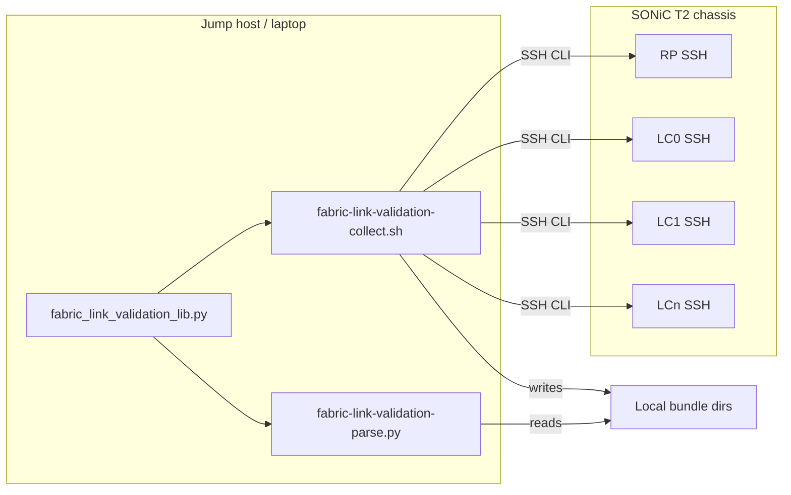
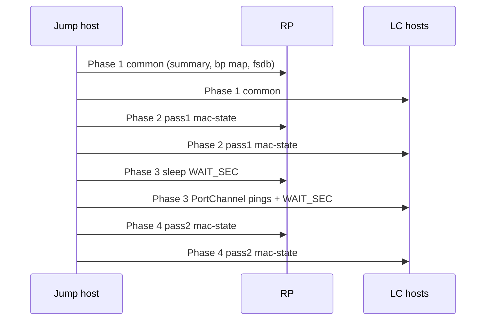

# High-Level Design: Fabric Link Remediation (Offline Tools)

## Revision History

| Version | Date       | Author   | Description |
|---------|------------|----------|-------------|
| 0.1     | 2025-02-17 | Anand Mehra (anamehra) | Initial scoping document |
| 0.2     | 2026-07-16 | Anand Mehra (anamehra) | Offline collect/parse toolkit (external execution) |

---

## Table of Contents

1. [Scope](#1-scope)
2. [Acronyms and Definitions](#2-acronyms-and-definitions)
3. [Feature Overview](#3-feature-overview)
4. [Requirements](#4-requirements)
5. [Design](#5-design)
6. [Configuration](#6-configuration)
7. [Modules Design](#7-modules-design)
8. [Testing](#8-testing)
9. [References](#9-references)
10. [Future Work Reference](#10-future-work-reference)

---

## 1. Scope

### 1.1 Scope of This Document

- **In scope:** Offline remediation toolkit for Cisco T2 chassis fabric backplane links on SONiC. CX runs tools from a **laptop or jump host** (outside the switch). The toolkit SSHs to RP and LC management addresses, collects CLI output into local **bundle** directories, and parses bundles offline to find faulty links and affected FC/LC cards.
- **Out of scope:** SDK marginal link detection; NOS runtime marginal link check and notification.

### 1.2 Target Platform

- SONiC on Cisco T2 chassis (Cisco 8000 class).
- Fabric backplane links between RP/FC (supervisor) and line cards (LC).
- CX must have SSH reachability to RP and each LC management IP used in `-H`.

### 1.3 Related Work

- XR uses similar remediation scripts on XR T2 chassis.
- This HLD covers the **offline** collect/parse toolkit only (jump-host execution).

---

## 2. Acronyms and Definitions

| Term | Definition |
|------|------------|
| BER | Bit Error Rate (extrapolated BER from mac-state) |
| Bundle | Local directory of collected CLI outputs from one host (one collection run) |
| CX | Customer Experience / support team |
| FC | Fabric Card (RP/FC NPU on supervisor) |
| FLR | Frame Loss Rate |
| LC | Line Card |
| Offline parse | Analysis of saved bundle files without SSH to the switch |
| RP | Route Processor / supervisor |
| rx_link_status_down_count | Link down event count from mac-state |
| RMA | Return Material Authorization |

---

## 3. Feature Overview

### 3.1 Purpose

The offline toolkit lets CX:

- Collect fabric validation data from **RP and all LCs** in one coordinated run.
- Detect degraded backplane links using BER, FLR, codeword, oper status, and `rx_link_status_down_count`.
- Map faults to **LC and FC slot/asic/port** for remediation.
- Report **consolidated LC fabric bandwidth** (and FC-NPU view when RP was collected).

### 3.2 Execution Model



Tools are distributed as a tarball (`fabric-link-validation-collect.sh`, `fabric-link-validation-parse.py`, `fabric_link_validation_lib.py`, `README.md`) and run on the jump host.

### 3.3 CX Remediation Workflow (Post-Analysis)

Analysis **identifies** faulty links and cards; CX **performs** remediation:

| Step | Action |
|------|--------|
| 1 | Reset ports on identified card(s) as applicable. |
| 2 | Remove FC or LC card(s); inspect backplane pins. |
| 3 | Clean connectors / reseat if no physical damage. |
| 4 | Re-run collect + parse; RMA if faults persist. |

### 3.4 Use Cases

- New chassis bringup
- Post-migration validation
- LC or FC RMA investigation

---

## 4. Requirements

### 4.1 Functional Requirements

| ID | Requirement | Status |
|----|-------------|--------|
| FR-1 | Parse shall evaluate BER, FLR, codeword, oper status, and rx_link_status_down_count against defined thresholds. | Defined |
| FR-2 | Parse shall map each fabric link to local and far-end slot/asic/port. | Defined |
| FR-3 | Output shall identify which FC or LC card is faulty and support CX logs. | Defined |
| FR-4 | Collect shall SSH to RP and each LC in `-H` and produce one bundle per host. | Defined |
| FR-5 | Multi-host collect shall align RP pass1 / inter-pass / pass2 with LC phases. | Defined |
| FR-6 | Collect shall fail before starting if any host in `-H` is unreachable. | Defined |
| FR-7 | Multi-LC parse shall emit one consolidated LC fabric bandwidth summary. | Defined |

### 4.2 Data Sources (Collected via SSH)

| Command / file | Purpose |
|----------------|---------|
| `show platform summary` | Role detection (`x86_64-8800_rp` → RP, else LC) |
| `show platform npu bp-interface-map` | LC ↔ FC port and slot/asic mapping |
| `show interface status -d all` | Admin/oper state; skip admin-down ports |
| `show platform npu mac-state` | BER, FLR, codeword, rx down (pass1 and pass2) |
| `/var/run/config_gen/*-{FC,LC}-fsdb.yaml` | Slice/ifg/serdes mapping |
| LC inter-pass: `show ip interface`, PortChannel pings in ASIC netns | Traffic during wait window (requires `sudo` on LC) |

---

## 5. Design

### 5.1 Two-Phase Architecture

| Phase | Component | Where it runs |
|-------|-----------|---------------|
| Collect | `fabric-link-validation-collect.sh` | Jump host; SSH to each `-H` target |
| Parse | `fabric-link-validation-parse.py` | Jump host; reads local bundles only |

Shared logic (thresholds, mapping, bandwidth math) lives in `fabric_link_validation_lib.py`.

### 5.2 Multi-Host Collection Phases

When `-H` lists RP and multiple LCs, collect runs **four synchronized phases** across all hosts:



If any host fails in a phase, remaining jobs are stopped (fail-fast).

### 5.3 Bundle Layout

| Host count | Output path |
|------------|-------------|
| One host | `OUTDIR/` (files at top level) |
| Multiple hosts | `OUTDIR/<sanitized_host>/` per SSH target |

Each bundle contains:

- `platform_summary.txt`, `bp_interface_map.txt`, `interface_status.txt`
- `fsdb/*.yaml`
- `mac_state/pass{1,2}_{rp,lc}_asic<N>.txt`
- `meta.json` (host, role, wait_sec, collected_at)
- `fabric-link-validation-collect.log` (per-host collection log)

### 5.4 Link Fault Criteria

A link is **faulty** when any of the following is true (`--dummy no`):

- Non-zero codeword bins > `FEC_BIN_LENGTH` (6)
- `eber > 1e-08`
- `eflr > 1e-21`
- `rx_link_status_down_delta > 0` between pass1 and pass2
- Interface `oper == down`

### 5.5 Parse Output

| Output | Location | Console |
|--------|----------|---------|
| Detailed analysis | `OUTDIR/fabric-link-validation-parse_*.txt` | Suppressed with `--quiet-details` |
| `FAULT:` lines per degraded link | Parse log + stderr | Yes |
| Consolidated LC fabric bandwidth | End of multi-LC run | Yes |
| FC-NPU bandwidth | End of run | Only if RP bundle was in `-H` |

Fabric bandwidth applies a **10% nominal penalty per distinct faulted LC–FC ASIC pair** (pairs do not stack per physical link).

### 5.6 Role Detection

From collected `platform_summary.txt`:

- Platform string contains `x86_64-8800_rp` → **rp** (supervisor / FC side collection)
- Otherwise → **lc**

Role is stored in `meta.json` at collect time. Include the **RP** in `-H` when FC-NPU bandwidth is required in consolidated parse output.

---

## 6. Configuration

### 6.1 `fabric-link-validation-collect.sh`

```bash
./fabric-link-validation-collect.sh -o OUTDIR -H HOST[,HOST2,...] -U USER [options] [--parse]
```

| Option | Default | Description |
|--------|---------|-------------|
| `-o OUTDIR` | (required) | Bundle output directory |
| `-H HOST,...` | (required) | Comma-separated SSH targets (RP + LCs) |
| `-U USER` | (required) | SSH username |
| `-P PASS` | prompt once | Password (`sshpass`) |
| `-i KEYFILE` | none | SSH private key |
| `-p PORT` | 22 | SSH port |
| `-w SEC` | 60 | Inter-pass wait (mac-state pass1 → pass2) |
| `-a` | off | RP: `mac-state -a ALL` per ASIC (default: `-i` per admin-up BP port) |
| `-l SLOT` | none | LC physical slot (optional bp map filter) |
| `--parse` | off | Run LC-only parse after collect |

**Jump-host prerequisites:** `python3`, `pyyaml`, `sshpass` (password auth only).

**Example:**

```bash
./fabric-link-validation-collect.sh -o ./OUTDIR \
  -H rp-ip,lc0-ip,lc1-ip,lc2-ip -U admin -P pass -w 60 --parse
```

### 6.2 `fabric-link-validation-parse.py`

Used for re-parse without re-collect:

```bash
./fabric-link-validation-parse.py --bundle ./OUTDIR/lc0,./OUTDIR/lc1 --lc-only --quiet-details
```

| Option | Description |
|--------|-------------|
| `--bundle` | One bundle dir or comma-separated list |
| `--lc-only` | Skip RP bundles in consolidated LC report |
| `--quiet-details` | Log detail to file; bandwidth summary on stdout |
| `--log-dir` | Parse report directory (default `.`) |

---

## 7. Modules Design

### 7.1 Components

| File | Role |
|------|------|
| `fabric-link-validation-collect.sh` | SSH orchestration, phased parallel collect, optional `--parse` |
| `fabric-link-validation-parse.py` | Offline bundle parser CLI |
| `fabric_link_validation_lib.py` | bp map, mac-state parse, thresholds, bandwidth, consolidation |

### 7.2 Dependencies

**Jump host:** bash, python3, PyYAML, sshpass (if password auth).

**Switch (during collect only):** SONiC CLIs above; LC inter-pass pings need `sudo` for `ip netns exec` / `timeout`.

---

## 8. Testing

### 8.1 Pre-Collect Checks

- SSH reachability to every `-H` target (script exits if any fail).
- Manual: `ssh user@host "show platform summary"`.

### 8.2 Collect Acceptance

- One bundle directory per host under `OUTDIR`.
- `mac_state/pass1_*` and `pass2_*` present for each ASIC namespace.
- LC bundles include `wait_ping/inter_pass_ping_commands.txt` when PortChannels exist.
- Multi-host run completes all four phases; RP inter-pass overlaps LC ping window.

### 8.3 Parse Acceptance

- No faults: consolidated LC bandwidth shows ~100% capacity per ASIC.
- Injected / known bad link: `FAULT:` line with LC/FC ports and BER/FLR/CW flags.
- Multi-LC: single consolidated bandwidth block at end (not per-host bandwidth on console).

### 8.4 Example Collect + Parse Command

```bash
tar -xzf fabric-link-validation-tools.tar.gz -C ./fabric-tools
cd fabric-tools
pip install pyyaml

./fabric-link-validation-collect.sh -o /tmp/fabric-run \
  -H 1.75.44.200,1.75.44.205,1.75.44.206,1.75.44.207 \
  -U admin -i ~/.ssh/id_rsa -w 60 --parse
```

---

## 9. References

| Reference | Description |
|-----------|-------------|
| `README.md` (toolkit tarball) | Install and collect usage |
| `fabric_link_validation_lib.py` | Threshold constants and parse implementation |
| SONiC CLIs | `show platform npu bp-interface-map`, `show platform npu mac-state` |

---

## 10. Future Work Reference

SDK bringup/runtime marginal link checks and NOS notification paths are out of scope; see prior scoping notes for `enable_mac_bad_port_state_check` and s1-cli exploration.

---

**Document type:** HLD for offline fabric link remediation toolkit (external execution).
