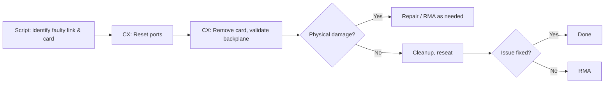
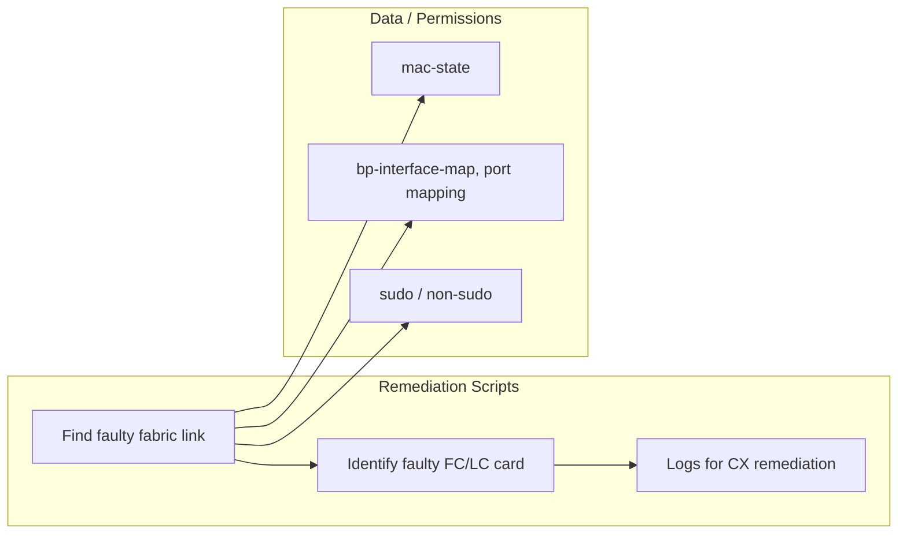

# High-Level Design: Fabric Link Remediation Scripts (SONiC)

## Revision History

| Version | Date       | Author   | Description                    |
|---------|------------|----------|--------------------------------|
| 0.1     | 2025-02-17 | Anand Mehra (anamehra) | Initial scoping document       |

---

## Table of Contents

1. [Scope](#1-scope)
2. [Acronyms and Definitions](#2-acronyms-and-definitions)
3. [Feature Overview](#3-feature-overview)
4. [Requirements](#4-requirements)
5. [Design](#5-design)
6. [Configuration](#6-configuration)
7. [Modules Design](#7-modules-design)
8. [Testing](#8-testing)
9. [References](#9-references)
10. [Future Work Reference](#10-future-work-reference)

---

## 1. Scope

### 1.1 Scope of This Document

- **In scope:** Remediation scripts for Cisco T2 chassis fabric-side link issues on SONiC. Scripts are used by the **CX team** to find fabric-facing faulty links, determine which FC or LC card is faulty, and drive remediation (reset ports, card removal, physical backplane validation, cleanup, reseat, RMA).
- **Out of scope:** SDK marginal link detection, NOS runtime marginal link check and notification, full NOS-internal implementation. These are additional work and will be covered by new scoping documents.

### 1.2 Target Platform

- SONiC on Cisco T2 chassis.
- Fabric card (FC) and line card (LC) backplane links. Fabric ports are initialized as network ports, same as front ports.

### 1.3 Related Work

- XR uses similar scripts for remediation on XR T2 chassis.
- This SONiC work uses a similar algorithm to find faulty links. The parameters for determining bad values (e.g. BER, FLR, codeword thresholds) will be adjusted as per SONiC T2 link configurations.

---

## 2. Acronyms and Definitions

| Term   | Definition |
|--------|------------|
| BER    | Bit Error Rate (e.g. extrapolated BER) |
| CX     | Customer Experience / support team using remediation scripts |
| FC     | Fabric Card |
| FLR    | Frame Loss Rate |
| LC     | Line Card |
| rx_link_status_down_count | Count of link status down events (e.g. from mac-state); used for link health evaluation. |
| RMA    | Return Material Authorization |
| SONiC  | Software for Open Networking in the Cloud |
| XR     | IOS-XR (Cisco NOS); uses similar remediation scripts on XR T2 chassis |

*Additional terms to be added when more design details are available.*

---

## 3. Feature Overview

### 3.1 Purpose

Remediation scripts run on SONiC to:

- Validate fabric link health using BER, FLR, codeword, oper status, and rx_link_status_down_count.
- Identify faulty fabric-facing links and map them to **local and far-end slot/asic/port** so CX can determine which **FC or LC card** is faulty.
- Produce logs and outputs that support the CX remediation workflow.

### 3.2 CX Remediation Workflow (Post-Script)

Scripts **identify** the faulty link and card(s); CX **performs** remediation:

| Step | Action |
|------|--------|
| 1 | Reset ports (as applicable) on the identified card(s). |
| 2 | Remove the identified FC or LC card(s) and physically validate the backplane for damaged, bent, or loose pins. |
| 3 | Cleanup if no physical damage is found (e.g. clean connectors, reseat). |
| 4 | Reseat the card(s) after cleanup. If the issue persists, proceed to RMA. |

### 3.3 Use Cases

- New chassis bringup.
- Chassis migration (post-migration validation on SONiC).
- Line card (LC) RMA.
- Fabric card (FC) RMA.

*Additional use cases may be added when more design details are available.*

---

## 4. Requirements

### 4.1 Functional Requirements

| ID   | Requirement | Status |
|------|-------------|--------|
| FR-1 | Script shall validate fabric link health using BER, FLR, codeword, oper status, and rx_link_status_down_count against defined thresholds. | Defined |
| FR-2 | Script shall map each fabric link to local and far-end slot/asic/port for fault identification. | Defined |
| FR-3 | Script shall produce logs/outputs that allow CX to identify which FC or LC card is faulty. | Defined |
| FR-4 | Script shall be runnable on each card (FC and LC) for full fabric coverage. | Defined |
| FR-5 | *(Additional functional requirements TBD when more design details are available.)* | TBD |

### 4.2 CLI / Show Commands

| Command / Data Source | Purpose | Notes |
|----------------------|---------|------|
| `show platform npu bp-interface-map` | Port mapping (LC ↔ RP/FC) | Used for local↔far-end mapping. |
| `show platform npu mac-state -i <port>` | Per-port BER, FLR, codeword, oper status, rx_link_status_down_count | Primary data source for link validation. |
| s1-cli | Future exploration to replace mac-state (TBD). | Not in current scope. |

*Additional CLI/show commands and automation interfaces to be added when more design details are available.*

### 4.3 Non-Functional Requirements

- *Performance, resource usage, and security requirements to be updated when more design details are available.*

---

## 5. Design

### 5.1 Architecture (High Level)

### 5.2 Link Status Criteria

A link is considered **faulty** when one or more of the following exceed defined limits:

- **BER** (e.g. extrapolated BER) vs threshold.
- **FLR** (e.g. Frame Loss Rate (SDK)) vs threshold.
- **Codeword** (e.g. FEC codeword error bins) vs threshold.
- **Oper status** (link up/down, PCS, etc. as available).
- **rx_link_status_down_count** vs threshold (count of link status down events).

*Exact thresholds and formulas to be consolidated when more design details are available.*

### 5.3 Data Flow

1. Script runs on a card (FC or LC), reads port mapping from `show platform npu bp-interface-map`.
2. For each local fabric port, script gathers link metrics via `show platform npu mac-state -i <port>`. Use of s1-cli to replace mac-state may be explored in future.
3. Script evaluates BER, FLR, codeword, oper status, and rx_link_status_down_count against thresholds.
4. For faulty links, script resolves and outputs local and far-end slot/asic/port (and thus FC/LC identity) and writes logs for CX.

*Detailed flow diagrams (e.g. UML) to be added when more design details are available.*

---

## 6. Configuration

- *Configuration parameters (e.g. thresholds, log paths, role/slot) to be defined when more design details are available.*
- *Script arguments (e.g. role, slot, log-dir) to be defined when more design details are available.*

---

## 7. Modules Design

### 7.1 Components in Scope

| Component | Description |
|-----------|-------------|
| Remediation script(s) | Run on SONiC (per card); parse bp-interface-map and mac-state; evaluate link criteria; output faulty link and FC/LC identification for CX. Exploring s1-cli to replace mac-state in future. |
| Port mapping | Uses `show platform npu bp-interface-map` to map LC backplane port ↔ RP/FC backplane port and slot/asic. |
| Link metrics | Uses `show platform npu mac-state -i <port>` for BER, FLR, codeword, oper status, rx_link_status_down_count. Exploring s1-cli to replace mac-state in future. |

### 7.2 Dependencies

- SONiC platform CLIs and dshell availability. Exploring s1-cli to replace mac-state in future.
- *Additional dependencies to be documented when more design details are available.*

### 7.3 Affected Modules

- *Platform-specific scripts and any NOS hooks to be listed when more design details are available.*

---

## 8. Testing

- *Test strategy, test cases, and acceptance criteria to be updated when more design details are available.*
- *Reference: AGENTS.md / Allure for test failure categorization and diagnostic report format.*

---

## 9. References

| Reference | Description |
|-----------|-------------|
| SONiC platform CLIs | `show platform npu bp-interface-map`, `show platform npu mac-state`. Future: exploring s1-cli to replace mac-state. |
| AGENTS.md / Allure | Test failure categorization and diagnostic report format. |

*Additional references to be added when more design details are available.*

---

## 10. Future Work Reference

The following areas are **out of scope** for the current remediation-script HLD but are listed here as reference for future scoping documents.

### 10.1 SDK Marginal Link Detection

**Bringup (SDK Marginal Link Bringup Check)**

- SDK performs link check during bringup.
- Can force retune during bringup to clear marginal errors.
- Enabling condition: device property `enable_mac_bad_port_state_check` must be set.

**Runtime (SDK Runtime Marginal Link Check and Notification)**

- SDK can notify when marginal link errors are seen during normal operation.
- Enabling condition: device property `enable_mac_bad_port_state_check` must be set.
- Caveat: enabling this property turns on the check for all ports, including external. There is a history of production issues; enabling is considered risky for 202405 and should be gated by risk acceptance and rollout plan.
- Recommendation: a new device parameter (e.g. to enable the check for fabric-side ports only) would allow marginal link detection on backplane links without affecting external/front ports and would reduce production risk.

*To be scoped in a separate document.*

### 10.2 NOS Runtime Marginal Link Check and Notification

**Role**

- NOS/platform-side process (or script) that periodically or on-demand checks link error state.
- Uses available NOS/CLI or platform APIs to read BER, FLR, codeword, oper status, and rx_link_status_down_count.
- When marginal or faulty thresholds are exceeded, NOS is notified (log, event, or integration point TBD).

**Data source options and constraints**

| Option | Pros | Cons |
|--------|------|------|
| mac-state (e.g. `show platform npu mac-state`) | Full metrics (BER, FLR, codeword, rx_link_status_down_count, etc.) | Not recommended with production traffic; impact on traffic or stability. |
| s1-cli (e.g. `show ports ber`, FEC data) | Future exploration to replace mac-state. | Usable with production traffic; scriptable; limited data for full marginal-link decision. |

Scoping assumption: exploring s1-cli to replace mac-state in future; use of mac-state in runtime path should be explicitly justified and risk-assessed.

*To be scoped in a separate document.*

---

**Document type:** Scoping HLD – remediation scripts only. Sections marked TBD or “to be updated when more design details are available” will be completed in later revisions.
