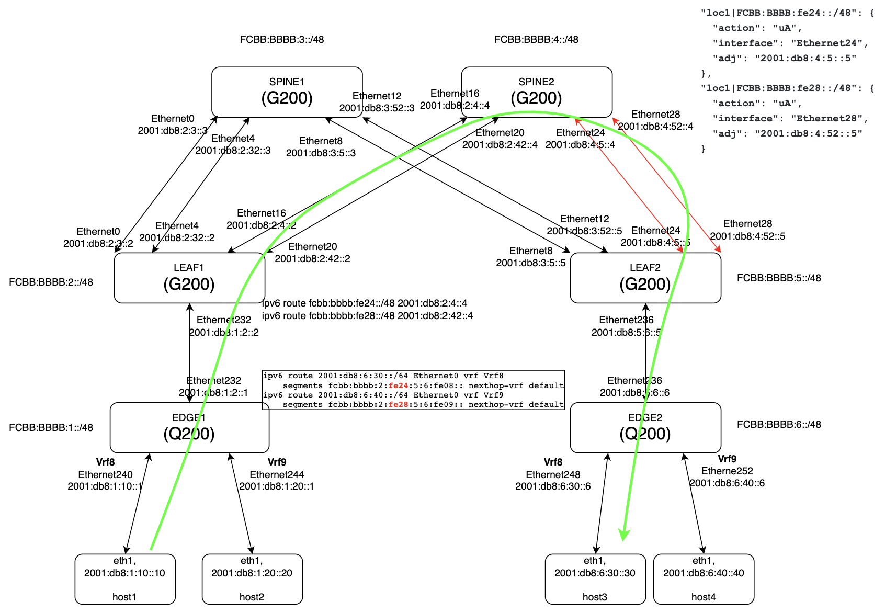

# SRv6 uSID uA behavior introduction

## Table of Content

1. [Revision](#revision)
2. [Scope](#scope)
3. [Definitions/Abbreviations](#definitionsabbreviations)
4. [Overview](#overview)
5. [Requirements](#requirements)
6. [Architecture Design](#architecture-design)
7. [High-Level Design](#high-level-design)
8. [SAI API](#sai-api)
9. [Configuration and management](#configuration-and-management)
10. [Warmboot and Fastboot Design Impact](#warmboot-and-fastboot-design-impact)
11. [Memory Consumption](#memory-consumption)
12. [Restrictions/Limitations](#restrictionslimitations)
13. [Testing Requirements](#testing-requirements)
14. [Open/Action items](#openaction-items)
15. [References](#references)

## Revision

| Rev | Date       | Author       | Change Description                                     |
|:---:|:----------:|:------------:|--------------------------------------------------------|
| 0.1 | 2026-03-06 | Baorong Liu  | Initial version                                        |
| 0.2 | 2026-08-17 | Baorong Liu  | Reorganized to follow `doc/guidelines/hld_template.md` |

## Scope

This document covers the SONiC side design change only. It does not include the dataplane (SAI/SDK).
For SAI/SDK changes, please refer to SDK PR in references.

> **Note:** This document is for introduction purposes only and will not be upstreamed.
> The related HLD, configuration, and code are already in the upstream PRs listed in [References](#references).

## Definitions/Abbreviations

| **Term**   | **Definition**                                                          |
|------------|-------------------------------------------------------------------------|
| SRv6       | Segment Routing over IPv6                                               |
| SID        | Segment Identifier                                                      |
| uSID       | Micro-segment ID                                                        |
| SRH        | Segment Routing Header                                                  |
| End.X      | L3 cross-connect behavior: forward to a specific adjacency              |
| NEXT-CSID  | Compressed SID flavor that advances to the next uSID in the same address |
| uN         | End behavior with NEXT-CSID flavor                                      |
| uA         | End.X behavior with NEXT-CSID, PSP and USD flavors                      |
| uDT46      | End.DT46 behavior with NEXT-CSID flavor                                 |
| L3Adj      | Layer 3 adjacency (egress interface plus next-hop)                      |
| PSP        | Penultimate Segment Pop                                                 |
| USD        | Ultimate Segment Decapsulation                                          |
| VRF        | Virtual Routing and Forwarding                                          |
| FRR        | Free Range Routing protocol suite                                       |
| bgpcfgd    | SONiC daemon that compiles CONFIG_DB entries into FRR configuration     |
| Srv6Orch   | SRv6 orchestration agent in orchagent                                   |
| CONFIG_DB  | Configuration Database                                                  |
| APPL_DB    | Application Database                                                    |
| ASIC_DB    | ASIC Database                                                           |
| SAI        | Switch Abstraction Interface                                            |

## Overview

### SRv6 micro-segment ID (uSID) technology

In classic SRv6, each segment is a full 128-bit IPv6 address. A path with many segments needs a long Segment Routing Header (SRH) and large IPv6 addresses, which increases header size and limits how many segments fit in one packet.

Micro-segment ID (uSID) compresses the segment list by encoding multiple segments inside a single IPv6 address. The same 128-bit destination can represent several instructions (e.g. several hops or behaviors) in sequence. That reduces header size.

#### uSID format

The 128-bit address is divided into fixed-length fields. A locator defines that layout (using the default format 3216 as an example):

| Field | Length (bits)          | Role                                    |
|-------|------------------------|-----------------------------------------|
| Block | block_len (default 32) | Common prefix (e.g. domain or operator) |
| Node  | node_len (default 16)  | Node identifier within the block        |
| Func  | func_len (default 16)  | Function/behavior (uN, uA, uDT46, etc.) |
| Arg   | arg_len (default 0)    | Optional argument bits                  |

#### "behavior usid" and the locator

A locator that uses uSID encoding is configured with `behavior usid` so the data plane interprets the address as block + node + func (+ arg) and applies uSID semantics (e.g. advancing to the next micro-segment in the same address).

#### uSID behaviors (functions)

The func bits select the behavior at this micro-segment. Common ones in the ecosystem include:

- uN - End with NEXT-CSID: "End" (process segment, update pointers) then advance to the next uSID in the same address.
- uA - End.X with NEXT-CSID: forward to a specific adjacency (interface + nexthop), then advance to the next uSID.
- uDT46 - End.DT46 with NEXT-CSID: decapsulate and lookup in a VRF (IPv4/IPv6), then advance.

So "micro-segment ID" refers both to the encoding (many short IDs in one IPv6 address) and to these per-uSID behaviors that execute one after another within the same destination address.

### uA behavior

uA is the uSID version of End.X ("End.X with NEXT-CSID"):

- End.X: when the packet's active segment is this SID, the node forwards it to a specific adjacency (egress interface and, usually, next-hop IPv6 address). It is an "adjacency" or "cross-connect" SID.
- NEXT-CSID (uSID): after doing that, the segment list is advanced to the next micro-segment in the same IPv6 address instead of the next 128-bit SID in the SRH.

So uA means "forward this packet to this adjacency, then move to the next uSID."

### Gap addressed by this work

[Static Configuration of SRv6 in SONiC](../srv6/srv6_static_config_hld.md) introduced the `SRV6_MY_LOCATORS` and `SRV6_MY_SIDS` CONFIG_DB tables, but the initial set of statically configurable behaviors was limited to `uN` and `uDT46`. Neither the CONFIG_DB schema, the YANG model, nor the bgpcfgd SRv6 Manager accepted an adjacency-bound behavior.

This work extends that static configuration path end to end so that `uA` can be configured from CONFIG_DB and programmed into the ASIC.

## Requirements

### Functional Requirements

* **R0 - uA as a statically configurable behavior**: `uA` must be accepted as an `action` value in the `SRV6_MY_SIDS` CONFIG_DB table, alongside the already supported `uN` and `uDT46`.

* **R1 - Adjacency parameters**: A `uA` SID entry must carry the L3 adjacency it cross-connects to:
  - `interface`: the egress interface
  - `adj`: the next-hop IPv6 address

* **R2 - bgpcfgd compilation**: The bgpcfgd SRv6 Manager must compile `uA` entries from CONFIG_DB into the FRR static-SID configuration. Invalid entries (missing or malformed interface/adjacency, unsupported action) must be rejected and logged to syslog without being pushed to FRR.

* **R3 - Locator layout independence**: `uA` SIDs must be configurable both under a node-specific locator (uN + uA on the same node) and directly under the block (uA only), i.e. the SID prefix length must not be assumed to be a fixed value.

* **R4 - ASIC programming**: The `uA` SID must reach the ASIC through APPL_DB `SRV6_MY_SID_TABLE` and Srv6Orch, which resolves the adjacency to a next-hop object and creates a `SAI_OBJECT_TYPE_MY_SID_ENTRY` with endpoint behavior `UA`.

* **R5 - Deferred adjacency resolution**: If the neighbor backing the adjacency is not yet resolved, the SID must be held pending and installed once the neighbor becomes ready, and removed/re-added as the neighbor goes down and comes back.

* **R6 - Kernel SID installation**: A dummy interface (`sr0`) must exist for SRv6 so that FRR/zebra can install SRv6 SIDs in the kernel.

* **R7 - YANG model**: The `sonic-srv6` YANG model must be extended so that `uA` and its `interface`/`adj` fields validate successfully.

### Configuration and Management Requirements

1. Users must be able to configure `uA` SIDs statically from CONFIG_DB, without involving BGP.
2. Configuration must persist across docker restart and system reboot, consistent with the rest of the `SRV6_MY_SIDS` table.

## Architecture Design

The `uA` configuration follows the same path as the other statically configured SRv6 behaviors. No new daemon or new database table is introduced; each existing stage is extended to understand the adjacency parameters.

```text
   CONFIG_DB                bgpcfgd                    FRR                     APPL_DB              orchagent            ASIC_DB
+---------------+      +---------------+      +-----------------+      +-------------------+   +-------------+   +-----------------+
| SRV6_MY_      |      | SRv6 Manager  |      | staticd / zebra |      | SRV6_MY_SID_TABLE |   |  Srv6Orch   |   | MY_SID_ENTRY    |
| LOCATORS      +----->| validate and  +----->| static-sids     +----->| action=uA         +-->| resolve adj +-->| behavior = UA   |
| SRV6_MY_SIDS  |      | compile       |      | (+ sr0 dummy)   | fpm  | adj=<nexthop>     |   | via NeighOrch|  | next_hop_id=... |
| action=uA     |      | to FRR CLI    |      |                 |sync  |                   |   |             |   |                 |
+---------------+      +---------------+      +-----------------+      +-------------------+   +------+------+   +-----------------+
                                                                                                      |
                                                                                               +------+------+
                                                                                               |  NeighOrch  |
                                                                                               | (next hop)  |
                                                                                               +-------------+
```

### Key Architecture Components

1. **CONFIG_DB** holds the user intent in `SRV6_MY_LOCATORS` and `SRV6_MY_SIDS`. For `uA`, the SID entry adds the `interface` and `adj` fields.
2. **bgpcfgd SRv6 Manager** subscribes to both tables, validates the entries, and compiles them into FRR configuration. This is the component that must learn the `uA` action and its adjacency parameters.
3. **FRR (staticd/zebra)** owns the static SID configuration and installs the SID. The `sr0` dummy interface is required for the kernel-side installation.
4. **fpmsyncd** propagates the installed SIDs from FRR into APPL_DB `SRV6_MY_SID_TABLE`.
5. **Srv6Orch** subscribes to `SRV6_MY_SID_TABLE`, resolves the `adj` address into a next-hop object through **NeighOrch**, and programs the SID into ASIC_DB. Pending SIDs are retained until the neighbor resolves.
6. **syncd/SAI** creates the `SAI_OBJECT_TYPE_MY_SID_ENTRY` object in hardware.

## High-Level Design

### CONFIG_DB schema

The existing `SRV6_MY_SIDS` schema is reused. Two fields become relevant for `uA`:

```text
key = SRV6_MY_SIDS|locator|ip_prefix
; field = value
action    = behavior       ; "uA" for End.X with NEXT-CSID
interface = ifname         ; egress interface for the cross-connect
adj       = ipv6_address   ; next-hop address of the adjacency
```

The supported static behavior list is extended to:

| Alias | SRv6 Behavior         |
|:------|:----------------------|
| uN    | End with NEXT-CSID    |
| uDT46 | End.DT46 with CSID    |
| uA    | End.X with NEXT-CSID  |

### bgpcfgd changes

The SRv6 Manager compiles a `uA` entry into the FRR `static-sids` block, carrying the interface and next-hop through to FRR. For the uN + uA configuration in [Configuration and management](#configuration-and-management), the compiled FRR configuration is of the form:

```text
segment-routing
   srv6
      static-sids
         sid fcbb:bbbb:4:fe24::/64 locator loc1 behavior uA interface Ethernet24 nexthop 2001:db8:4:5::5
         sid fcbb:bbbb:4:fe28::/64 locator loc1 behavior uA interface Ethernet28 nexthop 2001:db8:4:52::5
```

> The exact FRR CLI keywords should be confirmed against the FRR version bundled in the target image before this section is treated as final.

Validation performed by the manager: the action must be a supported behavior, and a `uA` entry must have a valid interface and adjacency address. Invalid entries are logged and not pushed to FRR.

### FRR changes

Two fixes were ported from FRR mainline, covering SID *installation* and SID *programming* for `uA`. See [References](#references) for the corresponding PRs.

### sr0 dummy interface

A dummy interface named `sr0` is created for SRv6. It provides the interface context FRR/zebra needs to install SRv6 SIDs into the kernel.

### Srv6Orch behavior

Srv6Orch already supports the L3 adjacency attribute for the cross-connect behaviors, as described in [SRv6 SID L3Adj](../srv6/srv6_sid_l3adj.md):

- On receiving a `SRV6_MY_SID_TABLE` update whose entry carries `adj`, Srv6Orch calls `neighOrch->hasNextHop()`.
- If the next hop exists, it invokes `sai_srv6_api->create_my_sid_entry()` and sets `SAI_MY_SID_ENTRY_ATTR_NEXT_HOP_ID` to the next-hop object.
- If the next hop is not ready, the SID is held in `m_pendingSRv6MySIDEntries` and installed on the subsequent neighbor ADD notification. A neighbor DELETE removes the SID from the ASIC and returns it to the pending list.

No Srv6Orch change is required specifically for `uA`; it reuses this existing path.

### YANG model

The `sonic-srv6` model is extended so the `action` enumeration accepts `uA` and so the `interface` and `adj` leaves are defined for `SRV6_MY_SIDS`.

## SAI API

No SAI change is required. The existing `SAI_OBJECT_TYPE_MY_SID_ENTRY` object already provides both the `UA` endpoint behavior and the `SAI_MY_SID_ENTRY_ATTR_NEXT_HOP_ID` attribute used to bind the adjacency.

The relevant entry points, from [`saisrv6.h`](https://github.com/opencomputeproject/SAI/blob/master/inc/saisrv6.h):

```c
sai_create_my_sid_entry_fn             create_my_sid_entry;
sai_remove_my_sid_entry_fn             remove_my_sid_entry;
sai_set_my_sid_entry_attribute_fn      set_my_sid_entry_attribute;
sai_get_my_sid_entry_attribute_fn      get_my_sid_entry_attribute;
```

### sairedis.rec example

```text
|c|SAI_OBJECT_TYPE_MY_SID_ENTRY:{"args_len":"0","function_len":"0","locator_block_len":"32","locator_node_len":"16","sid":"fcbb:bbbb:fe24::","switch_id":"oid:0x21000000000000","vr_id":"oid:0x3000000000042"}|SAI_MY_SID_ENTRY_ATTR_NEXT_HOP_ID=oid:0x40000000009b9|SAI_MY_SID_ENTRY_ATTR_ENDPOINT_BEHAVIOR=SAI_MY_SID_ENTRY_ENDPOINT_BEHAVIOR_UA|SAI_MY_SID_ENTRY_ATTR_ENDPOINT_BEHAVIOR_FLAVOR=SAI_MY_SID_ENTRY_ENDPOINT_BEHAVIOR_FLAVOR_PSP_AND_USD
```

Note that the endpoint behavior is `..._ENDPOINT_BEHAVIOR_UA` with flavor `..._FLAVOR_PSP_AND_USD`, and the next-hop OID is the adjacency resolved by Srv6Orch.

## Configuration and management

### Configuration example (uN + uA)

The SIDs sit under a node-specific locator, so the func bits are allocated within `FCBB:BBBB:4::`:

```json
{
  "SRV6_MY_LOCATORS": {
    "loc1": {
      "prefix": "FCBB:BBBB:4::"
    }
  },
  "SRV6_MY_SIDS": {
    "loc1|FCBB:BBBB:4:fe24::/64": {
      "action": "uA",
      "interface": "Ethernet24",
      "adj": "2001:db8:4:5::5"
    },
    "loc1|FCBB:BBBB:4:fe28::/64": {
      "action": "uA",
      "interface": "Ethernet28",
      "adj": "2001:db8:4:52::5"
    }
  }
}
```

### Configuration example (uA only)

The uA SIDs are allocated directly under the block, giving a shorter prefix:

```json
{
  "SRV6_MY_LOCATORS": {
    "loc1": {
      "prefix": "FCBB:BBBB:4::"
    }
  },
  "SRV6_MY_SIDS": {
    "loc1|FCBB:BBBB:fe24::/48": {
      "action": "uA",
      "interface": "Ethernet24",
      "adj": "2001:db8:4:5::5"
    },
    "loc1|FCBB:BBBB:fe28::/48": {
      "action": "uA",
      "interface": "Ethernet28",
      "adj": "2001:db8:4:52::5"
    }
  }
}
```

### Manageability

Configuration is applied through the standard CONFIG_DB mechanisms (`config_db.json` or `config reload`) and validated by the `sonic-srv6` YANG model.

## Warmboot and Fastboot Design Impact

No uA-specific warmboot or fastboot handling is introduced. `uA` reuses the CONFIG_DB tables, the bgpcfgd SRv6 Manager, the FRR static-SID path and the Srv6Orch path that the already supported `uN` and `uDT46` behaviors use, so it inherits the warm reboot behavior described in the base [Static Configuration of SRv6 in SONiC HLD](../srv6/srv6_static_config_hld.md), where warm reboot is intended to be supported for planned system warm reboot.

Existing warmboot/fastboot functionality is not expected to be affected, since no new daemon, no new database table and no new boot-time service are added.

### Warmboot and Fastboot Performance Impact

- **Stalls/sleeps/IO in the boot critical chain**: none added. uA configuration is processed by bgpcfgd, which already subscribes to `SRV6_MY_LOCATORS` and `SRV6_MY_SIDS`; handling one additional action value does not add blocking operations.
- **Additional CPU heavy processing**: none. No new Jinja template rendering or similar processing is introduced in the boot path.
- **Third party dependency updates**: the FRR fixes for uA SID installation and programming are ports of upstream FRR patches into the existing FRR package. No new dependency is introduced, so no boot time impact is expected from them.
- **`sr0` dummy interface**: creating the dummy interface adds one interface creation during startup. This is a single netlink operation and is not expected to be measurable, but it is the only new boot-path step this feature adds.
- **Service delay**: the feature is part of the existing bgp/swss containers and is not separately delayable.

> Control plane and data plane downtime have not yet been measured for a configuration containing uA SIDs. Measurements should be added here before this document is treated as final.

## Memory Consumption

No measurable memory increase is expected when the feature is unused. `uA` does not add a new CONFIG_DB or APPL_DB table, a new daemon, or a new orchagent object type; it adds the `interface` and `adj` fields to `SRV6_MY_SIDS` entries and reuses the existing `SAI_OBJECT_TYPE_MY_SID_ENTRY` object.

When the feature is configured, memory grows proportionally with the number of configured uA SIDs, in the same way as for the existing `uN` and `uDT46` SIDs, plus the next-hop objects for the adjacencies, which are shared with regular routing and are not allocated specifically for SRv6.

Srv6Orch retains SIDs whose adjacency is unresolved in the `m_pendingSRv6MySIDEntries` structure. This is bounded by the number of configured SIDs with unresolved neighbors.

## Restrictions/Limitations

- The statically configurable SRv6 behaviors are limited to `uN`, `uDT46` and `uA`. Other behaviors in RFC 8986 are not configurable through `SRV6_MY_SIDS` at this time.
- A `uA` SID is only programmed into the ASIC once the neighbor backing its adjacency is resolved. Until then, the SID is held pending by Srv6Orch and is not installed in hardware.
- Removing the neighbor associated with a uA SID removes the SID from the ASIC; it is reinstalled when the neighbor returns.
- Whether the egress interface of a uA SID may be a port channel member has not been validated. See [Open/Action items](#openaction-items).
- Node reachability diagnostics (SRv6 ping/traceroute per RFC 9259) for uSID are not covered by this work.
- Dataplane support is out of scope for this document; refer to the SAI/SDK PR referenced in [Scope](#scope).

## Testing Requirements

### Test setup



### Unit tests

Extending the bgpcfgd SRv6 Manager unit tests in the same style as the existing `uN`/`uDT46` cases:

| Test Case                                                              | Expected Result                                                          |
|:-----------------------------------------------------------------------|:-------------------------------------------------------------------------|
| Add a SID with `uA` action, valid interface and adjacency               | The corresponding static-sid entry is created in the FRR config           |
| Delete a SID with `uA` action                                           | The static-sid entry is removed from the FRR config                       |
| (Negative) Add a `uA` SID without an interface                          | The configuration is rejected, logged, and not pushed to FRR              |
| (Negative) Add a `uA` SID with a malformed adjacency address            | The configuration is rejected, logged, and not pushed to FRR              |
| Add a `uA` SID under a block-length locator (uA only layout)            | The static-sid entry is created with the correct prefix length            |

YANG model validation is covered by the `sonic-yang-models` test suite for the extended `SRV6_MY_SIDS` fields.

### System/mgmt tests

sonic-mgmt coverage for uA is tracked by the sonic-mgmt PRs in [References](#references), driven by the updated SRv6 test plan. Test plan updates are still in progress (see [Open/Action items](#openaction-items)).

## Open/Action items

- Investigate node reachability diagnostics for SRv6 uSID, similar to SRv6 SID ping / traceroute.
  - Reference: [RFC 9259](https://www.rfc-editor.org/rfc/rfc9259.html)
- Check if the interface can be a member of a port channel.
- Update mgmt tests.
- Confirm the exact FRR static-sid CLI syntax for `uA` against the FRR version in the target image.

## References

### Related upstream PRs to support SRv6 uA behavior

| Repo | PR title | State |
|------|----------|-------|
| SONiC HLD update | [add uA to static srv6 SID config](https://github.com/sonic-net/SONiC/pull/2124) |  |
| sonic-buildimage | [[srv6]sonic-bgpcfgd to handle SRv6 SID uA](https://github.com/sonic-net/sonic-buildimage/pull/24279) |  |
| sonic-buildimage | [FRR: Port fix for SRv6 uA SID installation from FRR mainline](https://github.com/sonic-net/sonic-buildimage/pull/25158) |  |
| sonic-buildimage | [FRR: Port fix for SRv6 uA SID programming from FRR mainline](https://github.com/sonic-net/sonic-buildimage/pull/24649) |  |
| sonic-buildimage | [[srv6]: update yang model for srv6 uA](https://github.com/sonic-net/sonic-buildimage/pull/24683) |  |
| sonic-buildimage | [[srv6]: creating sr0 dummy interface for srv6](https://github.com/sonic-net/sonic-buildimage/pull/24084) |  |
| sonic-mgmt | [[srv6]uA mgmt-test](https://github.com/sonic-net/sonic-mgmt/pull/21818) |  |
| sonic-mgmt | [[srv6]Update srv6 testplan for uA](https://github.com/sonic-net/sonic-mgmt/pull/20983) |  |

### Related documents

- [Segment Routing over IPv6 (SRv6) HLD](../srv6/srv6_hld.md)
- [Static Configuration of SRv6 in SONiC HLD](../srv6/srv6_static_config_hld.md)
- [SRv6 SID L3Adj](../srv6/srv6_sid_l3adj.md)
- [SRv6 uSID](../srv6/SRv6_uSID.md)
- [RFC 8986 - SRv6 Network Programming](https://datatracker.ietf.org/doc/html/rfc8986)
- [RFC 9259 - OAM for SRv6](https://www.rfc-editor.org/rfc/rfc9259.html)
- [Support SRv6 on GR2 (SAI/SDK)](https://cto-github.cisco.com/Leaba/sdk/pull/63993)
