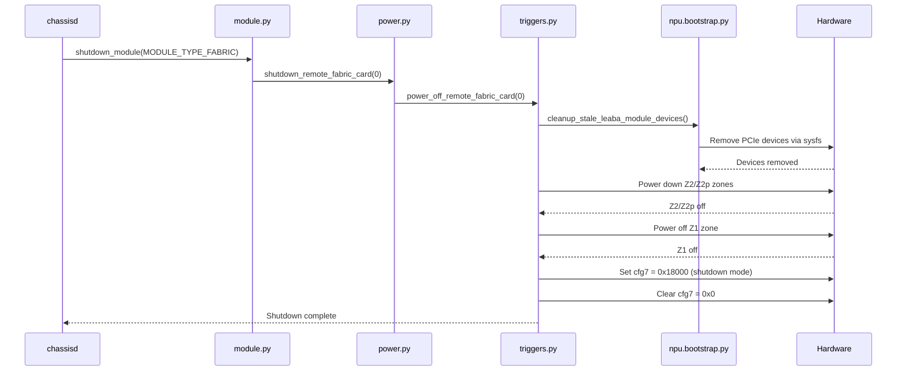
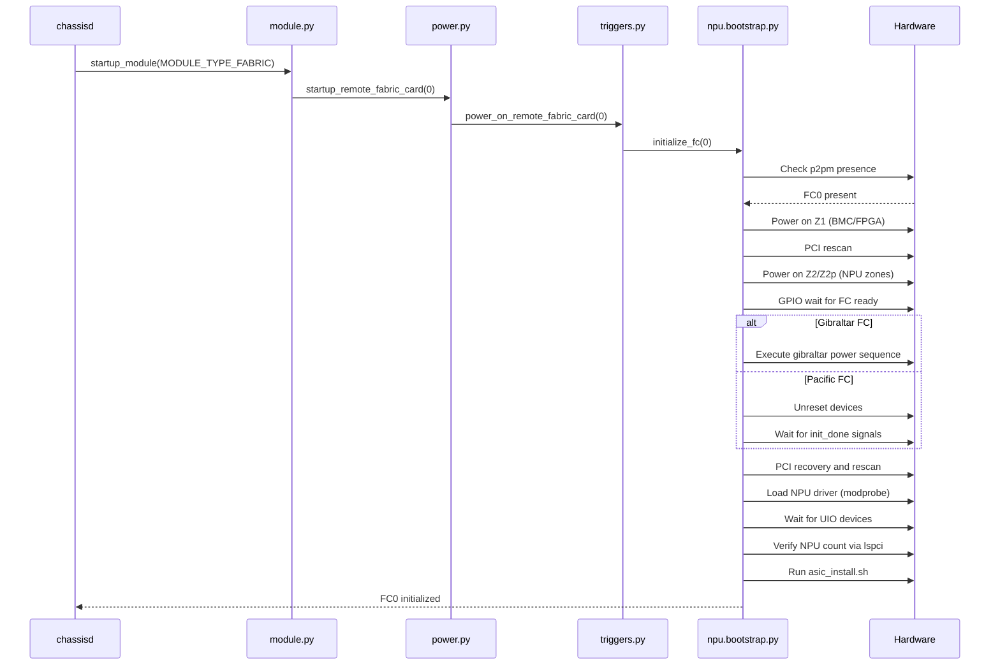

# Fabric Card Runtime Power Control for Cisco-8000 Chassis

## Table of Content

1. [Revision](#revision)
2. [Scope](#scope)
3. [Definitions/Abbreviations](#definitionsabbreviations)
4. [Overview](#overview)
5. [Requirements](#requirements)
6. [Architecture Design](#architecture-design)
7. [High-Level Design](#high-level-design)
8. [CLI Commands](#cli-commands)
9. [Flow Diagrams](#flow-diagrams)
10. [Testing Requirements](#testing-requirements)
11. [References](#references)

## Revision

| Rev |     Date    |       Author       | Change Description                |
|:---:|:-----------:|:------------------:|-----------------------------------|
| 0.1 | 12/09/2024  |   Guru Nanma Purushotam    | Initial version                   |

## Scope

This document provides a high-level design for runtime power control of Fabric Cards (FC) on Cisco-8808 chassis platforms. The design covers Platform Dependent design of CLI-based shutdown and startup of individual fabric cards without system reboot.

### In Scope
- Runtime shutdown of individual fabric cards (FC0-FC7)
- Runtime startup of individual fabric cards (FC0-FC7)
- Power zone management (Z1, Z2, Z2p)
- PCIe device management during power cycles
- NPU driver loading and initialization

### Out of Scope
- Boot-time fabric card initialization (already handled by bootstrap)
- Warm boot support for fabric cards
- Mixed fabric card types (Gibraltar + Pacific)
- Automatic recovery after power failures

## Definitions/Abbreviations

| **Term**                 | **Meaning**                         |
|--------------------------|-------------------------------------|
| FC                       | Fabric Card                         |
| NPU                      | Network Processing Unit             |
| Z1                       | Power Zone 1 (BMC/FPGA)            |
| Z2                       | Power Zone 2 (NPU/datapath)        |
| Z2p                      | Power Zone 2 additional (18-slot)  |
| cfg7                     | Control register for FC power      |
| UIO                      | Userspace I/O                      |
| p2pm                     | Platform-to-Platform Management    |
| Gibraltar                | Fowlmere fabric card type          |
| Pacific                  | Filton fabric card type            |
| BSP                      | Board Support Package              |
| OIR                      | Online Insertion and Removal       |
| RP                       | Route Processor                    |

## Overview

### Problem Statement

Cisco-8808 chassis contains up to 8 Fabric Cards. Currently, fabric cards can only be initialized at boot time. There is no way to shut down or start up individual fabric cards at runtime through CLI commands.

### Solution

Add runtime power control for individual fabric cards by:
- Adding CLI commands to shutdown/startup fabric cards (Support present on Platform Independent SONiC side)
- Creating power-off sequence that gracefully removes PCIe devices and powers down zones
- Creating power-on sequence that powers up zones, loads drivers, and initializes NPUs
- Using existing platform API and BSP infrastructure

### Use Cases

1. **Maintenance**: Shut down specific fabric card for hardware replacement
2. **Power saving**: Power down unused fabric cards
3. **Testing**: Test fabric redundancy by shutting down cards
4. **Recovery**: Restart fabric card after errors without rebooting chassis

## Requirements

### Functional Requirements

* **R0**: **CLI Shutdown**: The system must support shutting down individual fabric cards via CLI command without affecting other running fabric cards.

* **R1**: **CLI Startup**: The system must support starting up individual fabric cards via CLI command, including full NPU initialization.

* **R2**: **Graceful Shutdown**: Fabric card shutdown must gracefully remove PCIe devices before powering down zones to prevent kernel errors.

* **R3**: **Power Zone Sequencing**: Shutdown must power down zones in order: Z2/Z2p → Z1. Startup must power up zones in order: Z1 → Z2/Z2p.

* **R4**: **Physical Presence Check**: Startup must verify fabric card is physically present before attempting power-on.

* **R5**: **Driver Loading**: Startup must load appropriate NPU driver (leaba-q200 for Gibraltar, leaba-q100 for Pacific).

* **R6**: **NPU Verification**: Startup must verify expected number of NPUs are detected and initialized.

* **R7**: **Logging**: All operations must log to syslog for troubleshooting.

* **R8**: **Inventory Update**: When a fabric card is powered up, the system must update the inventory database with current hardware information.

### Limitations

1. **No warm boot**: Runtime power control always does complete power cycle (cold boot path).

3. **Manual recovery**: If startup fails, manual intervention required. No automatic retry.

5. **No rollback**: If startup fails after shutdown, manual recovery needed.

6. **No OIR support**: This design does not handle Online Insertion and Removal (OIR) scenarios. Automatic detection upon physical insertion is not supported. Users must use CLI commands explicitly.

## Architecture Design

### Platform Independent (PI) Orchestration

SONiC infrastructure automatically handles Syncd and SWSS container orchestration:
- When admin_status is changed in `CHASSIS_MODULE` table (CONFIG_DB), chassisd detects the change
- chassisd invokes the platform-specific API for hardware operations
- SONiC systemd layer manages container lifecycle:
  - Stops containers during module shutdown
  - Restarts containers after hardware is powered up and operational
- Module status is tracked in STATE_DB (`CHASSIS_MODULE_TABLE`, `CHASSIS_FABRIC_ASIC_TABLE`)

```
User / CLI
    ↓
config chassis modules shutdown/startup
    ↓
CONFIG_DB (CHASSIS_MODULE table)
    ↓
chassisd (module_config_update)
    ↓
SONiC Platform API (module.py)
    ↓
BSP Power Layer (power.py)
    ↓
BSP Triggers Layer (triggers.py)
    ↓
FC Bootstrap Manager (npu.bootstrap.py)
    ↓
Hardware (sysfs, PCIe, drivers)
```

### Key Components

1. **CLI**: `config chassis modules shutdown/startup FABRIC-CARD<N>`
2. **CONFIG_DB**: Stores fabric card admin state
3. **chassisd**: Monitors CONFIG_DB changes, calls Platform API
4. **module.py**: SONiC Platform API for module control
5. **power.py**: BSP orchestration layer
6. **triggers.py**: BSP low-level sysfs operations
7. **npu.bootstrap.py**: FC initialization logic

### Power Zones

Each fabric card has 3 power zones:
- **Z1**: BMC and FPGA power (`pseq-fc{fc}-z1.p2pm/`)
- **Z2**: NPU and datapath power (`pseq-fc{fc}-z2.p2pm.{chassis_size}/`)
- **Z2p**: Additional power for 18-slot chassis (`pseq-fc{fc}-z2p.p2pm/`)

## High-Level Design

### Shutdown Sequence (Individual FC)

1. **Remove PCIe device from bus**
   - Find FC NPU BDF addresses: `lspci -D -d :a001`  # Gibraltar
   - Write '1' to `/sys/bus/pci/devices/{bdf}/remove`
   - Device should disappear from `lspci -tv`

2. **Load FC present list**
   - Read `p2pm-m/FABRIC{fc}/presence` for specific FC

3. **Init NPU names**
   - Create list: `['FC{slot}.NPU0', 'FC{slot}.NPU1', ...]`

4. **Shutdown Zone 2 (NPU/ASIC power)**
   - Write 'off' to `pseq-fc{fc}-z2.p2pm.{chassis_size}/config`
   - Wait for `power_state == 'All rails powered off'`
   - For 18-slot: Also `pseq-fc{fc}-z2p.p2pm/config = 'off'`

5. **Shutdown Zone 1 (BMC/Management power)**
   - Write 'off' to `pseq-fc{fc}-z1.p2pm/config`
   - Wait for `power_state == 'All rails powered off'`

6. **Clear config register**
   - Write '0x0' to `xil-fc{fc}.p2pm/cfg7`


### Startup Sequence (Individual FC)

1. **Load FC present list and verify presence**
   - Read `p2pm-m/FABRIC{fc}/presence` for specific FC
   - Verify FC is physically present (value = 1)

2. **Initialize NPU names**
   - Add FC to fc_present list
   - Get FC type (Gibraltar or Pacific)
   - Create list: `['FC{slot}.NPU0', 'FC{slot}.NPU1', ...]`

3. **Turn on Zone 1 (BMC/Management power)**
   - Write 'on' to `pseq-fc{fc}-z1.p2pm/config`
   - Wait for `power_state == 'All rails powered on'`

4. **PCI rescan and cleanup**
   - Write '1' to `/sys/bus/pci/rescan`
   - Cleanup stale leaba devices

5. **Turn on Zone 2 (NPU/ASIC power)**
   - Write 'on' to `pseq-fc{fc}-z2.p2pm.{chassis_size}/config`
   - For 18-slot: Also write 'on' to `pseq-fc{fc}-z2p.p2pm/config`
   - Wait for `power_state == 'All rails powered on'`

6. **GPIO wait for FC ready**
   - Wait for fabric card ready signal

7. **Execute power sequence (FC type specific)**
   - **Gibraltar**: Execute GPIO operations
   - **Pacific**: Unreset devices

8. **NPU initialization sequence**
   - Wait for init_done signals in `xil-fc{fc}/NPU{npu}/init_done`

9. **PCI recovery and rescan**
   - Write '1' to `/sys/bus/pci/rescan`

10. **Load NPU driver**
    - `modprobe leaba-q200` (Gibraltar) or `modprobe leaba-q100` (Pacific)

11. **Wait for UIO devices**
    - Check `/dev/uio*` devices appear
    - Verify expected NPU count matches

12. **Install ASIC drivers (optional)**
    - `/opt/cisco/bin/asic_install.sh gibraltar` (or pacific)

### Inventory Database Update

When a fabric card is powered up (especially after replacement), the system will update the inventory database with current serial numbers and hardware information. This ensures the chassis database reflects the actual installed hardware.

### Data Structures

**fc_present**: List of FC slot IDs that are present (e.g., [0, 1, 2, 3, 4])

**fc_type**: Parallel list of FC types (e.g., ['gibraltar', 'gibraltar', 'gibraltar'])

**device_ids**: List of supported NPU PCI device IDs
- ':abcd' (Pacific)
- ':a001' (Gibraltar)
- ':a003' (Graphene)
- ':a004' (Palladium)
- ':a005' (Argon)
- ':a006' (Krypton)

## CLI Commands

### Shutdown Fabric Card
```bash
sudo config chassis modules shutdown FABRIC-CARD0
```

**Parameters**:
- Module name: `FABRIC-CARD<N>` where N is 0-7

**Expected output**:
- Syslog messages showing shutdown progress
- FC powers down
- NPU devices removed from lspci

### Startup Fabric Card
```bash
sudo config chassis modules startup FABRIC-CARD0
```

**Parameters**:
- Module name: `FABRIC-CARD<N>` where N is 0-7

**Expected output**:
- Syslog messages showing startup progress
- FC powers up
- NPU devices appear in lspci
- UIO devices created
- asic_install completes

### Check Status
```bash
show chassis modules status
```

**Expected output**:
```
       Name    Description    Physical-Slot    Oper-Status    Admin-Status
----------  --------------  ---------------  -------------  --------------
FABRIC-CARD0   Fabric card                0         Online              up
FABRIC-CARD1   Fabric card                1         Online              up
```

## Flow Diagrams

### Shutdown Flow



### Startup Flow


### Alternative: Text-Based Flow Diagrams

If Mermaid rendering is not available, here are the flows in text format:

**Shutdown Flow:**
```
chassisd
  └─> module.py: shutdown_module()
       └─> power.py: shutdown_remote_fabric_card()
            └─> triggers.py: power_off_remote_fabric_card()
                 ├─> npu.bootstrap.py: cleanup_stale_leaba_module_devices()
                 │    └─> Hardware: Remove PCIe devices
                 ├─> Hardware: Power down Z2/Z2p zones
                 ├─> Hardware: Power off Z1 zone
                 ├─> Hardware: Set cfg7 = 0x18000
                 └─> Hardware: Clear cfg7 = 0x0
```

**Startup Flow:**
```
chassisd
  └─> module.py: startup_module()
       └─> power.py: startup_remote_fabric_card()
            └─> triggers.py: power_on_remote_fabric_card()
                 └─> npu.bootstrap.py: initialize_fc()
                      ├─> Hardware: Check p2pm presence
                      ├─> Hardware: Power on Z1
                      ├─> Hardware: PCI rescan
                      ├─> Hardware: Power on Z2/Z2p
                      ├─> Hardware: GPIO wait
                      ├─> Hardware: Power sequence (Gibraltar/Pacific)
                      ├─> Hardware: PCI recovery and rescan
                      ├─> Hardware: Load NPU driver
                      ├─> Hardware: Wait for UIO devices
                      ├─> Hardware: Verify NPU count
                      └─> Hardware: Run asic_install.sh
```

## Testing Requirements

### Unit Testing

1. **Shutdown Test**:
   - Start with all FCs running
   - Shutdown FC0
   - Verify FC0 powered down
   - Verify other FCs still running
   - Check syslog for shutdown messages
   - Verify lspci shows FC0 NPUs removed

2. **Startup Test**:
   - Start with FC0 shutdown
   - Startup FC0
   - Verify FC0 powered up
   - Check syslog for startup messages
   - Verify lspci shows FC0 NPUs
   - Verify UIO devices created

3. **Isolation Test**:
   - Shutdown FC0
   - Verify FC0's Syncd and SWSS containers are down
   - Verify other FCs' Syncd and SWSS containers remain running
   - Verify no impact to other fabric cards
   - Check for core files (ensure no crashes)

4. **Startup Validation Test**:
   - Startup FC0
   - Verify FC0's Syncd and SWSS containers are up
   - Verify interfaces on FC0 are operational
   - Verify no impact to other FCs' interfaces
   - Verify no impact to other docker services
   - Check for core files (ensure no crashes)

### Manual Test Commands
```bash
docker exec -it pmon supervisorctl restart chassisd

# Shutdown test
sudo config chassis modules shutdown FABRIC-CARD0
tail -f /var/log/syslog | grep -i "fc\|fabric"
lspci | grep -i leaba

# Startup test
sudo config chassis modules startup FABRIC-CARD0
tail -f /var/log/syslog | grep -i "fc\|fabric"
lspci | grep -i leaba
ls -l /dev/uio*

# Check status
show chassis modules status

# Check for core files
ls -l /var/core/
```

## Future Enhancements

1. **Automatic recovery**: Retry startup on failure
2. **Health monitoring**: Periodic health checks on running FCs
3. **Bulk operations**: Shutdown/startup multiple FCs at once
4. **Rollback**: Automatic rollback on startup failure
5. **OIR support**: Automatic detection and initialization upon physical insertion

## References

- [SONiC Chassis Module Management HLD (PR #1694)](https://github.com/sonic-net/SONiC/pull/1694) - Community design for module shutdown/startup with container orchestration
- [SONiC Chassis Platform Management Design](https://github.com/sonic-net/SONiC/blob/master/doc/pmon/pmon-chassis-design.md) - Overall chassis architecture and module management framework
