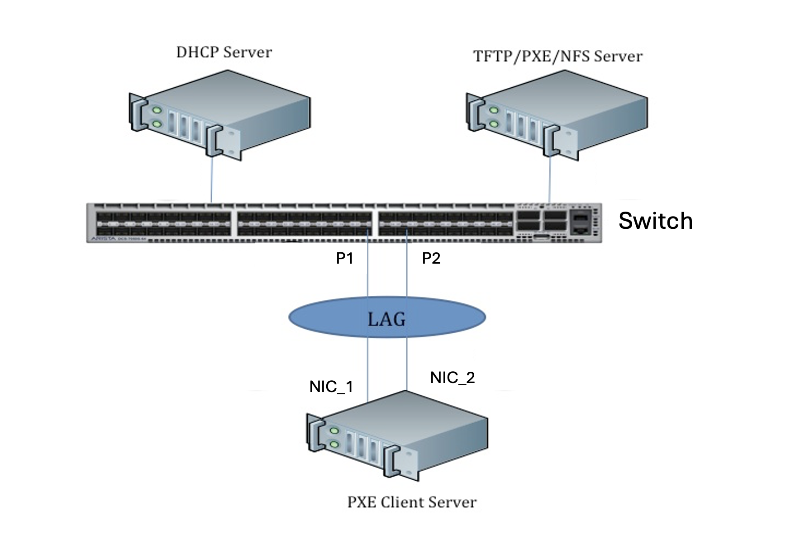
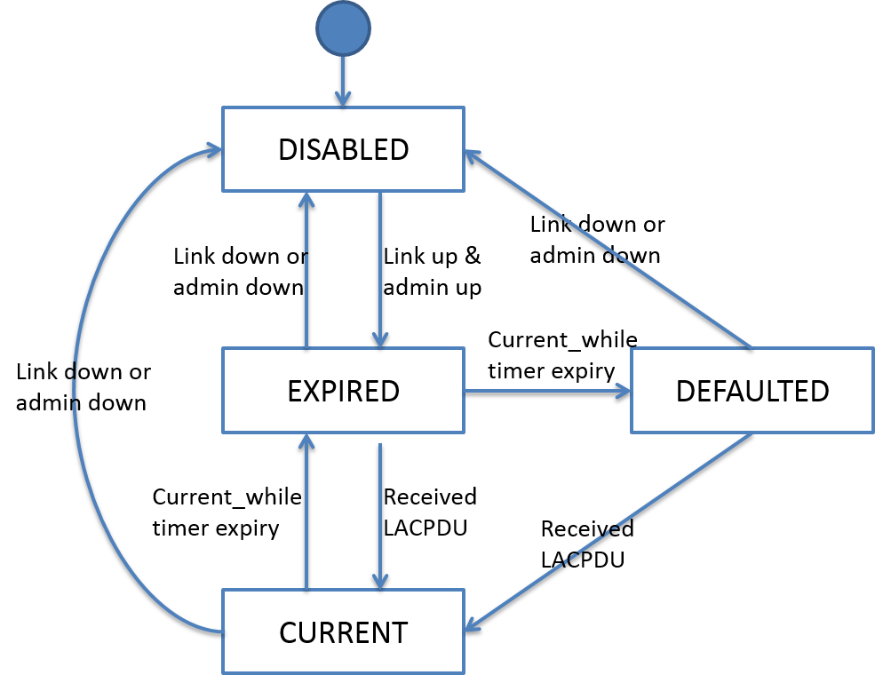
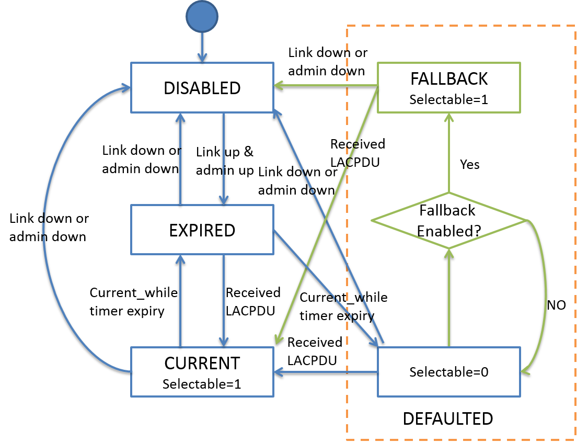
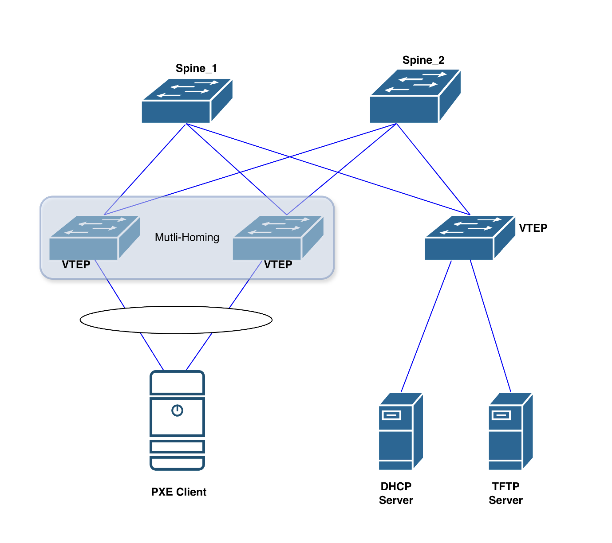

# Introduction
## Overview

In a standard Link Aggregation Control Protocol (LACP) setup, both ends of a port channel must exchange LACP Data Units (PDUs) to negotiate and form an active aggregation. If the peer device does not send LACP PDUs, the associated member interfaces remain in a down state and no traffic can be forwarded. The LACP fallback mode when enabled, allows one of the LAG member ports to become active even in the absence of LACP PDUs from the peer. This is particularly useful in scenarios where the peer device is not capable of running a full network stack but still needs network connectivity — for example, during Preboot Execution Environment (PXE) boot.

Consider a server with multiple NICs connected to a switch using a portchannel.
During PXE boot, the server’s NICs operate at firmware level and cannot participate in LACP negotiation. Due to this all links in the LAG would remain inactive, preventing DHCP or image download traffic from passing.

With LACP fallback mode enabled, the switch temporarily activates one port in the port channel. This allows the PXE client to:
- Send DHCP discovery requests to obtain an IP address.
- Download the OS image from a centralized PXE server.

Activating only one port avoids issues with MAC address learning and packet delivery, since traffic sourced from one NIC (e.g., NIC1) will always be returned to the same interface. If multiple ports were active simultaneously, responses might arrive on a different interface (e.g., NIC2), leading to MAC mismatches and dropped packets.





## Feature Specifications

- LACP fallback feature can be enabled/disabled per LAG.
- Only one member port will be selected as active per LAG during fallback mode
- The member port will be moved out of the fallback state if the LAG receives any LACP PDU.
- The active port election will be re-triggered when a new member port comes up.
- Interoperability with other devices running standard 802.3ad LACP protocol.
- With fallabck mode enabled min-links configuration will not be taken into consideration.  

# LACP State Machine and Timer
The receive machine has four states:
- Rxm\_current
- Rxm\_expired
- Rxm\_defaulted
- Rxm\_disabled

The current\_while timer is started in the Rxm\_current and Rxm\_expired states with timeout interval that depend on the fast-rate configuration. By default fast-rate is disabled for a portchannel and the LACP PDUs are sent every 30seconds. Non-receival of PDUs for 3 consecutive intervals cause the timer to be expired. If the fast-rate is enabled the PDUs are sent every one second and timer expires at the end of 3 seconds.



# LACP Fallback Design

In the standard rx state machine described above, the member port will be put into defaulted state if the member port never receives LACP PDUs from remote end. Also the member port is not selectable in defaulted state and hence the port cannot be aggregated to the LAG.

In order to support LACP fallback feature, the port should be selectable in defaulted state if fallback is enabled.



With fallback enabled, the port's selected bit is being set, which means the port is
selectable and can be aggregated into the LAG. If any LACP PDU is being received over the LAG during this mode, the port will move to expired state, and restart the LACP negotiation with peer. Only one member port can be put into fallback mode per LAG. And the server is
supposed to use only the member port in fallback mode to communicate with
switch.

The selection of the active port follows a defined hierarchy:
1. **System MAC Address** (MCLAG scenarios):  
In Multi-Chassis LAG configurations, the port associated with the device that has the lower system MAC address is selected as the active port.
2. **Port Priority**:  
Among ports within the same PortChannel, the interface with the lowest LACP port priority is elected as active.
3. **Interface Index**:  
If all member ports share the same priority, the switch compares their interface numbers and selects the one with the lowest value. For example, Ethernet1 is preferred over Ethernet2.

# LACP Fallback Config
```
config portchannel add <portchannel_name> --fallback <true/false>
```
Default value is false. The value cannot be changed dynamically.  

# Deployment Scenario
## PXE Boot over Multi-Homed EVPN-VXLAN

A PXE client is connected to two switches (multi-homed) via separate NICs through a portchannel. The **DHCP/PXE Server** is located across the EVPN-VXLAN network. 

During PXE boot, the client's firmware cannot participate in LACP negotiation. The BOOTP/DHCP packets from the client must be forwarded through the EVPN-VXLAN fabric to reach the DHCP/PXE server. Critically, the DHCP response must be received on the client on the same port through which the request was sent to ensure proper packet delivery. Hence LACP fallback is enabled on **only one** of the multi-homed switches. This ensures that the PXE client can send DHCP discovery requests through a single active port
so that the request and response packets follow the same path, preventing MAC address mismatches.

By enabling fallback on a single switch, the boot traffic path remains deterministic, allowing the PXE client to successfully obtain an IP address and download the OS image before the full network stack is loaded and LACP negotiation begins. Hence LACP fallback **must be** configured asymmetrically to ensure reliable boot operations.


# Limitations

- LACP fallback mode can only be configured during portchannel creation and cannot be modified on existing portchannels. To enable fallback on an existing portchannel, the existing portchannel must be first deleted and then recreated it with the `--fallback true` option.
- The min-links constraint will take into effect once any of the member ports receive LACP PDUs and session is established.
- LACP port priority cannot be set via cli currently but can be set via teamdctl utility.
```
sudo teamdctl PortChannel01 port config update Ethernet40 '{ "lacp_key": 101, "link_watch": { "name": "ethtool" }, "lacp_prio": 50 }'
teamdctl PortChannel01 port add Ethernet40
```

# References

- SONiC Configuration Management
- Open Source libteam https://github.com/jpirko/libteam
- IEEE 802.3ad Standard for LACP http://www.ieee802.org/3/ad/public/mar99/seaman_1_0399.pdf