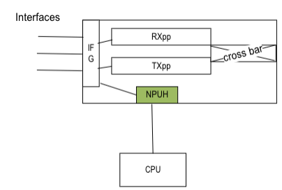

# NPU HOST based TGEN Feature on SONIC CISCO 8000 platforms

<!-- TOC start (generated with https://github.com/derlin/bitdowntoc) -->
- [NPU HOST based TGEN Feature on SONIC CISCO 8000 platforms](#npu-host-based-tgen-feature-on-sonic-cisco-8000-platforms)
  - [Introduction](#introduction)
  - [Use-cases](#use-cases)
    - [Features](#features)
  - [Limitations](#limitations)
  - [Future enhancements:](#future-enhancements)
  - [NPU family](#npu-family)
  - [Platforms](#platforms)
  - [Sonic Branch](#sonic-branch)
    - [Implementation details](#implementation-details)
  - [Management CLI](#management-cli)
    - [Configuration commands](#configuration-commands)
    - [show commands](#show-commands)
  - [USAGE examples](#usage-examples)
    - [Show commands](#show-commands-1)
    - [Debug commands](#debug-commands)
  - [Dependencies](#dependencies)
  - [Community contribution](#community-contribution)
  - [References](#references)
  - [Scale](#scale)
  - [Yang model](#yang-model)
  - [Testing and automation](#testing-and-automation)
  - [Implementation review comments](#implementation-review-comments)

<!-- TOC end -->

<!-- TOC -->

## Introduction

 A built-in TGen is available in Silicon One ASIC's that can generate packets from NPUHost inside NPU.

 It has following advantages.

- It ensures that the traffic generator is always available for network diagnostics.
- Don't face compatibility issues because the traffic generator is inbuilt and easy to maintain.

The current feature implements a CLI interface on top of existing TGEN API for user to  create/delete/start/stop the traffic streams

This feature should be used with caution on live networks. User should be fully aware of the impact of packets injected.
Injecting packets into a live network may result in network outages

CPU based traffic gen also can be implemented. but it has below  disadvantages

- Traffic Generation rate is low
- Traffic can be injected only on one slice
- Traffic can interfere with other control plane traffic
- Higher delay
- Usage of more CPU cycles and control plane bandwidth

## Use-cases

- System engineers to troubleshoot customer devices
- Developers to generate packets for feature testing
- Validate health of any link based on checking CRC errors
- Validate health of forwarding within the router
- Measure convergence in the production network topology using XR routers
- Send out any traffic (mimic any traffic) to troubleshoot i.e. packet loss within the network
- Snake test and stress test with traffic
- Offline data plane health monitoring

### Features

- The inbuilt traffic generator works in three modes modes
  - Ingress mode/inject-up mode, as if packets received from a wire, needs rx interface name
  - Egress mode/inject-down mode, as if packets directly to egress port, needs tx interface name
  - Raw mode in raw mode, user needs to define inject header of the packet
- Packet that needs to be generated can defined in raw(hex), pcap or scapy script
- Configurable rate
- Configurable duration
- Configurable Traffic-class
- Ability to create and control multiple traffic generator sessions at the same time
- Ability to define packets either at command line or within a file.
- The traffic generator can inject packets in egress, or ingress, or both directions at the same time

## Limitations

- Packet counters and RAW mode in not supported on G200 in SDK.
- Complete packet need to be specified for injectdown or when packet is provided in hex/pcap format
- Interface name should be physical port. portchannel, sub-interface and other variations are not currently supported
- Packet content is fixed when traffic generator is created. It is not possible to change any of the fields
- The inbuilt traffic generator does not retain the instance or the data if the line card or slot gets reloaded
- Maximum length for packets at command line is 255 characters. For larger packets, define the packets within a file.

## Future enhancements:

- Support capture option
- Support Raw mode
- Have input as slice/ifg/SERDES ID
- Move to GRPC based implementation

<!-- TOC -->

## NPU family

- Q100/Q200
- G200

## Platforms

- Fixed platforms
- Chassis platforms
- SIM based platforms
- In T2 SONIC chassis, traffic generator can be run from RP for fabric NPU and on line card for its NPU

<!-- TOC -->

## Sonic Branch

- Master
- 202405.1

### Implementation details

- Parse and validate arguments
- Pass them to debug shell client in syncd
- debug shell client passes it to server
- Get system port info using other API
- Parse packet header if it is in scapy format
- Add Ether header if not provided
- Add VLAN header if ingress interface is sub-interface
- Generate padding and append to the header.
- Convert the complete packet to hex.
- Calls SDK API
- Display full packet generated above
- Returns the OID assigned to generator

<!-- TOC -->

## Management CLI

### Configuration commands

New CLI introduced is shown below.

- config platform cisco tgen create -interface <> -packet <> -file <> -mode <> -duration <> -n asic0

Ethernet header can be generated if it is not provided. It is allowed only  when mode is inject-up
Default SMAC: 00:00:00:00:00:01
Default DMAC: ingress interface MAC

- config platform cisco tgen start -id <> -traffic-class <> -rate <> -n asic0
- config platform cisco tgen stop -id -n asic0
- config platform cisco tgen delete -id -n asic0

### show commands

- show platform npu tgen list -n asic0
- show platform npu tgen examples

## USAGE examples

Please refer  . for tgen creation

### Show commands

show platform npu tgen list

Below command  provide help on  how to use the feature

show platform npu tgen examples

### Debug commands

show queue counters -nz |grep Ethernet0
show platform npu voq queue_counters -i Ethernet0 -t 3

<!-- TOC -->

## Dependencies

None

<!-- TOC -->

## Community contribution

Not applicable
<!-- TOC -->

## References

- Vendor platform-layer implementation review 1 (internal)
- Vendor platform-layer implementation review 2 (internal)
- [Automation](https://wwwin-github.cisco.com/whitebox/sonic-test/pull/1243)

<!-- TOC -->

## Scale

- 13.7 Million packets per second or 66.4 Gbps
- 8 different configurable transmit rates shared across flows
- Maximum packet size of 608 bytes on line cards and routers with the Q100/Q200
- Maximum of 585 flows with packet size<= 112 bytes and up-to 8 flows for larger packets.
- Maximum packet size of 608 bytes on line cards and routers with the Q100\Q200
- Maximum packet size of 4K bytes on line cards and routers with the G200

<!-- TOC -->

## Yang model

Not applicable

<!-- TOC -->

## Testing and automation

- Test Injectup with inline scapy packet
- Test Inject down  with inline scapy packet
- Test Duration, rate and traffic class
- Test with different packet sizes
- Test TGEN with  PCAP  file
- Test TGEN with HEX file
- Test TGEN on line card NPU
- Test TGEN  on fabric NPU using RP

## Implementation review comments

- Test Maximum allowed packet size on Q200 and G200
    Result: 608 bytes for Q200, 4K for G200

- Test identification field is varying for IP packets
   Result: does not vary

- Test that packet injection can occur even if interfaces are down, but will drop packets without proper configuration.

- Test the maximum allowed traffic rate

- Enable raw mode

- Enable capture option so that packets are not sent out

- Request SDK team to allow changing  packet pattern in single instance of traffic generator

- Request SDK team to increase packet size

- Move to GRPC implementation

- Conduct further research on how XR uses similar features and ensure proper documentation is available.

-  Check with  SDK team on G200 limitations for RAW mode  and counter support

