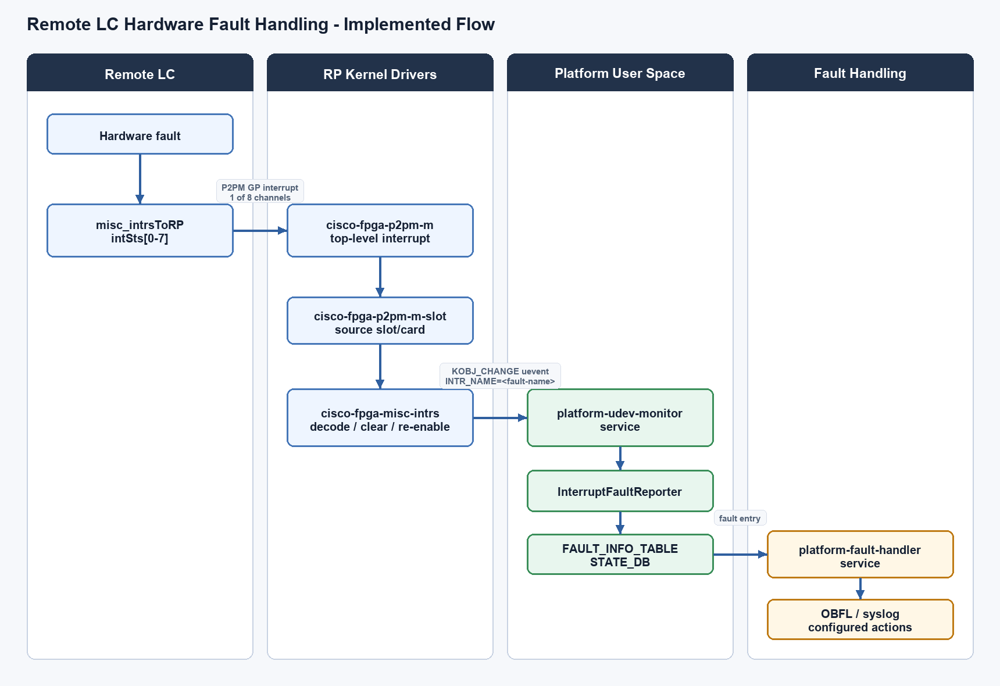
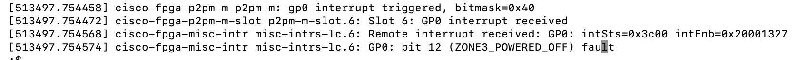
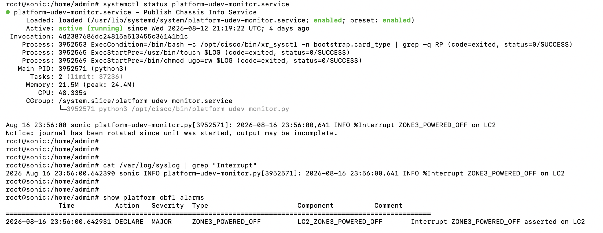

# Remote LC Hardware Fault Detection and Handling

## 1. Executive Summary

This document describes the high-level design for detecting and handling hardware faults on remote Line Cards (LCs) through the P2PM interrupt mechanism. The feature enables the RP to receive and process hardware failure events from remote LCs, providing visibility into critical faults such as CAT_ERR that can only be detected through this interrupt-based mechanism.

---

## 2. Problem Statement

### 2.1 Background

In a distributed chassis architecture with multiple Line Cards (LCs) and a Route Processor (RP), hardware faults occurring on remote LCs need to be detected and reported to the RP for proper fault management and system health monitoring.

### 2.2 Current Limitations

- **Limited Visibility:** The RP has no direct mechanism to detect hardware faults occurring on remote LCs
- **Critical Fault Detection:** Certain critical hardware faults (e.g., CPU CAT_ERR) can only be detected through interrupt mechanisms
- **Delayed Response:** Without interrupt-based notification, fault detection relies on polling or reactive discovery, leading to delayed responses
- **Incomplete Monitoring:** Power zone faults, CPU readiness changes, and other hardware events on LCs remain invisible to the RP

### 2.3 Requirements

1. **Real-time Fault Detection:** Detect hardware faults on remote LCs in real-time
2. **Fault Classification:** Support multiple interrupt types (8 general-purpose interrupts) for different fault categories
3. **Source Identification:** Identify which specific LC (LC0-LC17), FC (FC0-FC7), FT (FT0-FT3), or other module raised the interrupt
4. **Fault Granularity:** Support detailed fault information including power zone faults, CPU errors, and state changes

## 3. Architecture Overview

### 3.1 System Components

```
┌──────────────────────────────────────────────────────────────────────┐
│                        Route Processor (RP)                          |
│                                                                      |
│  ┌─────────────────────────────────────────────────────────────────┐ |
│  │                    User Space Applications (Software)           │ │
│  │                      ┌──────────────────┐                       │ │
│  │                      │  Fault Manager   │                       | |
│  │                      │       (FM)       │                       | |
│  │                      └────────┬─────────┘                       | |
│  │                               │                                 | |
│  │  ┌────────────────────────────┴───────────────────────────────┐ │ |
│  │  │     LC Fault Monitor Agent (NEW COMPONENT)                 │ │ │
│  │  │  ┌──────────────────────────────────────────────────────┐  │ │ │
│  │  │  │ - Registers callbacks with  P2PM driver              │  │ │ │
│  │  │  │ - Processes GP interrupt notifications               │  │ │ │
│  │  │  │ - Reads rmt_gp_intr[n] to identify source cards      │  │ │ │
│  │  │  │ - Reads LC intSts registers via P2PM                 │  │ │ │
│  │  │  │ - Decodes faults based on card type                  │  │ │ │
│  │  │  │ - Interfaces with Fault Manager                      │  │ │ │
│  │  │  │ - Manages fault history and statistics               │  │ │ │
│  │  │  └──────────────────────────────────────────────────────┘  │ │ │
│  │  └────────────────────────────────────────────────────────────┘ │ │
│  └─────────────────────────────────────────────────────────────────┘ │
|  ╔═════════════════════════════════════════════════════════════════╗ │
│  ║                   KERNEL SPACE (Software Drivers)               ║ │
│  ╚═════════════════════════════════════════════════════════════════╝ │                                         
│                          │                                           │
│  ┌───────────────────────┴───────────────────────────────────────┐   │
│  │  ┌──────────────────────────────────────────────────────────┐ │   │
│  │  │  P2PM Master Driver (cisco-fpga-p2pm-m.c )               │ │   │
│  │  │  - Local interrupt enable/disable/status/clear           │ │   │
│  │  │  - Manages intr_stat, intr_en, intr_dis registers        | |   |
│  │  │  - ISR handler, Callback dispatch                        │ │   │
│  │  └──────────────────────────────────────────────────────────┘ │   │
│  |  ┌──────────────────────────────────────────────────────────┐ │   |
│  │  |  misc_intrsToRP IP block driver                          │ │   |
│  │  |  - Manages intSts0-7 status registers                    │ │   |
│  │  └──────────────────────────────────────────────────────────┘ |   │
│  └───────────────────────────────────────────────────────────────┘   │
│  ╔════════════════════════════════════════════════════════════════╗  │
│  ║                         HARDWARE                               ║  │
│  ╚════════════════════════════════════════════════════════════════╝  |
|                                                                      |
│                  P2PM Master Hardware Block                          │
│  ┌─────────────────────────────────────────────────────────────────┐ │
│  │  Interrupt Control Registers                                    │ │
│  │  - intr_stat  (@0x1809c) - Shows which GP interrupt fired       │ │
│  │  - intr_en    (@0x180a4) - Enable interrupts                    │ │
│  │  - intr_dis   (@0x180a8) - Disable interrupts                   │ │
│  └─────────────────────────────────────────────────────────────────┘ │
│  ┌─────────────────────────────────────────────────────────────────┐ │
│  │  Remote GP Interrupt Source Registers                           │ │
│  │  - rmt_gp_intr0 (@0x18260) - Which card raised GP intr 0        │ │
│  │  - rmt_gp_intr1 (@0x18264) - Which card raised GP intr 1        │ │
│  │  - ... (rmt_gp_intr2-7)                                         │ │
│  └─────────────────────────────────────────────────────────────────┘ │
└────────────────────┬─────────────────────────────────────────────────┘
                     │ P2PM Link
                     │
┌────────────────────┴───────────────────────────────────────────────────┐
│              Line Card (LC) - Vanguard/Lancer                          │
│  ┌──────────────────────────────────────────────────────────────────┐  │
│  │      Misc Interrupts Block (misc_intrsToRP @ 0xfa000)            │  │
│  │  - intSts0 (@0xfa020) - Power Zone & CPU Ready Events            │  │
│  │  - intSts1 (@0xfa030) - CPU CAT_ERR                              │  │
│  │  - intSts2-7 (@0xfa040-0xfa090) - Other faults (card-specific)   │  │
│  └──────────────────────────────────────────────────────────────────┘  │
└────────────────────────────────────────────────────────────────────────┘

```

## 4. Detailed Design

### 4.1 RP P2PM Master Block

#### 4.1.1 Interrupt Status Register (intr_stat @ 0x1809c)

**Purpose:** Top-level interrupt status showing which general-purpose interrupt was raised by remote cards.

**Register Layout:**

| Bit | Name | Access | Description |
|-----|------|--------|-------------|
| 24 | rmt_gp_intr7 | R/WOCLR | Remote GP interrupt 7 asserted |
| 23 | rmt_gp_intr6 | R/WOCLR | Remote GP interrupt 6 asserted |
| 22 | rmt_gp_intr5 | R/WOCLR | Remote GP interrupt 5 asserted |
| 21 | rmt_gp_intr4 | R/WOCLR | Remote GP interrupt 4 asserted |
| 20 | rmt_gp_intr3 | R/WOCLR | Remote GP interrupt 3 asserted |
| 19 | rmt_gp_intr2 | R/WOCLR | Remote GP interrupt 2 asserted |
| 18 | rmt_gp_intr1 | R/WOCLR | Remote GP interrupt 1 asserted |
| 17 | rmt_gp_intr0 | R/WOCLR | Remote GP interrupt 0 asserted |

**Characteristics:**
- Sticky bits (remain set until cleared by software)
- Write-one-clear (R/WOCLR) - writing 1 clears the bit
- Each bit maps to one of 8 general-purpose interrupt channels

#### 4.1.2 Remote GP Interrupt Source Registers

**Purpose:** Identify which specific card/module raised the interrupt.

**Register:** rmt_gp_intr0 @ 0x18260 (Power Error Interrupts)

| Bits | Description |
|------|-------------|
| 17:0 | LC17 ~ LC0 (18 Line Cards) |
| 25:18 | FC7 ~ FC0 (8 Fabric Cards) |
| 29:26 | FT3 ~ FT0 (4 Fan Trays) |
| 30 | Peer RP |
| 31 | Local BMC FPGA (Kingman) |

**Registers:** rmt_gp_intr1-7 @ 0x18264-0x1827c

Similar bit mapping for different interrupt types (mapping defined per HWFS).

### 4.2 LC Misc Interrupts Block (Vanguard/Lancer)

#### 4.2.1 Interrupt Status Registers (intSts0-7)

**Base Address:** misc_intrsToRP @ 0xfa000

**Register:** intSts0 @ 0xfa020 (Power Zone and CPU Ready Events)

| Bits | Name | Description |
|------|------|-------------|
| 30 | intrpt30 | CPU ready rising edge |
| 29 | intrpt29 | CPU ready falling edge |
| 14 | intrpt14 | ZONE3 power cycling |
| 13 | intrpt13 | ZONE3 powering off |
| 12 | intrpt12 | ZONE3 powered off |
| 11 | intrpt11 | ZONE3 powering on |
| 10 | intrpt10 | ZONE3 powered on |
| 9 | intrpt9 | ZONE3 fault1 |
| 8 | intrpt8 | ZONE3 fault0 |
| 7 | intrpt7 | ZONE12 power cycling |
| 6 | intrpt6 | ZONE12 powering off |
| 5 | intrpt5 | ZONE12 powered off |
| 4 | intrpt4 | ZONE12 powering on |
| 3 | intrpt3 | ZONE12 powered on |
| 2 | intrpt2 | ZONE12 fault1 |
| 1 | intrpt1 | ZONE12 fault0 |
| 0 | intrpt0 | ZONE0 fault0 |

**Register:** intSts1 @ 0xfa030 (CPU Catastrophic Error)

| Bits | Name | Description |
|------|------|-------------|
| 0 | intrpt0 | CPU CAT_ERR (Catastrophic Error) |
| 1-31 | intrpt1-31 | Reserved/TBD |

**Registers:** intSts2-7 @ 0xfa040-0xfa090

## 5. Software Design

### 5.1 Interrupt Flow

1. **Fault Generation:** Hardware fault occurs on LC (e.g., CPU CAT_ERR, power zone fault)
2. **Local Registration:** LC's misc_intrsToRP block registers the fault in appropriate intSts register
3. **P2PM Transmission:** LC sends interrupt to RP via P2PM slave-to-master communication
4. **RP Reception:** RP's P2PM master block receives interrupt, sets corresponding bit in intr_stat
5. **ISR Processing:** Reads intr_stat register to see which interrupts are active (bits 17-24)
6. **Callback Dispatch:** ISR calls registered callback (LC Fault Monitor Agent)
7. **Agent Processing:**
    - Reads rmt_gp_intr[n] register to identify which cards raised the interrupt
    - Reads LC's interrupt status registers to determine specific fault 
    - Report to Fault Manager for logging, generates alarms, triggers recovery
8. **Fault Handling:** Agent reports faults to FM for system-wide fault correlation (logging, recovery, alarm generation)


```
┌─────────────────────────────────────────────────────────┐
│  RP Interrupt Handler Entry                             │
└────────────────────┬────────────────────────────────────┘
                     │
                     ▼
┌─────────────────────────────────────────────────────────┐
│  Read intr_stat register (@0x1809c)                     │
│    - Check bits 17-24 for active GP interrupts          │
└────────────────────┬────────────────────────────────────┘
                     │
                     ▼
┌─────────────────────────────────────────────────────────┐
│  For each active interrupt bit                          │
│     - Call registered callback (LC Fault Monitor)       │
└────────────────────┬────────────────────────────────────┘
                     │ Callback execution
                     ▼
┌─────────────────────────────────────────────────────────┐
│  LC Fault Monitor Agent Processing (USER SPACE)         │
├─────────────────────────────────────────────────────────|
│  1. Read rmt_gp_intr[n] register (@0x18260 + n*4)       │
│     - Decode card bitmap (bits indicate which cards)    │
│       * bits [17:0]  = LC0-LC17                         │
│       * bits [25:18] = FC0-FC7                          │
│       * bits [29:26] = FT0-FT3                          │
│       * bit  [30]    = Peer RP                          │
│       * bit  [31]    = Local BMC FPGA                   │
│  2. For identified LC:                                  │
│     - Read LC's misc_intrsToRP base + intSts[0-7]       │
│     - Parse active interrupt bits                       │
│     - Map to specific fault types                       │
│  3. Process Faults:                                     │
│     - Log fault details                                 │
│     - Report to Fault Manager                           │
└────────────────────┬────────────────────────────────────┘
                     │
                     ▼
┌─────────────────────────────────────────────────────────┐
│  FM infra                                               │
│    - Fault handling and recovery based on fault type    │
└────────────────────┬────────────────────────────────────┘
                     │
                     ▼
┌─────────────────────────────────────────────────────────┐
│  Clear Interrupts:                                      │
│     - Write 1 to clear LC's intSts register bits        │
│     - Write 1 to clear RP's rmt_gp_intr[n] bits         │
│     - Write 1 to clear RP's intr_stat bits              │
└────────────────────┬────────────────────────────────────┘
                     │
                     ▼
┌─────────────────────────────────────────────────────────┐
│  Return from Interrupt Handler                          │
└─────────────────────────────────────────────────────────┘
```

### 5.2 Fault Handling

#### 5.2.1 Fault Types and Actions

| Fault Type | Description | Action |
|------------|-------------|--------|
| CPU CAT_ERR | CPU catastrophic error | Log, alarm, consider LC reset/isolation |
| Power Zone Fault | Power delivery failure | Log, alarm |

Additional interrupt status registers for other fault types

**Characteristics:**
- All bits are R/WOCLR (write-one-clear)
- Sticky bits that remain set until cleared
- 32-bit registers providing detailed fault information

### 5.3 Card-Specific Handling

Supporting LC- Vanguard, Lancer for now

### 5.4 Implementation Details

The implementation preserves the design of using the P2PM general-purpose
interrupt path for remote LC hardware fault notification. The RP receives the
remote LC interrupt indication through the P2PM master interrupt path, while the
detailed fault identity is decoded from the LC-side `misc_intrsToRP` interrupt
status registers.

In the implemented flow, the remote LC hardware fault path connects to the
existing SONiC platform fault infrastructure. The kernel owns hardware interrupt
decode and uevent generation, and platform user space owns fault reporting,
policy matching, and alarm actions.

The implementation is split across BSP, kernel, and platform user space:

| Area | Implementation responsibility |
|------|-------------------------------|
| LC hardware | Latches the remote hardware event in `misc_intrsToRP` interrupt status registers |
| P2PM hardware path | Carries one of the 8 general-purpose interrupt indications from LC to RP |
| BSP - ACPI | Describes remote LC interrupt-capable devices and maps interrupt bits to fault names |
| RP kernel driver | Identifies the interrupt source, reads remote LC interrupt status, clears and re-enables interrupts, and emits a named uevent |
| Platform user space | Converts kernel uevents into SONiC fault records |
| Fault policy | Applies OBFL, syslog, and other configured actions |

```text
misc-intrs-lc kernel uevent
        |
        v
platform-udev-monitor.service
        |
        v
FAULT_INFO_TABLE in STATE_DB
        |
        v
platform-fault-handler.service
        |
        v
OBFL / syslog / configured policy actions
```

The major software components are:

| Layer | Component | Responsibility |
|-------|-----------|----------------|
| BSP - ACPI<br>(Enhanced) | `misc-intrs-lc` | Defines LC interrupt status bit names exposed to the RP |
| BSP - ACPI<br>(Enhanced) | `p2pm-m-rmt` | Enables the existing remote P2PM infrastructure for selected remote LC x86 FPGA access |
| BSP - ACPI<br>(New) | `info-x86-lc` | Exposes remote LC x86 FPGA info through a dedicated child device |
| BSP - ACPI<br>(New) | `x86-ctl-lc` | Exposes remote LC x86 control/status needed for CATERR validation |
| Kernel<br>(Enhanced) | `cisco-fpga-p2pm-m` | Handles RP-side P2PM master interrupt status |
| Kernel<br>(Enhanced) | `cisco-fpga-p2pm-m-slot` | Resolves the remote slot/card source and dispatches to remote child handlers |
| Kernel<br>(Enhanced) | `cisco-fpga-misc-intrs` | Reads LC interrupt status, maps bits to names, clears handled bits, and emits uevents |
| Kernel<br>(Enhanced) | `cisco-fpga-p2pm-m-rmt` | Exposes selected remote FPGA children after the P2PM remote link is ready |
| Kernel<br>(New) | `cisco-fpga-x86-ctl` | Exposes remote x86 control/status fields such as `cpu_ierr_l` |
| User space<br>(Enhanced) | `platform-udev-monitor.service` | Consumes `misc-intrs-lc` uevents |
| User space<br>(New) | `InterruptFaultReporter` | Writes interrupt faults into `FAULT_INFO_TABLE` |
| User space<br>(Enhanced) | `platform-fault-handler.service` | Applies `fault_policy.json` actions such as OBFL and syslog |

The interrupt name reported to user space is provided by BSP ACPI
`intSts*_bits` definitions.

Supported interrupt names include:

- `ZONE0_FAULT0`
- `ZONE12_FAULT0`
- `ZONE12_FAULT1`
- `ZONE12_POWERED_OFF`
- `ZONE3_FAULT0`
- `ZONE3_FAULT1`
- `ZONE3_POWERED_OFF`
- `BIOS_BOOT_INVALID`
- `CPU_READY_FALLING_EDGE`

On remote LC removal, active faults associated with that LC are cleared by
writing matching `FAULT_INFO_TABLE` entries with `action=CLEAR`.

CATERR handling is implemented using the same generic remote interrupt path.
The LC reports `CPU_READY_FALLING_EDGE`; user space then validates the remote
x86 status through `x86-ctl-lc` and reports `CPU_IERR_L` only when
`cpu_ierr_l` is asserted low.

### 5.5 Implemented Flow

The end-to-end implemented flow is shown below:



#### 5.5.1 Example Fault reported by this feature

##### Kernel



##### User Space



#### 5.5.2 CATERR-Specific Flow

CATERR handling uses the same generic remote interrupt path, with one
additional validation step to avoid false positives during normal LC reboot or
shutdown.

```text
CPU_READY_FALLING_EDGE interrupt
        |
        v
platform-udev-monitor.service
        |
        v
Read remote x86-ctl-lc cpu_ierr_l
        |
        +-- cpu_ierr_l == 0  --> report CPU_IERR_L
        |
        +-- cpu_ierr_l == 1  --> ignore
        |
        +-- node unavailable --> ignore as reboot/shutdown transition
```

For CATERR, the LC first reports `CPU_READY_FALLING_EDGE`. User space then
reads the remote LC x86 control node:

```text
/sys/bus/platform/devices/p2pm-m/p2pm-m-slot.<pd>/p2pm-m-rmt.<pd>/x86-ctl-lc.<pd>/cpu_ierr_l
```

Only when `cpu_ierr_l == 0`, meaning the active-low CPU IERR signal is
asserted, does user space raise the reportable fault `CPU_IERR_L`. This prevents
normal LC reboot or shutdown transitions from being reported as CATERR faults.

## 6. Testing Strategy
Automated SpyTest coverage validates this feature from the distributed RP. The
tests cover remote LC hardware discovery and the end-to-end interrupt fault
reporting path.

| Test case | Coverage |
|-----------|----------|
| `test_ft_platform_services` | Verifies `platform-udev-monitor.service` and `platform-fault-handler.service` are active before running interrupt fault tests |
| `test_ft_remote_lc_x86_info_and_ctl` | Verifies RP-side remote LC x86 sysfs exposure, including `info-x86-lc` `fpga_id` and `version`, and `x86-ctl-lc` `cpu_ierr_l` |
| `test_ft_remote_lc_npu_shutdown_interrupt` | Triggers LC NPU shutdown and verifies `ZONE3_POWERED_OFF` is reported in `FAULT_INFO_TABLE` and `show platform obfl alarms` |
| `test_ft_remote_lc_npu_interrupt_after_service_restart` | Restarts the platform services and verifies a later LC NPU shutdown interrupt is still reported |
| `test_ft_remote_lc_reboot_interrupts` | Shuts down an online LC, verifies `ZONE3_POWERED_OFF` and `ZONE12_POWERED_OFF` reporting, reloads the LC from the RP, verifies faults clear, and verifies `CPU_READY_FALLING_EDGE` does not raise `CPU_IERR_L` when `cpu_ierr_l=1` |

Validation covered:

- Remote LC discovery from the RP through `p2pm-m-slot.<pd>` and `p2pm-m-rmt.<pd>`
- Remote x86 status reads through `info-x86-lc.<pd>` and `x86-ctl-lc.<pd>`
- Fault `RAISE` entries in `FAULT_INFO_TABLE`
- Fault severity matching against `fault_policy.json`
- OBFL alarm generation through `show platform obfl alarms`
- Fault `CLEAR` entries and OBFL alarm removal after LC recovery
- Service restart resilience for `platform-udev-monitor.service` and `platform-fault-handler.service`
- CATERR false-positive prevention during LC reboot when `cpu_ierr_l=1`
