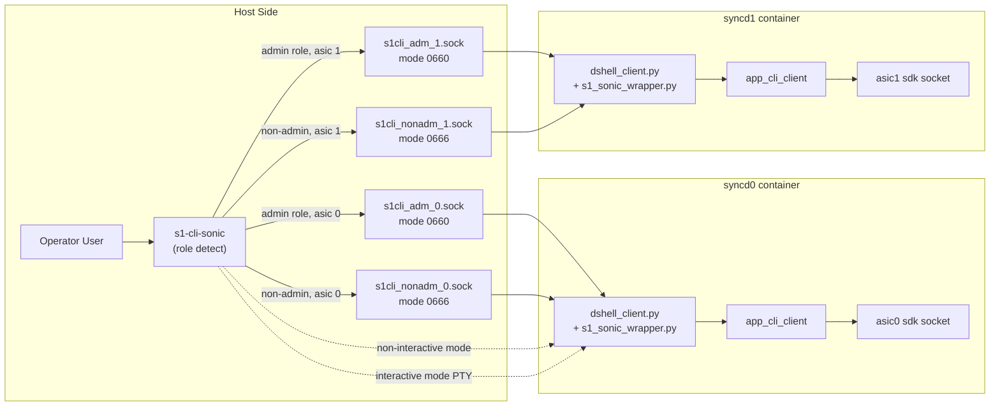
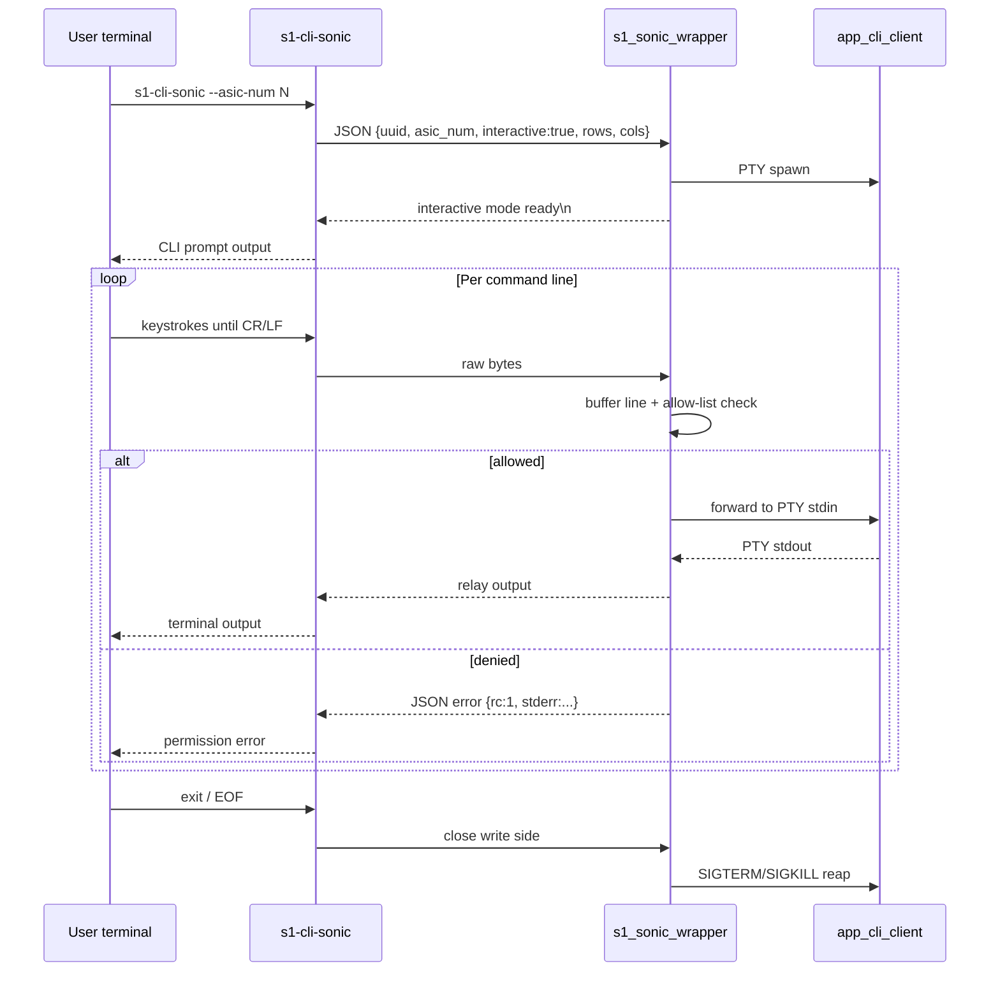

# s1-cli-sonic Non-Sudo Show Access HLD

## Table of Content

1. [Revision](#1-revision)
2. [Scope](#2-scope)
3. [Definitions/Abbreviations](#3-definitionsabbreviations)
4. [Overview](#4-overview)
5. [Requirements](#5-requirements)
   - [5.1 Functional requirements](#51-functional-requirements)
   - [5.2 Security requirements](#52-security-requirements)
   - [5.3 Non-requirements](#53-non-requirements)
6. [Architecture Design](#6-architecture-design)
   - [6.1 Current architecture](#61-current-architecture)
   - [6.2 Proposed architecture](#62-proposed-architecture)
   - [6.3 Component placement](#63-component-placement)
   - [6.4 Alternatives considered](#64-alternatives-considered)
   - [6.5 JSON Protocol and Multi-ASIC Flow](#65-json-protocol-and-multi-asic-flow)
7. [High-Level Design](#7-high-level-design)
   - [7.1 Command roles](#71-command-roles)
   - [7.2 Socket permissions](#72-socket-permissions)
   - [7.3 Request protocol](#73-request-protocol)
   - [7.4 Command normalization and validation](#74-command-normalization-and-validation)
   - [7.5 Interactive mode](#75-interactive-mode)
   - [7.6 Backend execution](#76-backend-execution)
   - [7.7 Failure behavior](#77-failure-behavior)
   - [7.8 Logging and audit](#78-logging-and-audit)
   - [7.9 Security threat coverage](#79-security-threat-coverage)
8. [SAI API](#8-sai-api)
9. [Configuration and management](#9-configuration-and-management)
   - [9.1 Manifest](#91-manifest)
   - [9.2 CLI/YANG model Enhancements](#92-cliyang-model-enhancements)
   - [9.3 Config DB Enhancements](#93-config-db-enhancements)
   - [9.4 Build and packaging](#94-build-and-packaging)
10. [Warmboot and Fastboot Design Impact](#10-warmboot-and-fastboot-design-impact)
11. [Memory Consumption](#11-memory-consumption)
12. [Restrictions/Limitations](#12-restrictionslimitations)
13. [Testing Requirements/Design](#13-testing-requirementsdesign)
    - [TC1 Non-Interactive Mode](#tc1-non-interactive-mode)
    - [TC2 Interactive Mode](#tc2-interactive-mode)
    - [TC3 Session Concurrency](#tc3-session-concurrency)
    - [TC4 Role Allow-List and Security](#tc4-role-allow-list-and-security)
    - [TC5 Performance and System](#tc5-performance-and-system)
14. [Open/Action items - if any](#14-openaction-items---if-any)

## 1. Revision

| Revision | Date | Originator | Comments |
|---|---|---|---|
| 1.0 | 06/10/2026 | Keith Lu | Initial draft |
| 1.1 | 07/10/2026 | Anand Mehra (anamehra) | Converted to SONiC HLD format; clarified scope, security model, limitations, and tests |

## 2. Scope

This HLD covers non-sudo, read-only Silicon One SDK CLI access on Cisco-8000 through `s1-cli-sonic`—the SONiC host wrapper for the Silicon One SDK NPU CLI and the successor to the legacy `s1-cli` path that reaches `app_cli_client` in `syncd`.

In scope:

- Allow TAC and operations users without `sudo` or docker-group access to run approved `show` commands through `s1-cli-sonic`.
- Support both non-interactive mode, for example `s1-cli-sonic --asic-num 1 -c "show version"`, and interactive mode, for example `s1-cli-sonic --asic-num 1`.
- Keep configuration, debug, clear, session-changing, and any other non-read-only commands behind the privileged path.
- Enforce command authorization and input validation on the server side before the request reaches `app_cli_client`.
- Validate inputs for non-printable characters, terminal escape/control characters, malformed JSON, oversized requests, shell metacharacters, and unsupported protocol fields.
- Preserve single-ASIC and multi-ASIC routing.
- Avoid granting docker daemon access to TAC or operations users.

Out of scope:

- Granting non-sudo access to `debug`, `config`, `clear`, shell, file-copy, packet-capture write, or other state-changing SDK CLI commands.
- Granting users membership in the `docker` group.
- Changing Silicon One SDK command semantics.
- Adding SAI APIs, Config DB schema, YANG models, REST, gNMI, SNMP, or KLISH commands.
- Solving command authorization for every future SDK CLI command. New commands must be classified and added to policy explicitly.

## 3. Definitions/Abbreviations

| Term | Definition |
|---|---|
| ASIC | Application Specific Integrated Circuit |
| AF_UNIX | Linux Unix-domain socket transport |
| CLI | Command Line Interface |
| HLD | High-Level Design |
| SDK | Silicon One software development kit |
| S1 | Cisco Silicon One |
| TAC | Technical Assistance Center |
| Privileged user | `root` or a user in an approved administrative group such as `sudo`, `admin`, or `wheel` |
| Non-sudo user | Local SONiC user without `sudo` privilege and without docker-group membership |
| Read-only command | SDK CLI command that only queries state and does not mutate configuration, counters, debug state, captures, files, or hardware state |

## 4. Overview

`s1-cli-sonic` is the host-side entry point for accessing the Silicon One SDK CLI server. The current implementation first tries to run `/usr/bin/app_cli_client` directly on the host. If that path fails, it falls back to executing `app_cli_client` inside the `syncd` container with `docker exec`.

Evidence from the current `s1-cli-sonic` script in the vendor platform layer:

```bash
# Single ASIC host probe.
eval "/usr/bin/app_cli_client -p /opt/cisco/silicon-one/cli/res -s unix:/var/cache/cisco/sdk-cli.sock '-c show version' >/dev/null 2>&1"

# Single ASIC fallback path.
docker exec $opts syncd /usr/bin/app_cli_client -p /opt/cisco/silicon-one/cli/res -s unix:/var/cache/cisco/sdk-cli.sock "$@"

# Multi ASIC fallback path.
docker exec $opts syncd$number /usr/bin/app_cli_client -p /opt/cisco/silicon-one/cli/res -s unix:/var/cache/cisco/$number/sdk-cli.sock "$@"
```

The fallback path requires access to the Docker daemon socket. Normal TAC and operations users do not have docker access, and granting docker-group membership would provide broad container control rather than only read-only SDK CLI access.

This design adds a constrained local proxy path for `s1-cli-sonic`. The proxy path runs inside the existing `syncd`/`dshell_client` context, accepts local AF_UNIX socket requests, authorizes the request by socket role, validates the command, and then executes `app_cli_client` inside the container without requiring the user to call `docker exec`.

The security boundary is server-side. Client-side checks are useful for better error messages, but the server must reject unauthorized requests because any local user that can connect to a user-writable socket can bypass the client binary.

## 5. Requirements

### 5.1 Functional requirements

| ID | Requirement |
|---|---|
| FR1 | non-sudo user can run approved read-only `show` commands through `s1-cli-sonic` without docker-group membership. |
| FR2 | Non-sudo access is supported in non-interactive mode with `-c "<command>"`. |
| FR3 | Non-sudo access is supported in interactive mode. Each submitted command line is authorized before forwarding to the SDK CLI process. |
| FR4 | non-sudo user cannot run `debug`, `config`, `clear`, `session`, shell, file write, packet capture write, or other non-read-only commands through this non-sudo path. |
| FR5 | Privileged users retain access to commands that require `sudo` or an approved privileged group. |
| FR6 | Single-ASIC and multi-ASIC systems route requests to the correct SDK socket. |
| FR7 | Existing `s1-cli-sonic` invocation syntax remains backward compatible. |
| FR8 | The implementation logs allow/deny decisions with user identity, ASIC, mode, command classification, result code, and reason. |

### 5.2 Security requirements

| ID | Requirement |
|---|---|
| SR1 | Authorization must be enforced on the server side before invoking `app_cli_client`. |
| SR2 | Non-admin requests must be accepted only for approved read-only `show` commands and interactive `exit`. |
| SR3 | Admin-only commands must be reachable only through a privileged socket or privileged execution path. |
| SR4 | The server must reject malformed JSON, unexpected JSON keys, invalid field types, invalid ASIC numbers, and role/socket mismatches. |
| SR5 | The server must reject non-printable command characters, NUL bytes, terminal escape characters, C0/C1 control characters, and oversized command lines. |
| SR6 | The server must reject shell metacharacters and command composition tokens that are not part of the approved SDK command grammar. |
| SR7 | The implementation must execute `app_cli_client` with an argument vector and must not pass user input to a shell. |
| SR8 | The implementation must bound request size, command length, output wait time, idle time, and active sessions. |
| SR9 | The user-writable socket must not provide access to privileged commands even if the client binary is bypassed. |
| SR10 | Audit logs must sanitize control characters before writing user-provided command text. |

### 5.3 Non-requirements

- This design does not make Docker daemon access available to non-sudo users.
- This design does not make all SDK CLI commands available to non-sudo users.
- This design does not guarantee that every SDK command beginning with `show` is safe. A command is enabled only after it is classified as read-only.
- This design does not change platform AAA, TACACS, or Linux user provisioning.

## 6. Architecture Design

### 6.1 Current architecture

Current `s1-cli-sonic` behavior:

1. Detect whether the platform is single-ASIC or multi-ASIC.
2. In single-ASIC mode, probe host execution with `/usr/bin/app_cli_client ... -s unix:/var/cache/cisco/sdk-cli.sock '-c show version'`.
3. In multi-ASIC mode, require `--asic-num <number>`, validate the ASIC number, and probe host execution with `/usr/bin/app_cli_client ... -s unix:/var/cache/cisco/<asic>/sdk-cli.sock '-c show version'`.

In the proposed design (Section 6.2), `/usr/bin/app_cli_client` is installed in each syncd image at build time. There is no runtime copy of the binary into the container.

The failure mode for non-sudo users is the Docker daemon access check, not the SDK socket alone. The existing command path talks to `/var/run/docker.sock` when the host path is unavailable.

### 6.2 Proposed architecture

The proposed architecture adds role-gated AF_UNIX sockets owned by the in-container service.

```text
Host user
  |
  | s1-cli-sonic --asic-num N [-c "show ..."]
  v
Host proxy logic in s1-cli-sonic
  |
  | non-admin role -> /var/cache/cisco/s1cli_nonadm_N.sock
  | admin role     -> /var/cache/cisco/s1cli_adm_N.sock
  v
syncdN / dshell_client hosted S1 wrapper
  |
  | validate JSON, peer role, ASIC, command grammar, command policy
  v
/usr/bin/app_cli_client -p /opt/cisco/silicon-one/cli/res -s unix:<sdk_socket>
  |
  | single-ASIC:  /var/cache/cisco/sdk-cli.sock
  | multi-ASIC:   /var/cache/cisco/<asic>/sdk-cli.sock
```

On single-ASIC systems, the backend uses the flat SDK socket path (same as the current design). On multi-ASIC systems, each `syncd<asic>` uses the per-ASIC path. Omitting `--asic-num` on single-ASIC must not route to `/var/cache/cisco/0/sdk-cli.sock`.

### 6.3 Component placement

| Component | Repository | Path | Purpose |
|---|---|---|---|
| Host CLI entry | Vendor platform layer | Vendor platform CLI path | Keeps user-facing command and routes to privileged/non-privileged socket |
| S1 wrapper | Vendor platform layer | Vendor syncd wrapper path | Validates and dispatches S1 CLI requests |
| Socket owner | Vendor platform layer | Vendor syncd client path | Creates sockets and owns request loop |
| Syncd startup | Vendor platform layer | Vendor syncd startup path | Starts `dshell_client` as part of syncd container flow |
| HLD | `whitebox/SONiC` | `doc/cisco/silicon-one-cli/s1-cli-non-sudo-impl.md` | Design review artifact |

### 6.4 Alternatives considered

| Alternative | Decision | Reason |
|---|---|---|
| Add TAC/operations users to the `docker` group | Rejected | Docker daemon access is broader than read-only SDK CLI access and can be equivalent to root-level host control. |
| Add sudoers rule for unrestricted `docker exec syncd* app_cli_client *` | Rejected | This still exposes a privileged execution path and is hard to constrain safely for interactive input. |
| Client-only command filtering | Rejected | Any local user can bypass the client and write directly to a user-writable socket. Authorization must be server-side. |
| Fix host library dependencies and run `app_cli_client` directly | Future option | This can reduce the need for Docker fallback, but still needs the same command authorization and input validation. |
| Role-gated wrapper inside `syncd` | Selected | Avoids host docker access for users, keeps SDK execution in the existing container context, and centralizes authorization. |

### 6.5 JSON Protocol and Multi-ASIC Flow

This section extends the same design to multi-ASIC systems where each ASIC has its own role-gated sockets and syncd container/dshell_client instance.

#### Two-Mode Architecture Flow



## 7. High-Level Design

### 7.1 Command roles

| Role | Access path | Allowed command class |
|---|---|---|
| Non-admin | `s1cli_nonadm_<asic>.sock` | Approved read-only `show` commands and `exit` in interactive mode |
| Privileged | `s1cli_adm_<asic>.sock` or existing privileged path | Approved admin command set, including commands under `debug` or `config` that require privileged access |

The non-admin role is narrow by design. Only commands whose normalized form matches the explicit read-only SDK policy (Sections 7.1~7.4) are allowed—not every string that starts with `show`. Shell composition tokens (`;`, `|`, `&`, redirection, subshells) are rejected before dispatch (Section 7.4), and `app_cli_client` is invoked with an argument vector and `shell=False`, so the wrapper never runs user input through a shell and command chaining cannot be used for privilege escape.

### 7.2 Socket permissions

| Socket | Mode | Purpose |
|---|---|---|
| `/var/cache/cisco/s1cli_nonadm_<asic>.sock` | `0666` or narrower operator group ACL | Non-sudo read-only show access |
| `/var/cache/cisco/s1cli_adm_<asic>.sock` | `0660`, `root:<sudo|admin|wheel>` or ACL | Privileged command access |

If an operator group exists, the preferred deployment is to make the non-admin socket `0660 root:<operator-group>` instead of `0666`. If no stable operator group exists, `0666` is acceptable only because the server-side policy treats this socket as untrusted and allows read-only show commands only.

The server should record peer credentials using Linux AF_UNIX peer credential support where available. Peer credentials are used for audit logging and can be used for future RBAC decisions. Peer credentials must not replace socket role and command policy validation.

### 7.3 Request protocol

The host proxy sends one newline-delimited JSON object before command execution.

Non-interactive request:

```json
{"uuid":"s1cli_nonadm_1","asic_num":1,"interactive":false,"command":"show version"}
```

Interactive request:

```json
{"uuid":"s1cli_nonadm_1","asic_num":1,"interactive":true,"command":"","rows":48,"cols":120}
```

Allowed keys:

| Key | Required | Type | Validation |
|---|---|---|---|
| `uuid` | Yes | String | Must match socket role and ASIC, for example `s1cli_nonadm_1` |
| `asic_num` | Yes | Integer | Must be within local ASIC range |
| `interactive` | Yes | Boolean | Selects one-shot or PTY relay mode |
| `command` | Yes | String | Empty only for interactive handshake |
| `rows` | No | Integer | Interactive only; bounded, for example 10-200 |
| `cols` | No | Integer | Interactive only; bounded, for example 40-300 |

Any unsupported key is rejected.

### 7.4 Command normalization and validation

The server normalizes the command before policy evaluation:

1. Decode as UTF-8.
2. Reject invalid UTF-8.
3. Reject NUL bytes.
4. Reject C0/C1 control characters and ESC. In command text, printable ASCII `0x20` through `0x7e` is allowed.
5. Normalize repeated spaces and strip leading/trailing whitespace.
6. Reject empty command except the interactive handshake.
7. Enforce maximum command length, initially 4096 bytes.
8. Reject shell-control tokens unless explicitly required by an approved SDK command grammar: `;`, `|`, `&`, `<`, `>`, backtick, `$(`, `${`, newline inside a command, carriage return inside a command, and shell redirection.
9. Parse the first token.
10. Apply role policy.

Non-admin policy:

- Allow `exit` only in interactive mode to close the session.
- Allow only commands whose first token is `show`.
- Require the normalized command to match the read-only command policy.
- Deny `debug`, `config`, `clear`, `session`, `shell`, `bash`, `sudo`, `docker`, and any command alias that mutates state.

Privileged policy:

- Accept privileged commands only from the privileged socket/path.
- Keep debug/config commands outside the non-admin socket.
- Apply the same malformed input and control-character validation before dispatch.

### 7.5 Interactive mode

Interactive mode starts `app_cli_client` behind a PTY only after the server validates the initial JSON handshake.

**Interactive flow**



Interactive command processing:

1. Server sends a ready marker to the proxy after PTY startup.
2. User input is buffered until CR/LF.
3. Each complete line is normalized and authorized before it is forwarded to `app_cli_client`.
4. Rejected lines return an error and are not forwarded.
5. `exit` is always permitted for non-admin interactive session termination.
6. Input line length is bounded.
7. Idle sessions are closed after a timeout, initially 300 seconds.
8. On EOF, the server drains remaining output for a short bounded interval, then terminates the child process.

Pager behavior:

- Pager keys are allowed only when the wrapper has detected pager state.
- Allowed pager input is limited to space, Enter, `q`, and arrow keys if required by the SDK CLI pager.
- Pager escape sequences are not accepted as command text.

### 7.6 Backend execution

The backend must invoke `app_cli_client` without a shell.

**Backend SDK socket selection**

| Platform | `sdk_socket` passed to `app_cli_client` |
|---|---|
| Single-ASIC | `unix:/var/cache/cisco/sdk-cli.sock` |
| Multi-ASIC | `unix:/var/cache/cisco/<asic>/sdk-cli.sock` |

The wrapper selects the path from platform mode (single vs multi-ASIC), not by always appending the ASIC index. Single-ASIC default operation (NI06: omit `--asic-num`) must use the flat socket path.

Required pattern:

```python
subprocess.run([
    "/usr/bin/app_cli_client",
    "-p", "/opt/cisco/silicon-one/cli/res",
    "-s", sdk_socket,
    "-c", normalized_command,
], shell=False, timeout=command_timeout)
```

The implementation must not use:

```python
subprocess.run("app_cli_client ... " + user_input, shell=True)
```

The current host script uses shell `eval` for the host probe. The new non-sudo request path should not add more shell evaluation of user input. The long-term cleanup should remove `eval` from the host script or isolate it to fixed probe commands only.

### 7.7 Failure behavior

| Failure | Behavior |
|---|---|
| Socket missing | Return a clear error that S1 CLI service is unavailable for the ASIC |
| Invalid ASIC | Reject before socket connection |
| Malformed JSON | Reject and log malformed request without dispatch |
| Unexpected JSON key | Reject and log unsupported field |
| Non-printable/control character | Reject and log sanitized command summary |
| Non-admin debug/config command | Reject before dispatch |
| Backend timeout | Terminate child process and return timeout error |
| Existing active session | Return server-busy error |

### 7.8 Logging and audit

For each request, log:

- Timestamp.
- Peer UID/GID when available.
- Socket role.
- ASIC number.
- Mode: interactive or non-interactive.
- Normalized command summary, with control characters escaped or removed.
- Decision: allowed or denied.
- Deny reason.
- Backend return code and timeout status.

Logs must not include raw terminal escape sequences.

### 7.9 Security threat coverage

| Threat | Control |
|---|---|
| User bypasses host client and writes to user socket | Server-side authorization and command allowlist |
| Command injection through shell metacharacters | No shell execution; reject composition/redirection tokens |
| Terminal escape injection in commands/logs | Reject ESC/control characters; sanitize logs |
| Privilege escalation through Docker daemon | Non-sudo path does not call Docker daemon from user context |
| Unauthorized config/debug command | Non-admin socket denies non-read-only command classes |
| Resource exhaustion by long input/output | Request size, line length, timeout, idle timeout, and concurrency limits |
| Future SDK command accidentally exposed | Read-only command policy must be explicit and tested |

## 8. SAI API

No SAI API change is required.

This design does not add or modify SAI objects, attributes, notifications, or vendor SAI requirements. The feature is a platform CLI access-control and dispatch change for Cisco-8000.

## 9. Configuration and management

### 9.1 Manifest

Not applicable. This is not a SONiC Application Extension.

### 9.2 CLI/YANG model Enhancements

No new SONiC CLI syntax is introduced.

Existing user-facing command syntax remains:

```bash
s1-cli-sonic --asic-num <asic> -c "<show command>"
s1-cli-sonic --asic-num <asic>
```

Behavioral change:

- Non-sudo users can run approved read-only show commands.
- Non-sudo users receive an authorization error for config/debug/non-read-only commands.
- Privileged users retain access through the privileged path.

No YANG, REST, gNMI, SNMP, or KLISH model change is required.

### 9.3 Config DB Enhancements

No Config DB schema change is required.

The command policy should be code-owned or installed as a root-owned static policy file. If a policy file is used, it must be writable only by root and validated at service startup.

### 9.4 Build and packaging

Expected implementation location: the vendor platform layer.

Expected packaging changes:

- Install updated `s1-cli-sonic`.
- Install/update `s1_sonic_wrapper.py`.
- Install/update `dshell_client.py` integration.
- Install `/usr/bin/app_cli_client` into each syncd image at build time (no runtime copy).
- Ensure socket directory ownership and permissions are created consistently.
- If sudoers or ACL files are added for privileged-only operations, install them with mode `0440` and validate with `visudo -c` during package build or test.

## 10. Warmboot and Fastboot Design Impact

This feature should not change warmboot or fastboot data-plane behavior.

Boot-chain impact:

- The socket service is hosted in the existing `syncd`/`dshell_client` control path.
- The service creates local AF_UNIX sockets and initializes lightweight request handling.
- No additional hardware programming is introduced.
- No SAI replay, ASIC DB replay, or Config DB migration is introduced.

Performance impact:

- When unused, the feature consumes only the socket listener and minimal Python state.
- Command execution happens only on operator request.
- The implementation must not block `syncd` readiness. If policy initialization fails, the service should not publish the non-admin socket and should log the reason.

Warmboot and fastboot tests must confirm that enabling this access path does not add boot-critical stalls or data-plane downtime.

## 11. Memory Consumption

Expected memory impact is small and bounded:

- One additional listener socket per ASIC for the non-admin role.
- One additional listener socket per ASIC for the privileged role if implemented separately.
- Command policy data structure.
- At most one active SDK CLI child process per ASIC if the concurrency limit is one.

The service must clean up child processes on session exit, EOF, timeout, and backend failure. No unbounded per-request state should be retained after request completion.

## 12. Restrictions/Limitations

- Non-sudo access is limited to approved read-only `show` commands.
- `debug`, `config`, `clear`, session-changing commands, shell commands, and commands that write files or alter device state require the privileged path.
- A command starting with `show` is not automatically safe. It must be classified as read-only before being enabled.
- Interactive mode validates complete command lines. It does not support arbitrary raw terminal programs.
- The initial design supports local host users only. Remote RBAC integration is a future enhancement.
- If the SDK CLI grammar requires characters outside the initial safe character policy, those characters must be added explicitly with tests.
- If `dshell_client` or the SDK CLI server is not running, non-sudo access is unavailable and must fail closed.
- The HLD describes the target design. Exact file paths and function names must be verified against the vendor platform-layer implementation review.

## 13. Testing Requirements/Design

Automation for **sonic-mgmt** (`tests/cisco/silicon_one_cli/`) and platform integration validates the role-gated design on single-ASIC and multi-ASIC systems.

**Test users**

| User | Groups | Expected socket |
|---|---|---|
| `admin` | admin, sudo, docker | `s1cli_adm_<asic>.sock` (`0660`) |
| `testuser` | users only (non-sudo, no docker) | `s1cli_nonadm_<asic>.sock` (`0666`) |

Unless noted, run each case as both `admin` and `testuser`.

---

#### TC1 Non-Interactive Mode

One-shot `s1-cli-sonic -c '<cmd>'`; JSON response within 30s.

| ID | User | Description | Pass |
|:--:|:---|:---|:---|
| NI01 | testuser | `show version` without sudo | rc=0, Version table |
| NI02 | admin, testuser | Short response (`show version`) | rc=0 |
| NI03 | admin, testuser | Long response (`show ports counters`) | rc=0, within timeout |
| NI04 | admin, testuser | Back-to-back short and long commands | Both succeed |
| NI05 | admin, testuser | Multi-ASIC sweep `--asic-num 0/1/...` | Each ASIC rc=0 |
| NI06 | admin, testuser | Default ASIC (omit `--asic-num`) on single-ASIC; backend uses `/var/cache/cisco/sdk-cli.sock` | rc=0 |
| NI07 | admin | Invalid `--asic-num` | Rejected before SDK |
| NI08 | testuser | `show version; id` shell metachar | Rejected, no dispatch |
| NI09 | testuser | Command with ESC or NUL byte | Rejected, no dispatch |
| NI10 | testuser | Oversized command line | Rejected before dispatch |
| NI11 | testuser | JSON with unsupported key | Rejected before dispatch |
| NI12 | testuser | Normalize leading/trailing spaces | Accepted after normalization if in policy |

---

#### TC2 Interactive Mode

PTY session via `printf | script | s1-cli-sonic`.

| ID | User | Description | Pass |
|:--:|:---|:---|:---|
| IN01 | admin, testuser | `show version` then `exit` | Version table, clean exit |
| IN02 | admin, testuser | Long response with paging (`show ports counters`) | Pager navigation works |
| IN03 | admin, testuser | Continuous short and long in one session | All commands succeed |
| IN04 | admin, testuser | Session-ready marker | `interactive mode ready` or prompt seen |
| IN05 | testuser | `config terminal` rejected, then `exit` | Config denied; exit succeeds |
| IN06 | testuser | Interactive `exit` closes session | Session slot released |

---

#### TC3 Session Concurrency

One active session per ASIC; admin and non-admin sockets share the semaphore.

| ID | User | Description | Pass |
|:--:|:---|:---|:---|
| TL01 | admin, testuser | Second interactive while first is open | `server busy` JSON |
| TL02 | admin, testuser | Non-interactive while interactive is open | Blocked or `server busy` |
| TL03 | admin, testuser | Slot release after session exit | `-c` succeeds after cleanup |
| TL04 | testuser | Idle session timeout | Session closes after idle timeout |

---

#### TC4 Role Allow-List and Security

Role policy enforcement and direct-socket security tests.

**Admin allow-list:** `clear`, `config`, `debug`, `exit`, `help`, `session`, `show` (privileged socket).

**Non-admin policy:** Interactive `exit` only for session termination. Each normalized `show ...` command must match the **explicit read-only SDK command policy** (Sections 7.1~7.4).

| ID | User | Mode | Description | Pass |
|:--:|:---|:---|:---|:---|
| AL01 | admin | Non-interactive | `show version` (in read-only policy) | rc=0 |
| AL02 | admin | Non-interactive | `config terminal` | Allowed through privileged path |
| AL03 | admin | Interactive | `config terminal` | Allowed in PTY session |
| AL04 | testuser | Non-interactive | `debug ...` | Rejected before dispatch |
| AL05 | testuser | Non-interactive | `config ...` | Rejected before dispatch |
| AL06 | testuser | Non-interactive | `clear ...` | Rejected before dispatch |
| AL07 | testuser | Interactive | `config terminal` | `command not permitted` |
| AL08 | testuser | Direct-socket | Send `debug ...` JSON | Rejected server-side |
| AL09 | testuser | Direct-socket | Malformed JSON | Rejected server-side |
| AL10 | testuser | Direct-socket | Spoof admin `uuid` | Rejected server-side |
| AL11 | testuser | Host | `docker exec syncd...` denied | Docker permission denied |

Input validation for shell metacharacters and control characters is covered in TC1 (NI08–NI09).

---

#### TC5 Performance and System

Throughput, platform readiness, and session/resource resilience.

| ID | User | Mode | Description | Pass |
|:--:|:---|:---|:---|:---|
| PF01 | admin | Non-interactive | Loop `-c "show version"` (50–100 iterations) | Every iteration rc=0; no `server busy`; no orphan processes |
| PF02 | admin | Non-interactive | `show ports counters` throughput | rc=0; no timeout; metrics recorded |
| PF03 | admin | Non-interactive | `show ports counters`; abort before JSON complete; repeat (5×) | Same leak checks as PF04 |
| PF04 | admin | Interactive | `show ports counters`; kill client before output; repeat (5×) | Follow-up `-c` succeeds; slot released; no orphan children |
| PF05 | system | System | Boot socket/syncd readiness | No warmboot/fastboot regression; sockets ready |
| PF06 | system | System | Audit log for allow/deny events | Logs include user, ASIC, mode, decision, reason |

---

## 14. Open/Action items - if any

| ID | Action item | Owner |
|---|---|---|
| OI1 | Define the initial read-only SDK `show` command policy from SDK CLI documentation and platform validation. | Cisco-8000 platform owner |
| OI2 | Confirm whether the non-admin socket should be `0666` or restricted to a TAC/operator Linux group. | Platform/security owners |
| OI3 | Verify Linux peer credential behavior for host users connecting to AF_UNIX sockets served from inside `syncd`. | Platform owner |
| OI4 | Confirm exact implementation paths and function names in the vendor platform-layer implementation review. | Implementation owner |
| OI5 | Add unit tests for command parser, role policy, and malformed input handling. | Implementation owner |
| OI6 | Add sonic-mgmt or platform integration tests for non-sudo interactive and non-interactive flows. | Test owner |
| OI7 | Document the operational process for adding a new SDK show command to the read-only policy. | Platform owner |

## References

- Vendor platform layer: host CLI entry point
- `whitebox/SONiC`: `doc/guidelines/hld_template.md`
- https://cto-github.cisco.com/Leaba/sdk/wiki/SDK-CLI-User-Guide
- Vendor platform-layer implementation reviews (internal)
