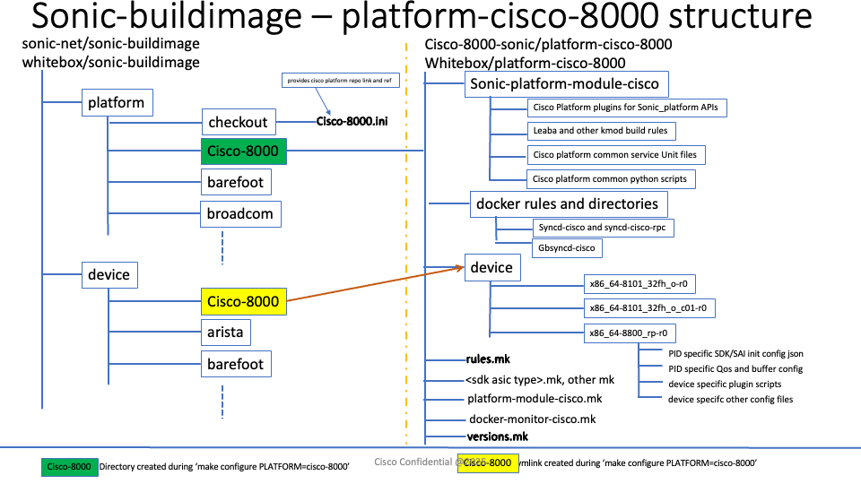
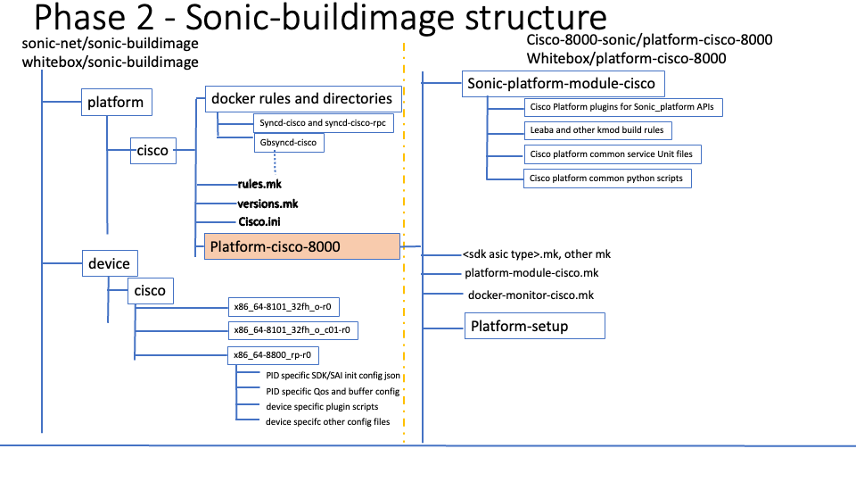

# SONiC Cisco-8000 Platform Code Restructuring
## High Level Design Document
### Rev 0.1

# Table of Contents
  * [Revision](#revision)
  * [About this Manual](#about-this-manual)
  * [Scope](#scope)
  * [Problem Statement](#problem-statement)
  * [Current Structure](#current-structure)
  * [Proposed Restructure](#proposed-restructure)
  * [Component Migration](#component-migration)
  * [Build Process Changes](#build-process-changes)
  * [Benefits](#benefits)
  * [Implementation Plan](#implementation-plan)
  * [Backward Compatibility](#backward-compatibility)
  * [Other Considerations](#other-considerations)
  * [Configuration Parameters](#configuration-parameters)
  * [Future Enhancements](#future-enhancements)

### Revision

| Rev | Date       | Author        | Change Description                |
|:---:|:----------:|:-------------:|-----------------------------------|
| 0.1 | 11/17/2025 | Anand Mehra    | Initial version                   |

# About this Manual
This document provides detailed information about the restructuring of Cisco-8000 platform code in SONiC-buildimage. The restructuring aims to improve build stability, enable multi-stream support, facilitate community engagement, and provide a foundation for "Build Your Own" (BYO) deliveries while protecting proprietary code.

# Scope

Restructure platform code distribution between `sonic-buildimage` and `platform-cisco-8000` repositories to:
- Move common, non-proprietary code into `sonic-buildimage`
- Relocate build configuration files to enable multi-stream branch strategy
- Establish foundation for community contributions while protecting proprietary code

Out of scope:
- Changes to platform/sdk driver build rules
- Modifications to existing platform APIs

## Problem Statement

The current Cisco-8000 platform code resides entirely in the external `platform-cisco-8000` repository, which is cloned during `make configure PLATFORM=cisco-8000`. This structure creates three issues:

1. Common non-proprietary code lacks protection from upstream SONiC changes, causing build failures
2. Platform-specific files (`rules.mk`, `versions.mk`) in `platform-cisco-8000` prevent multiple SONiC streams from sharing the same platform branch when artifact versions differ
3. No mechanism exists for staged community contributions of Cisco code

## Current Structure

### Repository Layout

```
sonic-buildimage/
├── platform/
│   └── cisco-8000/          # Created during 'make configure'
│       └── (cloned from platform-cisco-8000)
└── device/
    └── cisco/                # Created during 'make configure' as symlink
        └── (cloned from platform-cisco-8000, set as symlink)


platform-cisco-8000/          # External repository
├── sonic-platform-module-cisco/
│   ├── Cisco Platform plugins for SONiC_platform APIs
│   ├── Leaba and other kmod build rules
│   ├── Cisco platform common service Unit files
│   └── Cisco platform common python scripts
├── Platform-setup/
├── docker rules and directories/
│   ├── Syncd-cisco and syncd-cisco-rpc
│   └── Gbsyncd-cisco
├── rules.mk
├── versions.mk
├── cisco-8000.ini
├── platform-module-cisco.mk
├── docker-monitor-cisco.mk
└── device/
        ├── cisco-8000/
        ├── x86_64-8101_32fh_o-r0/
        ├── x86_64-8101_32fh_o_o01-r0/
        └── x86_64-8800_rp-r0/
            ├── PID specific SDK/SAI init config json
            ├── PID specific QoS and buffer config
            ├── device specific plugin scripts
            └── device specific other config files
```



### Existing Build Process

During `make configure PLATFORM=cisco-8000`:
1. `cisco-8000.ini` file is read from `platform-cisco-8000` repository
2. `platform/cisco-8000` directory is created in `sonic-buildimage`
3. `platform-cisco-8000` repository is cloned into this directory
4. Symlink created: `device/cisco-8000` → `platform/cisco-8000/device/`

### Current Issues

**Build Fragility**: Docker build rules (`docker-syncd-cisco`, `docker-gbsyncd-cisco`) in external repository are vulnerable to upstream SONiC changes.

**Version Management**: `versions.mk` location in `platform-cisco-8000` forces all SONiC streams to use identical artifact versions, blocking independent stream development.

**Community Contribution**: No mechanism to contribute approved platform code to SONiC community while maintaining proprietary code separation.

## Proposed Restructure

### New Repository Layout

```
sonic-buildimage/
├── platform/
│   ├── checkout/
│   ├── cisco/              
│   │   ├── cisco.ini       # Pulls platform-cisco-8000
│   │   ├── rules.mk
│   │   ├── versions.mk
│   │   └── docker rules and directories/
│   │   |    ├── syncd-cisco and syncd-cisco-rpc
│   │   |    └── gbsyncd-cisco
│   │   |--platform-cisco-8000/             # External repository (cloned as a subdir)
│   │       ├── sonic-platform-module-cisco/   # Cisco Platform plugins for SONiC_platform APIs
│   │       │   ├── Leaba and other kmod build rules
│   │       │   ├── Cisco platform common service Unit files
│   │       │   ├── Cisco platform common python scripts
│   │       │   └── Binaries and scripts (syncd-related)
│   │       ├── Platform-setup/
│   │       ├── platform-module-cisco.mk
│   │       └── docker-monitor-cisco.mk
│   ├── barefoot/
│   └── broadcom/
└── device/
    ├── cisco/                   # New: Moved from external repo
    │   ├── x86_64-8101_32fh_o-r0/
    │   ├── x86_64-8101_32fh_o_o01-r0/
    │   └── x86_64-8800_rp-r0/
    │       ├── PID specific SDK/SAI init config json
    │       ├── PID specific QoS and buffer config
    │       ├── device specific plugin scripts
    |       └── device specific other config files
    ├── arista/
    └── barefoot/
    |


```



### Component Migration

#### 1. Platform Initialization Configuration (cisco-8000.ini → cisco.ini)

**Current Behavior**:
- `cisco-8000.ini` file resides in `platform/checkout` in Sonic-buildimage repository
- Read during `make configure PLATFORM=cisco-8000`
- Specifies repository URL, branch, and clone target path
- Creates `platform/cisco-8000` directory in `sonic-buildimage`
- Clones entire `platform-cisco-8000` repository into this directory

**New Behavior**:
- `cisco.ini` file is created in `sonic-buildimage/platform/cisco/`
- Read during `make configure PLATFORM=cisco`
- Creates `platform/cisco/platform-cisco-8000/` subdirectory
- Clones `platform-cisco-8000` repository into subdirectory

**Configuration**:

`cisco.ini`:
```ini
[module]
url = https://github.com/Cisco-8000-sonic/platform-cisco-8000.git
ref = master
target_path = platform/cisco/platform-cisco-8000
```

**Build Command Change**:
- Old: `make configure PLATFORM=cisco-8000`
- New: `make configure PLATFORM=cisco`

**Directory Structure Impact**:
- Old: `platform/cisco-8000/` (entire repo cloned here)
- New: `platform/cisco/` (contains both community code and cloned repo)
  - `platform/cisco/docker-syncd-cisco/` (community code)
  - `platform/cisco/rules.mk` (community code)
  - `platform/cisco/platform-cisco-8000/` (cloned proprietary repo)

**Rationale**: 
- Separates platform name (Cisco ASIC family) from vendor-specific repository
- Allows community code and proprietary code to coexist in same platform directory
- Enables future support for other vendors using Silicon One ASIC

#### 2. Docker Syncd Binaries and Scripts

**Current Location**: `platform-cisco-8000/docker-syncd-cisco/`

**Action**: Move platform-specific binaries and scripts to `sonic-platform-module-cisco` debian package.

**Files to Move**:
- `dshell_client.py`
- `puntpkthandler`
- platform specific python scripts (mostly used for dshell CLI functionality)
    - `show_ports.py`
    - `show_transceivers.py`
    - `show_transceivers_detail.py`
    - `show_mac_state.py`
    - etc.

**Mechanism**: 
- Package files in debian module - sonic-platform-cisco_amd64.deb
- Install during lazy install phase
- Cleanup `docker-syncd-cisco/start.sh` to remove rules for copying files to `/usr/lib/cisco/pylib/leaba/`
- Update `sonic-platform-cisco_amd64.deb` to install files to `/usr/lib/cisco/pylib/leaba/`

**Installation Path for binaries**: 
  - dshell_client.py, puntpkthandler: `/opt/cisco/syncd/bin/`

**Installation Path for scripts**: 
  - show_ports.py, show_transceivers.py, show_transceivers_detail.py, show_mac_state.py, etc.: `/usr/lib/cisco/pylib/leaba/`

**Rationale**: Separates proprietary binaries from docker build rules, allowing docker rules to remain in `sonic-buildimage` while binaries and Cisco scripts stay in platform-cisco-8000 repository.

#### 3. Platform Docker Rules

**Current Location**: `platform-cisco-8000 repo docker-syncd-cisco, docker-gbsyncd-cisco`

**New Location**: `sonic-buildimage/platform/cisco`

**Files**:
- `docker-syncd-cisco/` directory
- `docker-gbsyncd-cisco/` directory
- Associated Makefiles and Dockerfiles

**Rationale**: Docker build rules contain no proprietary code. Moving to `sonic-buildimage` protects against upstream changes and enables community validation.

#### 4. Platform Configuration Files

**Current Location**: `platform-cisco-8000/` repo

**New Location**: `sonic-buildimage/platform/cisco/`

**Files**:
- `rules.mk` - Platform build rules
- `versions.mk` - Artifact version definitions
- other mk and dep files which are platform independent

**Rationale**: Enables per-stream version management. Different SONiC streams can maintain independent `versions.mk` while sharing `platform-cisco-8000` branch.

#### 5. Device Configuration

**Current Location**: `platform-cisco-8000/device/`

**New Location**: `sonic-buildimage/device/cisco/`

**Files**:
- Platform-specific directories (e.g., `x86_64-8101_32fh_o-r0/`)
- PID-specific SDK/SAI configuration JSON
- QoS and buffer configurations
- Device plugin scripts (approved for community)

**Linking Strategy**:

The device configuration management follows a hybrid approach to balance community contribution with proprietary code protection:

**Approved Platforms in `sonic-buildimage`**:
- Device folders for community-approved platforms are directly committed to `sonic-buildimage/device/cisco/`
- These contain non-proprietary configuration files:
  - PID-specific SDK/SAI initialization config JSON
  - QoS and buffer configurations
  - Standard device plugin scripts
  - Other device-specific config files
- Files are maintained and updated directly in `sonic-buildimage` repository
- Available for all builds without `platform-cisco-8000` access

**Proprietary Platforms in `platform-cisco-8000`**:
- Device folders containing Cisco-proprietary configurations remain in `platform-cisco-8000/device/` directory
- These may include:
  - Proprietary device plugin scripts
  - Cisco-specific configuration parameters
  - Pre-release or restricted platform configurations
- Not exposed to community without proper access

**Build-Time Linking via `platform-setup`**:
- During `make configure PLATFORM=cisco`, `platform-setup` rules execute
- Creates symlinks from `sonic-buildimage/device/cisco/` to proprietary device folders in `platform-cisco-8000/device/`
- Example symlink creation:
  ```bash
  # In platform-setup rules
  ln -sf $(PLATFORM_PATH)/platform-cisco-8000/device/x86_64-proprietary_platform \
         $(PROJECT_ROOT)/device/cisco/x86_64-proprietary_platform
  ```
- Symlinks make proprietary device configurations available during build without copying files
- Maintains single source of truth in `platform-cisco-8000` for proprietary configs

**Cisco-Specific Scripts Protection**:
- Device folders in `sonic-buildimage` may contain placeholder or stub scripts for proprietary functionality
- Actual proprietary scripts remain in `platform-cisco-8000`
- During build or lazy install, proprietary scripts are:
  - Copied to appropriate runtime paths, or
  - Symlinked from `platform-cisco-8000` location
- Example: Device-specific initialization scripts that call proprietary SDK functions

**Migration Path**:
- Start with all device configurations in `platform-cisco-8000`
- Identify platforms approved for community contribution
- Sanitize configurations to remove proprietary elements
- Move approved platforms to `sonic-buildimage/device/cisco/`
- Update `platform-setup` rules to handle remaining proprietary platforms

**Decision Criteria for Platform Placement**:

Place in `sonic-buildimage` if:
- Platform is publicly available and documented
- Configuration files contain no proprietary algorithms or parameters
- Device scripts use only standard SONiC APIs
- Cisco approves for community contribution

Keep in `platform-cisco-8000` if:
- Platform is pre-release or under NDA
- Configuration exposes proprietary SDK parameters
- Scripts contain Cisco business logic
- Platform requires restricted access

**Rationale**: This hybrid approach enables community contribution of approved device configurations while maintaining flexibility for proprietary platforms. It provides a clear path for gradual community contribution as platforms mature and are approved for public release.

#### 6. Platform Module

**Current Location**: `platform-cisco-8000/sonic-platform-module-cisco/`

**New Name**: `sonic-platform-module-cisco`

**Location**: Remains in `platform-cisco-8000` repository

**Future Enhancement**: Convert to prebuilt debian binary to reduce build time and enable binary releases.

**Rationale**: Contains proprietary drivers and platform code requiring protection. Renaming reflects Silicon One ASIC family.

### Build Process Changes

#### Configuration Phase

```bash
make configure PLATFORM=cisco
```

**Steps**:
1. Read `sonic-buildimage/platform/cisco/cisco.ini`
2. Clone `platform-cisco-8000` into `platform/cisco/platform-cisco-8000/`
3. Execute `platform-setup` rules to create symlinks for proprietary device configurations


#### Build Phase

**With `platform-cisco-8000` Access**:
- Full Cisco binary image with all proprietary components
- Platform module compiled from source
- All device configurations available

**Without `platform-cisco-8000` Access** (Community Validation):
- Docker images build successfully (syncd, gbsyncd, rpc-syncd)
- Device configurations limited to community-contributed platforms
- No platform module debian package
- Validates common docker build rules against upstream changes

### Authentication and Access

**Customer Builds**: Require GitHub authentication to clone `platform-cisco-8000` repository during `make configure`.

**Community Builds**: Can build and validate docker images without `platform-cisco-8000` access, using only code in `sonic-buildimage`.

## Benefits

### 1. Build Stability

Common docker build rules in `sonic-buildimage` are validated by SONiC CI/CD, reducing breakage from upstream changes.

### 2. Multi-Stream Support

`versions.mk` in `sonic-buildimage` allows different SONiC streams (e.g., 202205, 202305) to specify different artifact versions while sharing the same `platform-cisco-8000` branch.

### 3. Community Engagement

Enables staged contribution of Cisco code to SONiC community:
- Non-proprietary docker rules
- Approved device configurations
- Common build infrastructure

### 4. BYO (Build Your Own) Foundation

Provides base for customers to build Cisco images with community-available code. Customers can:
- Build docker images using community code in `sonic-buildimage`
- Add proprietary components via `platform-cisco-8000` access
- Use prebuilt debian packages for faster builds
- Customize configurations for specific deployment needs 

### 5. Proprietary Code Protection

Maintains separation of proprietary components:
- Platform drivers and modules
- Proprietary binaries
- Restricted device configurations

## Implementation Plan

### Phase 1: Core Infrastructure Migration

This phase moves non-proprietary build infrastructure to `sonic-buildimage` and refactors the platform module.

**Docker Rules Migration**:
1. Create `sonic-buildimage/platform/cisco/` directory
2. Move `docker-syncd-cisco/` and `docker-gbsyncd-cisco/` directories from `platform-cisco-8000`
3. Update Makefiles to reference new paths
4. Validate docker builds with and without `platform-cisco-8000` access

**Configuration Files Migration**:
1. Move `rules.mk`, `versions.mk` to `sonic-buildimage/platform/cisco/`
2. Move `cisco.ini` to `sonic-buildimage/platform/cisco/`
3. Update `make configure` logic to read from new location
4. Test multi-stream version management with different `versions.mk` per SONiC stream

**Platform Module Refactoring**:
1. Move `sonic-platform-module-cisco` to `sonic-platform-module-cisco` in `platform-cisco-8000`
2. Move syncd binaries (`dshell_client.py`, `puntpkthandler`) into module
3. Move platform-specific python scripts to module (e.g., `show_ports.py`, `show_transceivers.py`)
4. Update debian package to install binaries to `/opt/cisco/syncd/bin/`
5. Update debian package to install scripts to `/usr/lib/cisco/pylib/leaba/`
6. Cleanup `docker-syncd-cisco/start.sh` to remove file copy rules
7. Test lazy install functionality

**Community Validation Setup**:
1. Enable SONiC nightly builds without `platform-cisco-8000` access
2. Validate docker image builds (syncd, gbsyncd, rpc-syncd)
3. Configure CI to detect upstream breakage
4. Monitor build success rates

### Phase 2: Device Configuration Migration

This phase establishes the hybrid device configuration model with community and proprietary platforms.

1. Create `sonic-buildimage/device/cisco/` directory structure
2. Identify approved platforms for community contribution
3. Sanitize approved device configurations (remove proprietary elements)
4. Move approved device configurations to `sonic-buildimage/device/cisco/`
5. Update `platform-setup` rules to create symlinks for proprietary platforms
6. Test device configuration loading for both community and proprietary platforms
7. Validate platform detection and initialization

### Phase 3: Binary Deliverable Artifacts

This phase converts platform modules to prebuilt debian packages to reduce build time and enable binary-only releases.

**Debian Packages**:
1. `sonic-platform-cisco` - Platform drivers, APIs, and scripts
2. `cisco-wb-bsp` - Board support package for hardware initialization
3. `cisco-wb-fpd` - Field programmable device firmware management
4. Other platform-specific debian packages as needed

**Implementation**:
- Create build pipeline for generating debian packages from source
- Establish artifact repository for hosting prebuilt packages
- Implement version alignment with SONiC release streams
- Test installation and lazy install with prebuilt packages

## Backward Compatibility

### Handling cisco-8000 ASIC Type References

Code in `sonic-buildimage`, `sonic-mgmt`, and other SONiC repositories currently references "cisco-8000" as the ASIC type. To ensure a smooth transition to the cisco platform structure, modifications will be made to handle both "cisco-8000" and "cisco" references.

**Migration Strategy**:
- Add support for "cisco" as the primary platform identifier
- Maintain "cisco-8000" references for backward compatibility
- Existing code paths that check for "cisco-8000" ASIC type will continue to function
- New code should use "cisco" as the platform identifier

**Affected Areas**:
- Platform detection logic in `sonic-buildimage`
- Test scripts and automation in `sonic-mgmt`
- Configuration files and templates
- Documentation and deployment guides

**Implementation Approach**:
- Update platform detection to recognize both "cisco-8000" and "cisco"
- Add compatibility mappings where ASIC type is used for conditional logic
- Gradual deprecation path for "cisco-8000" references in future releases
- No immediate removal of "cisco-8000" to prevent breaking existing deployments

**Rationale**: This dual-support approach ensures existing installations, test infrastructure, and automation continue to function while enabling migration to the new cisco platform structure. It provides a transition period for customers and internal teams to update their configurations and scripts.

## CI/CD Support Requirements

The new build structure requires updates to CI/CD pipelines to support the restructured code layout and build process.

**Build Pipeline Changes**:
- Update CI/CD workflows to handle `platform/cisco/` directory structure
- Configure separate build jobs for community validation vs full Cisco image builds

**Artifact Management**:
- Configure artifact storage for prebuilt debian packages
- Implement version tracking and artifact retention policies
- Add package signing and verification steps

**Validation Gates**:
- Upstream SONiC change detection and build validation
- Binary package compatibility verification

## Error Handling

### Missing `platform-cisco-8000` Access
- Docker builds succeed with warning about missing platform module
- Device configurations limited to community-contributed platforms
- Build produces partial image suitable for validation, not deployment

### Invalid `cisco.ini`
- `make configure` fails with clear error message
- Provides guidance on repository access requirements

### Symlink Creation Failure
- `platform-setup` reports missing device configurations
- Build continues with available configurations

## Performance and Resource Usage

### Build Time Impact
- **With platform module source**: No change (same compilation time)
- **With prebuilt debian** (future): Reduced build time (To be evaluated)


## Configuration Parameters

### `cisco.ini`
```ini
[module]
url = https://github.com/Cisco-8000-sonic/platform-cisco-8000.git
ref = master
target_path = platform/cisco/platform-cisco-8000
```

### `versions.mk`

Defines artifact versions for platform components:
```
# Cisco version variables
export ARTIFACTORY ?= https://engci-maven.cisco.com/artifactory/whitebox-group/

export CISCO_TAM_LIBRARY_VERSION := 4.5.1-1-gc358f3f-bookworm

export CISCO_DIMM_DRIVER_VERSION := 2.0-4-gd1c9f3e-bookworm

export CISCO_TAM_DRIVER_VERSION := 2.0-3-gae54acb-bookworm

export CISCO_WB_KMOD_VERSION := 2.01-39-g6257590-bookworm

export CISCO_WB_BSP_VERSION := 0.4-597-g0ce030f4

export CISCO_WB_FPD_VERSION := 0.9-70-g0cfdfb5-bookworm

export CISCO_BACKPORTS_KMOD_VERSION := 5.10.103
export CISCO_BACKPORTS_URL := https://cdn.kernel.org/pub/linux/kernel/v5.x

export CISCO_Q100_SILICON_ONE_VERSION := 24.7.3000.41-sai-1.13.0-bullseye-87bc6e35a5d
export CISCO_Q100_VALIDATION_PKG_VERSION := 24.7.3000.41

export CISCO_Q200_SILICON_ONE_VERSION := 24.7.3000.41-sai-1.13.0-bullseye-87bc6e35a5d
export CISCO_Q200_VALIDATION_PKG_VERSION := 24.7.3000.41
```

Each SONiC stream can maintain independent versions while sharing the same `platform-cisco-8000` branch.

Code committed to Sonic-buildimage community repository should contains only public released artifacts and ASICs.
Internal branches may have local modified versions based on stream requirement.

#### Version Update Process

**Community Releases:**
- For any new releases in the community, `versions.mk` will be updated along with `cisco.ini` file
- Updates include any new version changes required for SDK, BSP, kmod, and/or any other artifact controlled via `versions.mk`
- Changes are committed together to ensure version consistency

**Internal SONiC-buildimage Branches:**
- For internal SONiC-buildimage branches (community or C branch), CI/CD pipelines will update the files based on internal build requirements
- When syncing these branches from upstream, git will prefer local files over remote versions in case of any conflict
- This ensures internal version requirements are preserved during upstream synchronization
- CI/CD automation handles version updates to maintain consistency across internal builds

### `rules.mk` (Key Variables)
```makefile
CISCO_PLATFORM_PATH = platform/cisco
CISCO_PLATFORM_MODULE = sonic-platform-module-cisco
CISCO_SYNCD_DOCKER = docker-syncd-cisco
CISCO_GBSYNCD_DOCKER = docker-gbsyncd-cisco
```

## Future Enhancements

### Prebuilt Platform Module Debian
Convert `sonic-platform-module-cisco` to prebuilt binary:
- Reduces build time
- Enables binary-only releases
- Simplifies customer build process

### Additional Community Contributions
- Platform monitoring scripts
- Common utility functions
- Test frameworks

### Multi-Vendor Silicon One Support
Structure enables other vendors using Silicon One ASIC to leverage common platform code.
