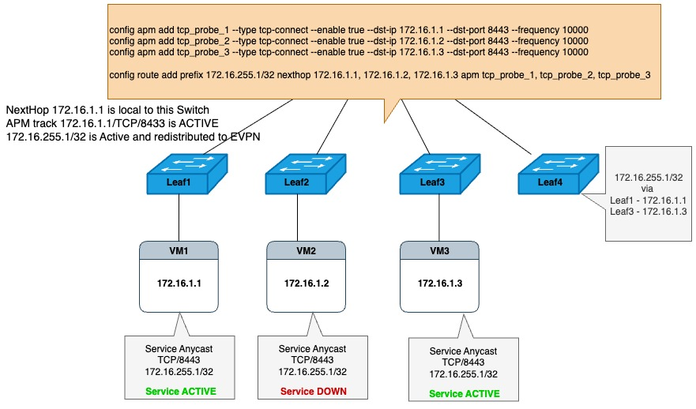
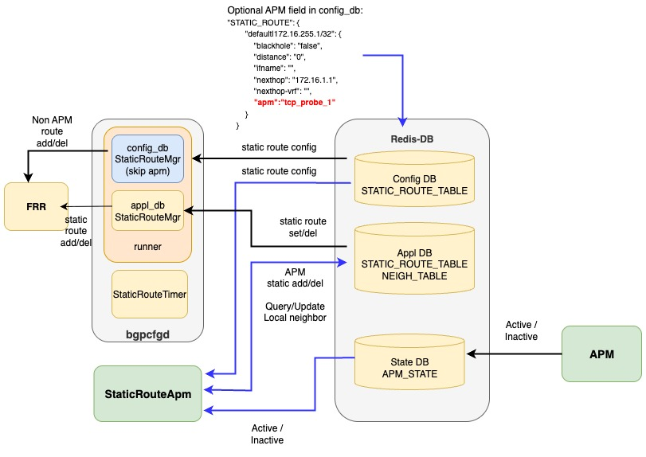
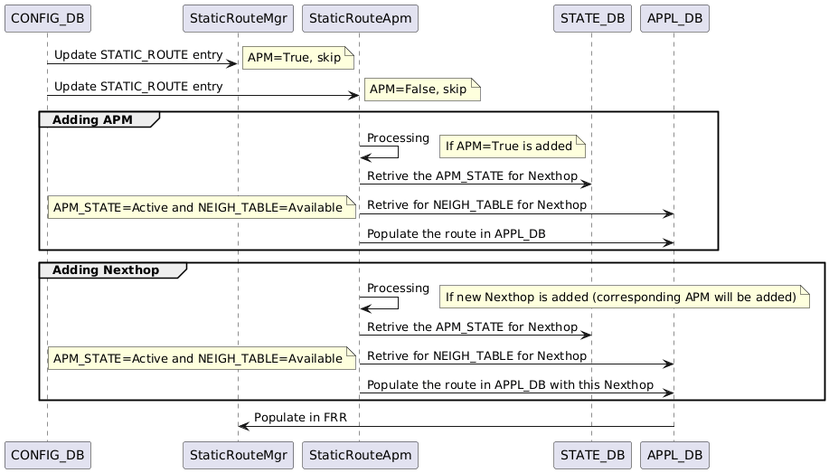
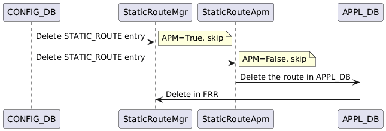
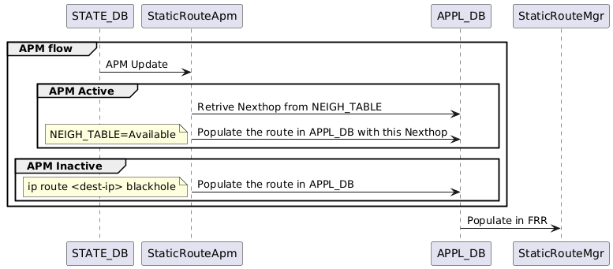

# SONiC Active Performance Monitoring for Static Routes HLD

## Table of Contents

### 1. Revision

- Initial version

### 2. Scope

This document describes the design for using Active Performance Monitoring (APM) to check the availability of static route next hops or application endpoints. Based on the state of APM sessions, it manages the installation, update, and removal of static routes in the system.

### 3. Definitions/Abbreviations

- **APM**: Active Performance Monitoring
- **Probe**: A synthetic packet sent to measure the performance of a network path.

### 4. Overview

Active Performance Monitoring (APM) in SONiC is a proactive framework for monitoring network performance using synthetic probes. APM enables real-time measurement of critical metrics such as reachability, round-trip latency, jitter, and packet loss across network paths. Operators can configure APM to monitor connectivity between SONiC switches or between a switch and remote endpoints.

This document discusses the use of APM probes to monitor the reachability and performance of next-hop IP addresses associated with static routes. By continuously probing these next hops, SONiC can automatically detect failures or degraded performance. When a probe indicates that a next hop is unreachable or fails to meet defined performance thresholds, SONiC can update the static route configuration by removing the affected next hop. This automated corrective action ensures that traffic is dynamically rerouted over healthy paths, minimizing downtime.

In the below topology, southbound static routes are installed by an operator to VM-based hosts running anycast-style services. APM is used to monitor the reachability of these hosts. If a host becomes unreachable, SONiC will automatically remove the static route to that host and stop advertising it to the network. This allows the network to quickly adapt to changes in host availability without manual intervention.



This feature has many similarities with BFD for static route, but also some key differences. It's discussed in details later in the document.

- StaticRouteBFD creates the BFD sessions internally for each nexthop while StaticRouteAPM requires the user to create APM sessions for each nexthop.

- StaticRouteBFD is inherently a bidirectional protocol and requires a matching configuration on both the endpoints, while StaticRouteAPM is unidirectional and doesn't require any configuration on the other side.

### 5. Requirements

1. Monitor static route configuration and if programmed with an APM session, take the ownership of the static route programming.
2. Monitor the state of APM sessions and update static routes based on the current state of each APM session.
3. Manage the lifecycle of static route configuration for FRR including:
   - Creation/deletion of Static Route.
   - Addition/deletion of nexthops as needed.
4. Handle application restarts gracefully by recovering static route and APM session states from the Redis databases (CONFIG_DB, APPL_DB, and STATE_DB) without impacting any existing installed static routes or active APM sessions.

### 6. Architecture Design

A new component, StaticRouteApm, has been introduced to support integration of static route with APM functionality. It will run as a separate process inside the BGP container. StaticRouteApm will monitor the static route configuration in CONFIG_DB, and update static routes in APPL_DB based on the state of APM sessions in STATE_DB. StaticRouteApm will take ownership of static routes that are configured with APM by checking the "apm" field in CONFIG_DB's STATIC_ROUTE_TABLE. If the "apm" field is present, StaticRouteApm will manage the static route and its nexthops based on the state of APM sessions.

### 7. High-Level Design

## System Overview with Static Route APM

In the diagram below, StaticRouteApm monitors the STATIC_ROUTE_TABLE in config_db. When a static route is configured with APM, StaticRouteApm monitors the APM session state in state_db. Based on the session state, it updates the STATIC_ROUTE_TABLE in appl_db to add, delete, or modify the static route's nexthop list.

To ensure compatibility with the existing bgpcfgd component StaticRouteMgr, an optional "apm" field is introduced in STATIC_ROUTE_TABLE. When this field is present and set to a valid APM entry in config_db, StaticRouteMgr ignores the static route, and StaticRouteApm takes over its handling. It writes the static route to appl_db based on the APM session state and nexthop configuration.

To prevent StaticRouteTimer from deleting static routes created by StaticRouteApm, the "expiry" field is set to "false" when writing to appl_db's STATIC_ROUTE_TABLE. When StaticRouteTimer encounters "expiry"="false", it skips deletion of that entry.



## DB changes

A new optional field named "apm" is introduced to the STATIC_ROUTE_TABLE schema. This field contains a list of APM session names corresponding to each nexthop. When left unconfigured, the field defaults to empty. Once the "apm" field is populated with valid APM session names, StaticRouteApm assumes control over managing that static route.

[*Reference: STATIC_ROUTE_TABLE schema:*
 [STATIC_ROUTE table in CONFIG_DB](https://github.com/Azure/SONiC/blob/master/doc/static-route/SONiC_static_route_hdl.md#3211-static_route).]

```JSON
;Defines IP static route  table
;
;Status: stable

key                 = STATIC_ROUTE|vrf-name|prefix ;
vrf-name            = 1\*15VCHAR ; VRF name
prefix              = IPv4Prefix / IPv6prefix
nexthop             = string; List of gateway addresses;
ifname              = string; List of interfaces
distance            = string; {0..255};List of distances.
                      Its a Metric used to specify preference of next-hop
                      if this distance is not set, default value 0 will be set when this field is not configured for nexthop(s)
nexthop-vrf         = string; list of next-hop VRFs. It should be set only if ifname or nexthop IP  is not
                      in the current VRF . The value is set to VRF name
                      to which the interface or nexthop IP  belongs for route leaks.
blackhole           = string; List of boolean; true if the next-hop route is blackholed.
                      Default value false will be set when this field is not configured for nexthop(s)
bfd                 = string; "true" or "false". "true" if use BFD to monitor nexthop
                      Default value false will be set when this field is not configured for nexthop(s)

apm                 = string; List of APM session names (one for each nexthop);
                      If this field is set to a valid APM session for any of the nexthops, StaticRouteApm will monitor the corresponding APM session state
                      to update the Static Route's active nexthops. If some nexthops have a valid APM session and others do not, the ones without a valid 
                      session will be treated as inactive.
                      
expiry              = string; "true" or "false". "false" if need to skip timeout checking
```

## Internal tables in StaticRouteApm

StaticRouteApm uses three internal tables (implemented as dictionaries or maps) to monitor nexthops via APM sessions and update static routes accordingly:

1. TABLE_CONFIG
    - purpose: Caches entries from config_db's STATIC_ROUTE_TABLE for routes with valid APM sessions.
    - key: {vrf, prefix}
    - value: {nexthop list, APM session list, other static route parameters (e.g., vrf, blackhole, etc.)}

2. TABLE_APM
    - purpose: Tracks APM sessions actively used by StaticRouteApm.
    - key: APM session name
    - value: {nexthop IP address, apm state, Dst prefix, vrf}

3. TABLE_SRT
    - purpose: Stores static routes written to appl_db's STATIC_ROUTE_TABLE by APMRouteManager (with "expiry"="false").
    - note: The nexthop list may differ from the configuration depending on APM session state.
    - key: {vrf, prefix}
    - value: {active nexthop list, APM session list, other static route parameters (e.g., vrf, blackhole, etc.)}

## Adding/updating static route flow

When a new static route is added to config_db::STATIC_ROUTE_TABLE, StaticRouteApm first checks for the "apm" field. If it's missing, the route is ignored.

If the route includes "apm", StaticRouteApm checks whether it already exists in TABLE_CONFIG. If not, it adds the route to TABLE_CONFIG and creates an entry in TABLE_SRT with an empty nexthop list (to be updated later based on APM session state). For each nexthop, if a valid APM session is configured, it updates or creates the corresponding entry in TABLE_APM.

If the route already exists in TABLE_CONFIG, the nexthop list is compared to identify additions and deletions. Newly added nexthops are reflected in TABLE_SRT and TABLE_APM. Deleted nexthops are removed from both tables.

If none of the remaining nexthops are associated with a valid APM session, those nexthops are considered inactive and will not be added to appl_db.



## Deleting static route flow

When a static route is removed from config_db::STATIC_ROUTE_TABLE, StaticRouteApm performs the following actions:

1. Check if the route exists in TABLE_CONFIG. If found, remove it from both TABLE_CONFIG and TABLE_SRT.
2. Delete the corresponding static route entry from appl_db's STATIC_ROUTE_TABLE.
3. For each nexthop that was part of the deleted route, remove the associated APM session entry from TABLE_APM.




## Dynamic static route "APM" config change support

When the "apm" field of a static route changes (from none to "apm session value" or vice versa), the ownership of the static route (between StaticRouteMgr and StaticRouteApm) also changes. StaticRouteMgr and StaticRouteApm must work together to handle this runtime ownership transition.

### APM field is set to "session" value from none
When StaticRouteMgr detects that a static route has been updated with an "apm" field set to a valid session value:

1. If StaticRouteMgr had previously installed this static route, it removes the route from FRR and clears it from its local cache, transferring ownership to StaticRouteApm.
2. If the route prefix is not present in StaticRouteMgr's local table, StaticRouteApm takes immediate ownership and installs the route based on the current APM session state and neighbor reachability.

StaticRouteApm then manages the route lifecycle by monitoring APM session states and updating the route's nexthop list accordingly in appl_db's STATIC_ROUTE_TABLE.

### APM field is set to none
When StaticRouteApm detects that the "apm" field has been removed (set to none) and the route exists in its internal table:

1. StaticRouteApm removes the route from its internal tables (TABLE_CONFIG, TABLE_SRT, and TABLE_APM).
2. StaticRouteApm deletes the corresponding entry from appl_db's STATIC_ROUTE_TABLE.
3. StaticRouteMgr resumes control of the route and programs it normally through FRR, as the route no longer has an "apm" field configured.

## APM session state update flow

StaticRouteApm will be notified if there is any update in state_db APM_SESSION_TABLE.

* 1\. Look up TABLE_APM, ignore the event if session is not found in local table. Otherwise get the nexthop
* 2\. If session found in TABLE_APM, lookup TABLE_SRT table to get the static route entry.
    * If the APM session state is UP and this nexthop is in the static route entry's nexthop list, no action needed
    * If the APM session state is UP and this nexthop is NOT in the static route entry's nexthop list:
        * Add this nexthop to the static route entry's nexthop list, set "expiry": "false", write this static route to redis appl_db STATIC_ROUTE_TABLE.
    * If the APM session state is DOWN and this nexthop is NOT in the static route entry's nexthop list, no action needed
    * If the APM session state is DOWN and this nexthop is in the static route entry's nexthop list,
        * Delete this nexthop from the static route entry's nexthop list
            * if the static route entry's nexthop list is empty, delete this static route from redis appl_db, break;
            * if the static route entry's nexthop list is NOT empty, write it to redis appl_db STATIC_ROUTE_TABLE with "expiry"="false".





## Table reconciliation after StaticRouteApm restart

When StaticRouteApm restarts, it loses all internal table contents. The process must rebuild the internal tables from Redis DB (i.e., configuration DB, application DB, state DB, etc.), perform cross-checking between these tables and Redis DB to ensure consistency, and then start processing events received from Redis DB.

### 8. SAI API

### 9. Configuration and Management

#### 9.1. CLI Enhancements
The existing `config route` command will be enhanced to include an optional `apm` field that accepts a list of APM probe session names:
```bash
config route add prefix <prefix_ip> nexthop <nexthop_ip1, nexthop_ip2...> apm <apm_profile1, apm_profile2...>

Sample Command:

config route add prefix 20.1.1.1/32 nexthop 10.1.100.2 apm tcp_probe_1
```

#### 9.2. YANG model Enhancements
A new leaf "apm" will be added to existing sonic-static-route yang

```
container sonic-static-route {
    container STATIC_ROUTE {
      description
        "STATIC_ROUTE part of config_db.json";
      list STATIC_ROUTE_TEMPLATE_LIST {
      ...
      
      leaf apm {
          type string;
          description
            "List of APM session names corresponding to each nexthop; each session monitors the reachability of its associated nexthop"
        }
```

### 10. Warmboot and Fastboot Design Impact

StaticRouteApm will restore all the configs from config db and accordingly repopulate its internal tables and DBs.

### 11. Restrictions/Limitations

### 12. Testing Requirements/Design

#### Tests
1. Verify route without apm is updated to FRR and route installed.
2. Verify route with apm and probe inactive is held and not installed.
3. Verify route with apm and probe active is pushed to FRR and installed.
4. Verify existing non apm route to apm route is pushed to FRR and installed based on local neighbor and apm probe state
5. Verify existing apm route to non apm route is pushed to FRR and installed
6. Verify deleting installed route withdraws it from FRR and removes entry.
7. Verify deleting held route removes it from pending list without FRR withdraw.
8. Verify blackhole route is skipped and not installed in FRR.
9. Verify probe transition from active to inactive withdraws dependent routes to hold.
10. Verify probe transition from inactive to active installs all held routes in FRR.
11. Verify deleting probe removes it from apm state and keeps routes held.
12. Verify static route addition/deletion in default VRF with apm
13. Verify static route addition/deletion in non default VRF with apm  
14. Verify apm routes addition/deletion for IPv6 address
15. Verify apm states and route installed after config relaod
16. Verify apm states and route installed after system relaod
17. Verify apm states and route installed after warmboot
18. Verify neighbor movement from one leaf to local leaf
19. Verify apm routes are updated based on neighbor going down and up 

### 13. Open/Action items

## Traffic convergence acceleration

The StaticRouteApm add/remove nexthop to/from prefix via FRR. This may takes time to recursively update all the FRR route. Using the approach similar to [ECMP acceleration](https://github.com/sonic-net/SONiC/blob/master/doc/ecmp/sonic-ecmp-acceleration.docx) can speed up the traffic convergence.
