# VxLAN DataCenter Interconnect (DCI) High-Level Design (HLD)

## Table of Content
1. Revision
2. Scope
3. Definitions/Abbreviations
4. Overview
5. Requirements
6. Architecture Design
7. High-Level Design
8. SAI API
9. Configuration and Management
10. Open/Action Items

### 1. Revision
| Rev  | Date       | Authors            | Change Description |
| ---- | ---------  | ------------------ | ------------------ |
| 0.x  | Sept-2025  | Patrice Brissette  | Initial draft      |

### 2. Scope
This document describes the high-level design for VxLAN DataCenter Interconnect (DCI)
in SONiC.

### 3. Definitions/Abbreviations

- BGW: Border GateWay - refer as a node and its placement in the network
- BUM: Broadcast, Unknown unicast, Multicast - refer to L2 traffic type
- DCI: DataCenter Interconnect - refer as the functionality of a node
- ES:  Ethernet Segment
- ESI: Ethernet Segment Identifier
- IRO: Ingress Route Optimization
- IR:  Ingress Replication

### 4. Overview

The Data Center Interconnect (DCI) feature in SONiC provides robust, scalable, and secure connectivity across geographically dispersed data centers.

Key capabilities include:

- Automated control plane mechanisms supporting both MAC and IP mobility
- High availability and resiliency with built-in multi-site redundancy
- Seamless VM migration (vMotion) enabled by Inclusive Route Origination (IRO)
- Flexible policy enforcement through dynamic BGP Route Target (RT) translation
- Separation of control plane and data plane for optimized operations

DCI is purpose-built for the requirements of modern cloud and enterprise deployments, offering:

- Support for multi-tenancy and network segmentation
- Rapid convergence and reduced downtime during migration events
- Seamless integration with existing SONiC infrastructure and operational workflows

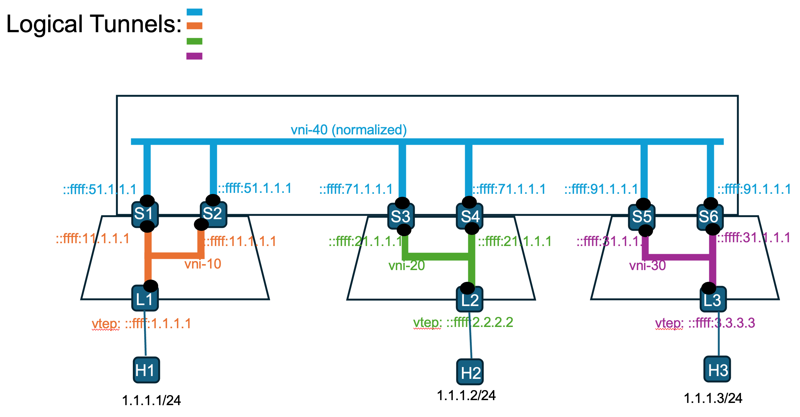
*Figure 1: DCI Architecture Overview*

The diagram illustrates three datacenters interconnected over a WAN. Each datacenter connects to the WAN through a redundant pair of BGW nodes that provide DCI (Data Center Interconnect) functionality. Connectivity across the inter-site WAN is normalized between sites, and the WAN may optionally include a BGP route server.

Here's a detailed summary of the DCI (Data Center Interconnect) functionality:

* BGW Node Configuration
  - BGW nodes can be spine
  - BGW nodes may also run as separate nodes
  - BGW may have directly connected hosts or orphan ports
  - Pair of BGW nodes per data center
  - Normalized VNI – symmetric VNI across data centers
  - Full VXLAN tunnel termination, lookup and re-encapsulation at BGW
  - Support of L2 and L3 connectivity at the BGW node

* Network Design Simplifications
  - Presence of route reflector or route server within WAN and DC
  - May use AnyCast VTEP for overlay
    - No ESI (Ethernet Segment Interface) support
    - Simplified design by removing DF election and filtering
  - VTEP can either be IPv4 or IPv6

* Route Handling
  - Route targets rewrites based on source and destination data centers AS number
  - End-to-end vMotion Sequence number handling
  - Ingress replication routes are locally significant to DC/WAN

* Policy and Advertisement
  - BGP Implicit and Exlicit route policy with route summarization
  - EVPN advertisement limited to:
    - Type 1 for mass-withdraw and aliasing
    - Type 2 for host advertisement; re-origination at BGW
    - Type 3 for ingress replication
    - Type 4 for Ethernet Segment and Multi-homing using per site-id
    - Type 5 for subnet advertisement; re-origination at BGW

The BGW / DCI solution plays an important role in datacenter deployment as a "swiss army" knife.
The main advantages are:

- Multi-hop native L2/L3 DC
  - Allow simple and easy DC extension for L2 and L3 services
- Scaling feature e.g., VTEPs, ingress replication endpoints, etc.
  - Allow to blast radius of some component to be small
  - Easy of hardware resources
- Ownership separation
  - Allow to extend DC across different owners
- Coexistence of different technology e.g., ACI, standalone, etc.
  - Allow to extend DC across different technologies
- Policy boundary
  - Allow route policy to control what is in/out from a specific DC
- Multi-VRF Northbound BGP / peering
  - Allow to extend DC to Northbound peer

For example, consider a customer who initially built a small data center with 2 spine switches and 4 leaf switches. As the customer looks to expand, the straightforward approach is to add more leaf switches and possibly additional spines. This expansion directly impacts the existing setup and configuration: it requires more VTEPs, additional tunnels, and larger ingress replication lists with more endpoints. The devices will also need increased hardware resources to accommodate the larger data center.

Using Data Center Interconnect (DCI) simplifies this process. Instead of significantly changing the existing configuration or upgrading hardware, the customer can expand by adding another similar data center (with 2 spines and 4 leafs) and interconnecting it. This allows for seamless growth without major configuration changes or hardware upgrades.

A second layer of spine switches (super-spine) can also be introduced, serving as Border Gateway (BGW) devices to connect with external WAN networks. If a tunneling technology such as IPsec is used for connectivity, the existing underlay encapsulation can remain unchanged. For example, the connection can be established using VXLAN over an IPsec tunnel.

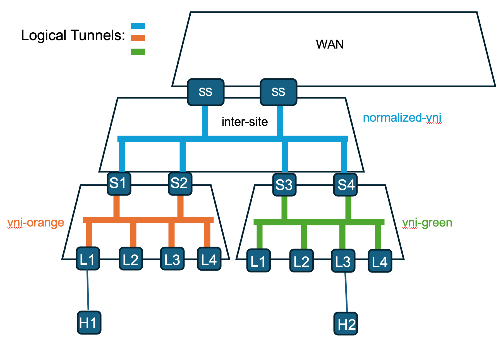
*Figure 2: DCI / Inter-site Advantages*

### 5. Requirements

DCI functionality is provided in multiple phases. The initial phase focuses on establishing the core foundation and Layer 2 services.

#### Functional Requirements
The initial requirements are:

- Establish VxLAN EVPN-based DCI between multiple data centers using multi-site architecture as per IETF draft
- Node resiliency connecting DC to WAN
- Support for transparent Layer 2 extension
- L2VNI normalized across inter-site
- Enable VM mobility with Inclusive Route Origination (IRO)
- vMotion capabilities have global scope
- Implement BGP Route Target (RT) translation for ingress/egress traffic
- VxLAN tunnels can be either IPv4 or IPv6 (VTEP)
- BGP policy over L2VNI is implicit only
- Per tunnel traffic counters
- Ensure control plane and data plane separation
- Support multi-tenancy and scalable segmentation
- L3VNI tunnel termination facing DC into IPv4/IPv6 unicast towards Northbound customer
- Integrate with SONiC management interfaces (CLI, REST, SNMP)

Future phase requirements are:
- Support for Layer 3 segmentation and stitching
- Support of locally connected host and orphan port on DCI nodes
- Support of ESI and multi-homing machinery on DCI nodes
- Support the concept of site-id per Ethernet Segment
- vMotion capabilities with local scope
- Failure tracking congestion policy based using weighted-ECMP
- BUM rate limitation
- Hub and spoke topology between sites
- Tunnel cost over BGP policy (pref. path)
- Explicit BGP policy over VNI
- Use of BGP route server in WAN
- Configuration of domain specific BGP route-target
- DC and WAN facing interface failure tracking
- DC and WAN facing remote neighbor tracking

#### Non-Functional Requirements
- Fast convergence during migration and failover
- Minimal impact on existing SONiC boot and memory performance
- Backward compatibility with existing SONiC deployments

#### Interoperability Requirements
- Compliance with multi-site EVPN and anycast aliasing standards
- Future Phase: Interoperability with third-party EVPN/VxLAN implementations

#### Comparison to IETF Drafts
The DCI requirements are mapped to the latest multi-site EVPN and anycast aliasing drafts. Key matching features include:
- Route advertisement and aliasing for MAC/IP mobility
- anycast IP in the overlay
- Control plane scalability and redundancy
- Policy enforcement via BGP RT translation

Drafts are:

- https://datatracker.ietf.org/doc/draft-rabnag-bess-evpn-anycast-aliasing/

#### List of Restrictions
This section provides the list of restrictions from initial delivery phase. Many of them will be lifted off in future deliveries.

BGW node does NOT support:
- Locally connected host and orphan port
- Routing protocol aka slow path support
- STP, DHCP-relay, IGMP, etc.
- IPM and/or any performance/probing measurement protocol
- SVI access interface
- Leaf node functionality
- Interface tracking (used in failure E scenario)
- Neighbor tracking (used in failure E scenario)
- Ethernet-Segment on peering BGW nodes
- Overlay VxLAN Tunnel between peering BGW nodes

Furthermore, there are few more restrictions that you MUST to be aware:
- Use of anycast VTEP on BGW nodes for L2 connectivity
- Use of a single physical VTEP on BGW nodes for L3 tunnel termination
- A maximum of 3 VTEPS per BGW node e.g., 2 anycast and 1 physical VTEPs
- BGP-EVPN peering done over separate loopback interface
- Full mesh connectivity required within DC and WAN domains
- VNI-normalized value is globally unique
- BGP RT-2 MAC-only route re-origination
- VRF-lite support towards Northbound customer with BGP peering within VRF

#### Scale Requirements

| Requirement                   | Comments                    |
|-------------------------------|-----------------------------|
| Pair of remote tunnels per DCI| 10 remote sites             |
| # of VTEPs per site           | 36                          |
| # of MAC per site             | 20K                         |
| # of L2VNI per site           | 256                         |
| # of L3VNI per site           | 10                          |
| # of Leaf per site            | 32                          |
| # of sites                    | 11                          |
| # of host                     | 20K / 40K with IRO          |
| # of redundant BGW per site   | 2 BGW per site              |


### 6. Architecture Design
The DCI architecture is designed to seamlessly integrate with the existing SONiC infrastructure and extending current capabilities to support multi-site connectivity, VM mobility, and advanced policy enforcement. The architecture is modular, allowing for phased implementation and future enhancements.

#### Domain
As part of DCI functionality, concept of domain is introduced at BGW nodes enabling granular control on network entity. For example, in the first picture, there are 4 different domains: 1 per DC and 1 for the WAN. As a first delivery, BGW nodes support only 2 domains; 1 domain for the connected datacenter and 1 domain for the WAN.

The domain concept significantly enhances the architecture by enabling a clear separation between the control plane and the data plane. Services are configured directly on the data plane side, such as a bridge domain with tunnel endpoints, where each tunnel connects to a different domain. Control plane establishment occurs on a per-domain basis, resulting in a more streamlined and cohesive architecture.

#### Site
A datacenter domain interconnects with a WAN domain via a pair of redundant BGW nodes where DCI functionality is provided. That pair of BGW nodes and its DC domain form a site. It is identified by defining a site-id. Both BGW share that same site-id.

#### Forwarding Paradigm
A BGW node performs simple operations to achieve DCI functionality. For each incoming packet from DC/WAN side, a full tunnel disposition chain is performed followed by a lookup based on the inner payload followed by a full tunnel imposition chain. For layer-2 connectivity, it looks like:

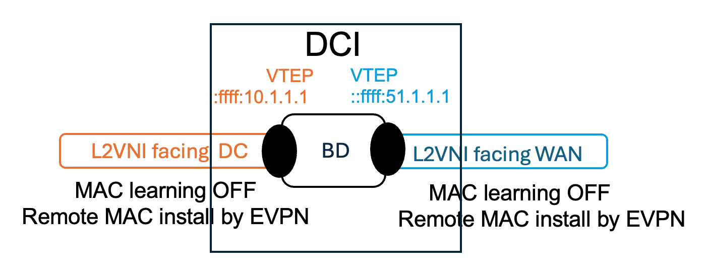
*Figure 3: L2 Forwarding Paradigm*

The same forwarding paradigm is used in both directions.

#### MAC programming
The L2 DCI functionality is achieved by installing remote MAC recevied from DC & WAN domains. This allow the MAC lookup to be performed properly after tunnel termination. Similar approach is taken for IP payload where the lookup is performed within the appropriate VRF.

#### Tunnel Establishment

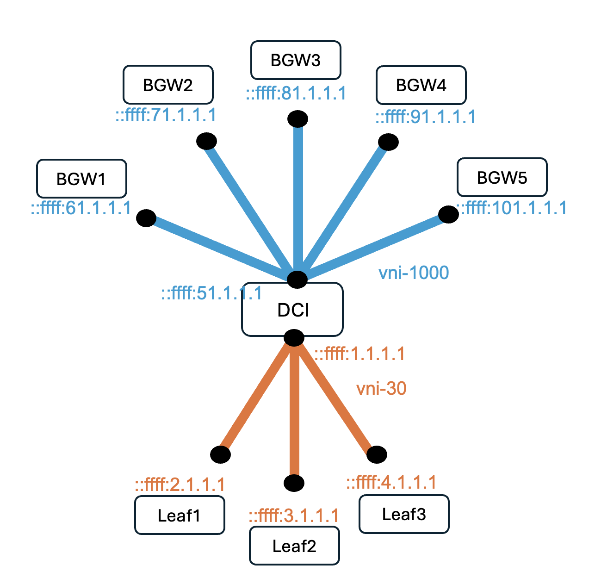
*Figure 4: L2 Tunnels Establishment*
With VxLAN, tunnels are established per source and destination VTEP addresses. During imposition procedures, the association of the VNI value is done per destination VTEP address. In the example of a BGW node, the VNI value differ for each domain / destination. This also allows the support of downstream assigned VNI used in a different context/scenario.

#### VNI assignment
The initial implementation is done using a normalized symmetric VNI approach in the WAN interconnecting various datacenters.
This approach is geared towards greenfield or fully managed deployments. Main advantages are: simplicity in term of monitoring, statistic, debugability and consistency. This solution also scale much better; it avoid having VNI dependency on the nexthop object.
In the initial phase, the normalized VNI value must be globally unique across all domains (WAN and datacenters).

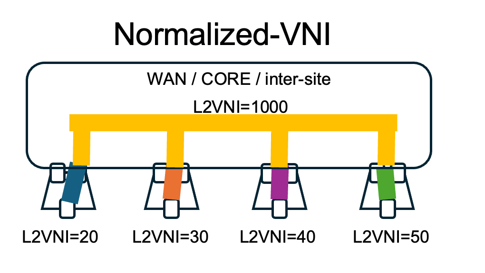
*Figure 5: Normalized-VNI Architecture*

Other NOS may use a difference approach where VNI being used are coming from BGP routes. That assymetric approach is refered as downstream-assign VNI. It is usually used in brownfield deployment where there are already an established WAN connecting datacenters using different VNI values. The main advantage is to have a single VNI rewrite across the entire network (instead of two with normalized-vni approach). On the down side, the VNI value being imposed is now dependent of the remote nexthop. This approach may be considered for future phase.

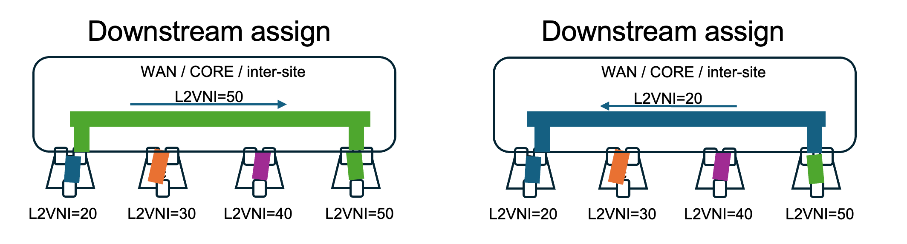
*Figure 6: Downstream-assign VNI Architecture*

#### VTEP address
There is a design choice for the initial implementation regarding VTEP IP address assignment: using either a Physical IP address (PIP) or an Anycast virtual IP address (VIP). Originally, SONIC VxLAN implementation has been done using PIP approach. For leaf type of implementation, it generally works very well. EVPN multi-homing machinery was also developped around that concept.

In the DCI usecase, since there is no support for orphan port and/or direclty connected host on BGW nodes, the usage of anycast VIP simplify greatly the solution. With anycast VIP, there is no need to support EVPN multi-homing between peering BGW nodes. L2 unicast and BUM traffic always hit a single BGW node from the datacenter and from the WAN side. Therefore, there is no need for DF election and any blocking scheme regarding L2 BUM traffic coming in/out from DC/WAN to WAN/DC. VTEP addresses scope is per domain i.e., a different VTEP is used facing connected datacenter from the one used on the WAN side allowing tunnel separation per domain.

#### Ethernet Segment
In scenarios where there is no directly connected host or orphan ports on BGW nodes and with the usage of anycast VTEP per domain per site, the usage of Ethernet Segment is not required. BUM traffic always hits a side BGW node when ingress replication is performed.

This is not the case when there is connected host. An Ethernet Segment is required to identify the logically connectivity of the datacenter. The Ethernet Segment Identifier is generated based on the side-id. The datacenter is considered as a "access" network connected on that BGW. Furthermore, as any access network, there should not be any loop as part of that network. Therefore, The VxLAN tunnel between peering BGW should not be used or established on the DC side. Any other multi-homed connected hosts have also their own ESI.

As any typical VxLAN node handling multi-homing, local bias is performed on peering BGW during BUM traffic handling.
The following picture demonstration the logical representation of various Ethernet Segment at play.

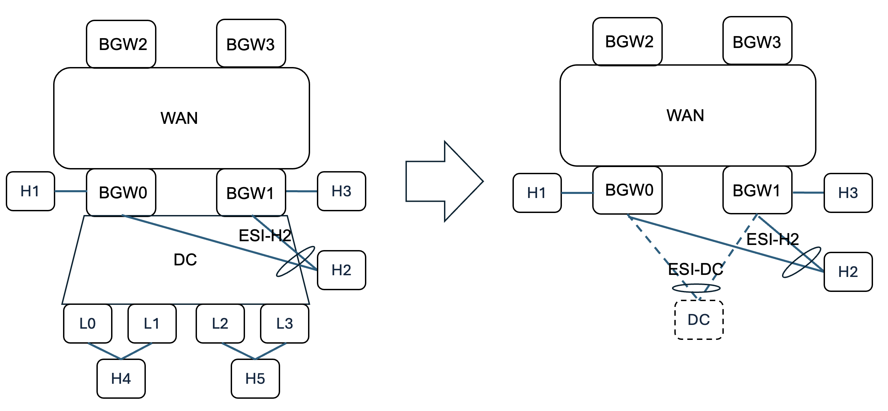
*Figure 7: Ethernet Segments*

#### Forwarding Tables
The usage of anycast VIP do not change how forwarding tables are built and how entries are resolved. For instance, there is no need for an extra recursion. The following pictures illustrate how FIB and FDB tables are built based on anycast VIP.
The first picture shows an example with separate Spine and BGW nodes.

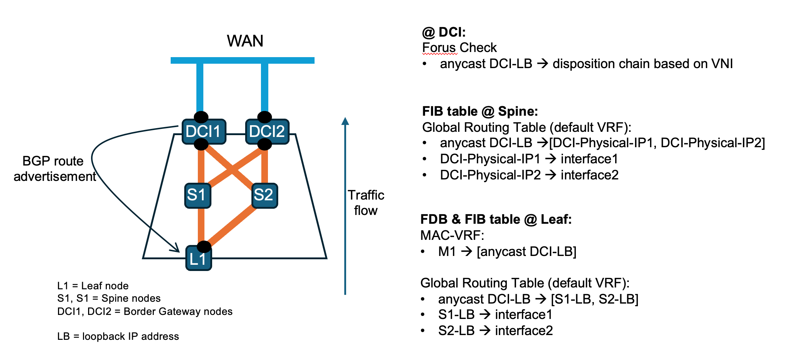
*Figure 8: Separate BGW and Spine nodes*

This second picture illustrates spine nodes playing also the role of BGW.

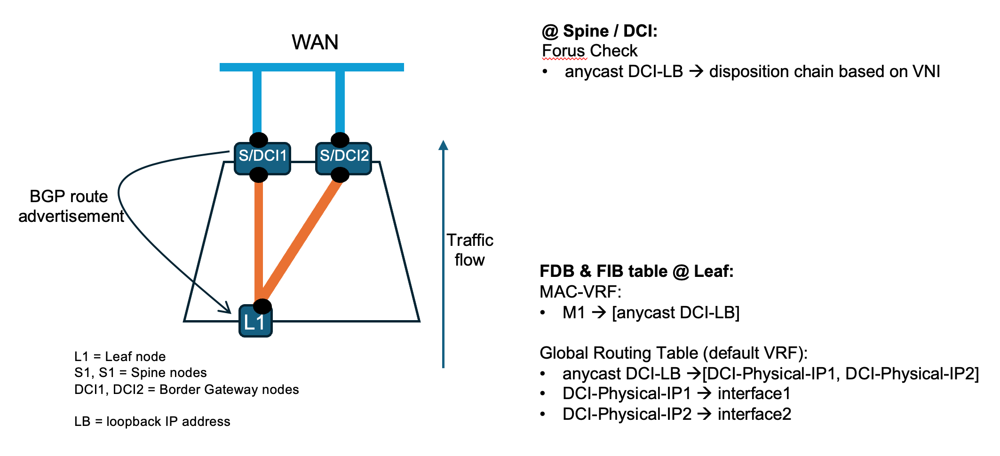
*Figure 9: Combine BGW and Spine nodes*

#### Split-Horizon Group 

In SONiC today, the per bridge domain split-horizon group table built for VxLAN multi-homing is as follow:

| Ingress / Egress     | AC-SH | AC-DF | AC-NDF | TUN  |
|----------------------|-------|-------|--------|------|
| **AC-BUM**           |   P   |   P   |   P    |  P   |
| **TUN-UC**           |   P   |   P   |   P    |  D   |
| **TUN-BUM-PEER**     |   P   |   D   |   D    |  D   |
| **TUN-BUM-REMOTE**   |   P   |   P   |   D    |  D   |

where P = Permit and D = Denial

For VxLAN multi-homing, the basic rule is the support of local bias.

In the SiOne SDK, the split-horizon group table is configured on a per-VTEP basis. This approach is necessary because a tunnel (defined by its source and destination VTEP) can transport L3VNI but also both L2VNI traffic. Since customer configurations can vary widely, programming the table per VTEP keeps the design straightforward and flexible. Currently, the SDK architecture supports only a 2x2 split-horizon group table.

For DCI functionality, the concept of site-id is used to represent the connected datacenter with an ESI. That Ethernet Segment is used to determine the Designated and Non-Designated Forwarding towards that DC as if it was a connected access device. Furthermore, to avoid any loop in the "access", there is no tunnel setup between peering BGW nodes from the DC side. That completely aligns with best network design practice. Usually, access connectivity is loop free; usage of protocol such a STP may be used for that purpose.

The VxLAN MH split horizon table is modified to support DCI functionality
This table is for the generic version where physical VTEP is used (no anycast VTEP) without any connected host or port on BGW.
| Ingress / Egress     | TUN-DC-DF | TUN-DC-NDF | TUN-WAN-DF | TUN-WAN-NDF |
|----------------------|-----------|------------|------------|-------------|
| **TUN-DC-UC**        |     D     |     D      |     P      |      P      |
| **TUN-DC-BUM**       |     D     |     D      |     P      |      D      |
| **TUN-WAN-UC**       |     P     |     D      |     D      |      D      |
| **TUN-WAN-BUM**      |     P     |     D      |     D      |      D      |

That table is simplified when anycast VTEP is used on all BGW (facing DC and WAN):
| Ingress / Egress | TUN-DC | TUN-WAN |
|------------------|--------|---------|
| **TUN-DC**       |   D    |   P     |
| **TUN-WAN**      |   P    |   D     |

To minimize code changes in the VxLAN multi-homing implementation, this table is defined with the presence of AC entry. The table is extended to:
| Ingress / Egress |  AC  | TUN-DC | TUN-WAN |
|------------------|------|--------|---------|
| **AC-BUM**       |  P   |   P    |   P     |
| **TUN-DC**       |  P   |   D    |   P     |
| **TUN-WAN**      |  P   |   P    |   D     |

With the support of L3VNI termination at the BGW facing DC, a third VTEP is configured. The split-horizon group table is extended to support the required PIP VTEP as show here.

| Ingress / Egress |  AC  | TUN-DC | TUN-WAN | TUN-PIP |
|------------------|------|--------|---------|---------|
| **AC-BUM**       |  P   |   P    |   P     |   P     |
| **TUN-DC**       |  P   |   D    |   P     |   P     |
| **TUN-WAN**      |  P   |   P    |   D     |   P     |
| **TUN-PIP**      |  P   |   P    |   P     |   D     |

In a future phase, support for locally connected hosts with SVI may be added to the BGW. The bridge domain will then handle not only L2VNI stitching, but also local ports, SVI interfaces, and multiple L2VNIs. As a result, the per-tunnel split-horizon group table will need to be further extended to accommodate these enhancements.

| Ingress / Egress       | AC-SH | AC-DF | AC-NDF | TUN-DC-DF | TUN-DC-NDF | TUN-WAN |
|------------------------|-------|-------|--------|-----------|------------|---------|
| **AC-BUM**             |   P   |   P   |   P    |     P     |     P      |    P    |
| **TUN-DC-UC**          |   P   |   P   |   P    |     D     |     D      |    P    |
| **TUN-DC-BUM-PEER**    |   X   |   X   |   X    |     X     |     X      |    X    |
| **TUN-DC-BUM-REMOTE**  |   P   |   P   |   P    |     D     |     D      |    P    |
| **TUN-WAN-UC**         |   P   |   P   |   P    |     P     |     P      |    D    |
| **TUN-WAN-BUM-PEER**   |   P   |   D   |   D    |     D     |     D      |    D    |
| **TUN-WAN-BUM-REMOTE** |   P   |   P   |   D    |     P     |     D      |    D    |

Due to hardware limitation, split-horizon filtering happens only on Egress. Basically, it is not possible to perform bi-directional BUM block on non-DF node. This situation leads to the usage of anycast VTEP for any BUM traffic coming from datacenter. BGW nodes use anycast VTEP as remote nexthop when advertising RT-3 towards DC side. On the WAN side, physical VTEP is still used for any types of routes.

Moreover, forwarding BUM traffic coming from peer BGW on DC side towards WAN side must not happen. It is prohibited. X is used to show that. In hardware, X must be set to denial.

#### Traffic Flows
The traffic flows for L2 connectivity looks like:

##### Anycast VTEP - no directly connected host / orphan port
Any packets (BUM or unicast) are treated the same way. With the usage of distinct anycast VTEPs on BGW per domain, traffic forwarding is based on ECMP. Once packet reaches destination DC, ingress replication is performed for BUM traffic; usually forwarding is done for unicast traffic i.e., ECMP or directly forwarded.

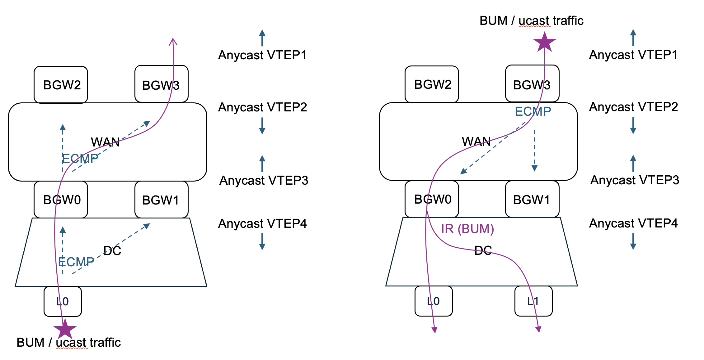
*Figure 10: Traffic flow - Anycast VIP, no orphan port*

##### Ethernet Segment - directly connected host / orphan port

Packet flows are different with the presence of locally connected host and/or oprhan port. Anycast VTEP is used towards DC to alleviate the hardware limitation where only Egress filtering is performed. Also, as mentioned before, local bias is performed on peering BGW.

The following picture shows the flow for BUM traffic coming from locally connected host at the BGW.

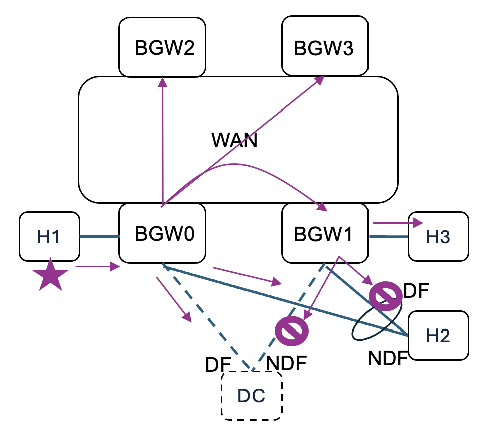
*Figure 11: Traffic flow - Connected Host*

First, local bias is performed on BGW0. Traffic is flooded to DC where ingress replication happens towards all leafs, to multi-homed H2 and to WAN side where ingress replication is also performed. BUM traffic is received on both BGW2 and BGW3 as well on peering BGW1. On BGW1, traffic is mainly dropped to all destination but H3 since it is a single-homed connected host.

The next pictures shows the flow for BUM traffic coming from remote BGW (different site).

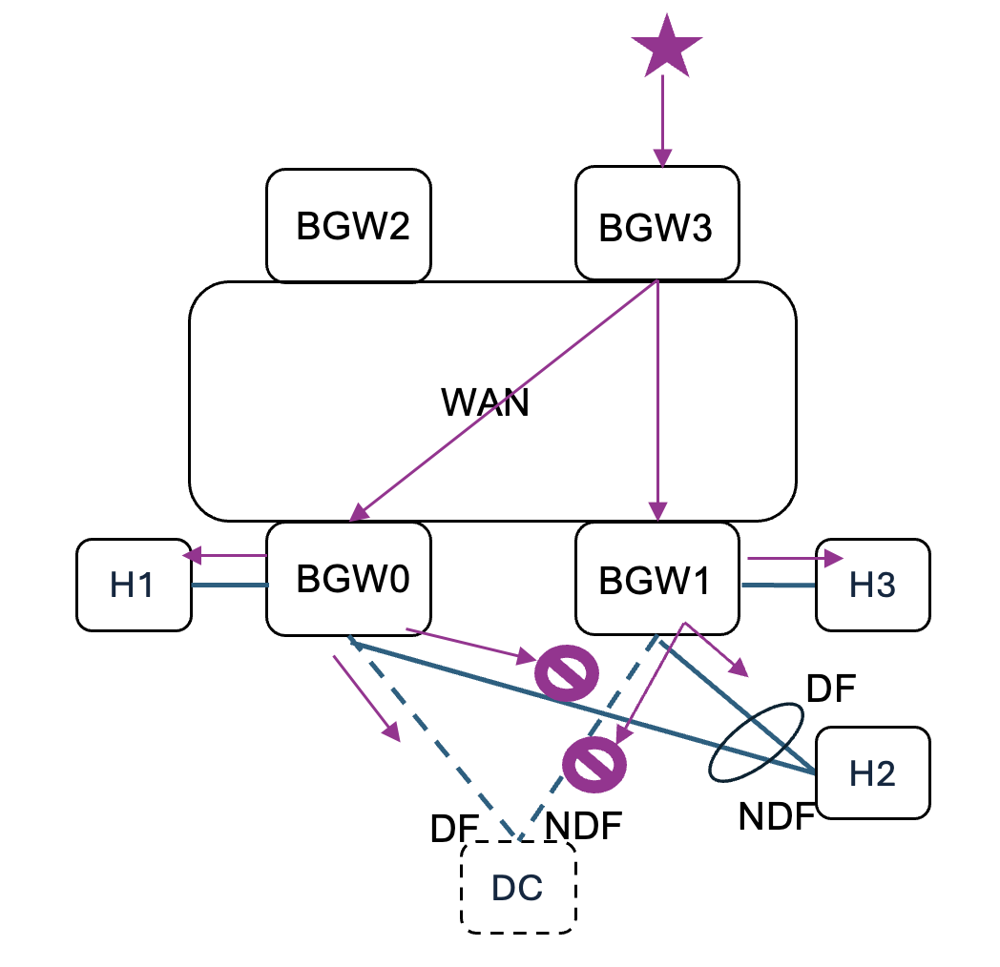
*Figure 12: Traffic flow - Connected Host (Remote)*

In this case, DF election filtering is applied over BUM traffic. Traffic is coming from BGW3 and is replicated to BGW0 and BGW1. On BGW0, traffic is forwarded to H1 and DC side (DF) where ingress replication happen. Traffic is not forwarded to H2 due to NDF. On BGW1, traffic is forwarded to H3 and H2 (DF) but not towards DC due to NDF.

Finally, the next picture shows the flow for BUM traffic coming from DC side.

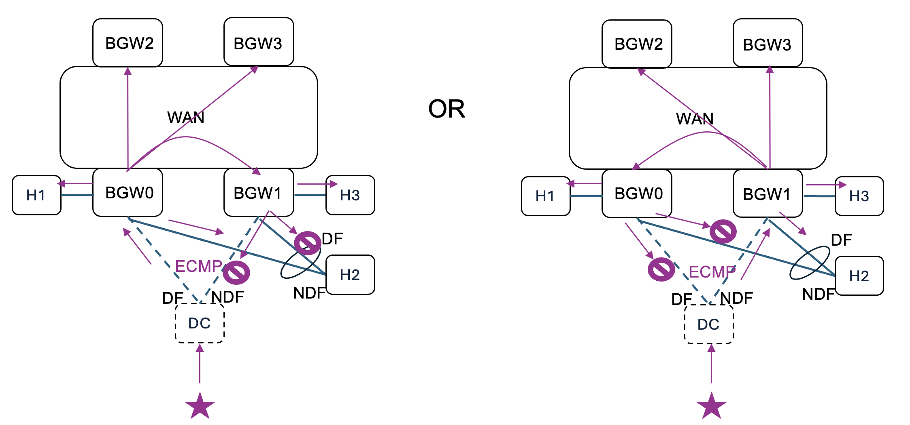
*Figure 13: Traffic flow - Connected Host (DC)*

BGW uses anycast VTEP when advertising multicast reachability (RT-3) towards DC. It allows DC network to behave like all-active. Therefore, any BUM traffic coming from DC hits only a single BGW where usually local bias treatment is performed as described previously.

In all above scenarios, there is no ingress replication / BUM traffic forwarding between peering BGW from DC side. It only occurs from WAN side. This is consistent with usual network deployment where access network are loop free.

#### Packet Flows

The image below illustrates the packet stack at each node as traffic traverses the inter-site network. The VXLAN header changes in each domain because it is fully terminated and recreated at the BGW and leaf nodes. The example shown is for L2 unicast traffic from host A. The same principles apply to Layer 2 BUM (Broadcast, Unknown Unicast, and Multicast) traffic, except the destination MAC address is set to all F's (broadcast) instead of a specific MAC address.
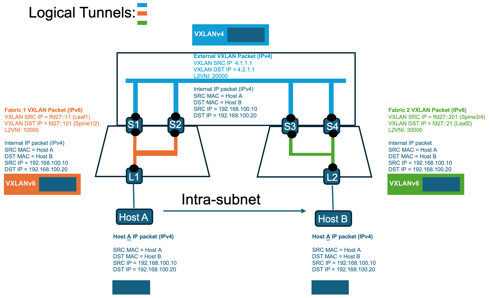
*Figure 14: Packet Flow - Layer2*

Simiarly, the packet flow for Layer3 connectivity over L3VNI is shown here. The main difference resides on the inner Ethernet Header. As per VxLAN standard, source and destination router MACs are used for routing packets (inter-subnet forwarding).
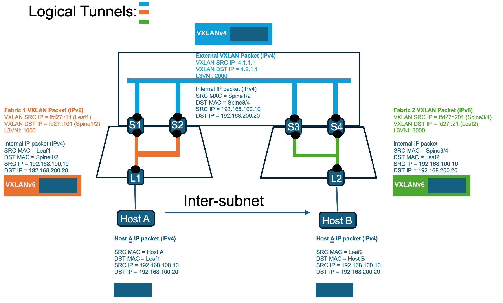
*Figure 15: Packet Flow - Layer3*

#### Mobility 
VM mobility across sites is achieved via L2VNI connectivity across sites. Ingress Route Optimization (IRO) is provided to connect outside customer to a specific appliance within a datacenter. Connectivity is kept with IRO during motion.

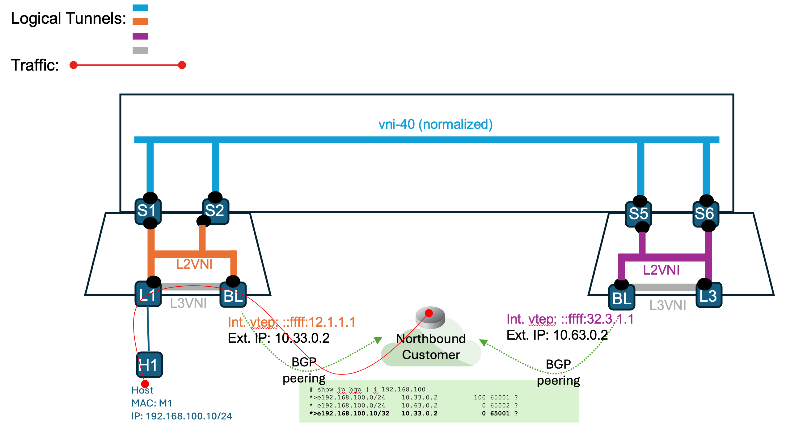
*Figure 16: VM mobility - Initially*

H1 has connectivity with a customer outside DC. That customer is connected via an IP network to a border leaf. VxLAN is not extended to that customer; it is purely IP.
When H1 moves behind leaf-3, it must maintains it's connectivity. This is achieved by supporting MAC mobility and advertising proper host route to border leaf. Using BGP peering, forwarding tables are getting properly updated on all domains. Northbound customer still have optimized forwarding to H1 post-motion. 

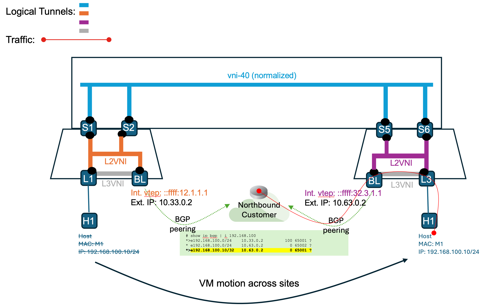
*Figure 17: VM mobility - Post Mobility*

EVPN mobility procedures are followed, with the scope of updates being either global (across multiple sites) or local to a specific site. In the initial phase, the scope is global. For example, when a host moves within the same site, RT-2 updates with an incremented sequence number are sent to all remote leaf switches in every remote site. However, this broad update is technically unnecessary, since all remote leafs already have host reachability information pointing to the same site, and the site itself has not changed.

In future implementations, the process will be optimized to operate on a per-site basis. With this improvement, RT-2 updates for host moves within the same site will be limited to the local site and will not affect all remote leaf switches. Only traffic arriving at the Border Gateway (BGW) node from the WAN will be directed to the appropriate leaf.

#### Combining BL function with BGW

Extending connectivity to a northbound customer by adding a BL node can be costly or even unfeasible due to certain restrictions, which may lead customers to avoid this approach. Instead, the solution is to combine the BL functionality with the BGW node. The following diagram illustrates a combined BGW/BL node providing external connectivity.

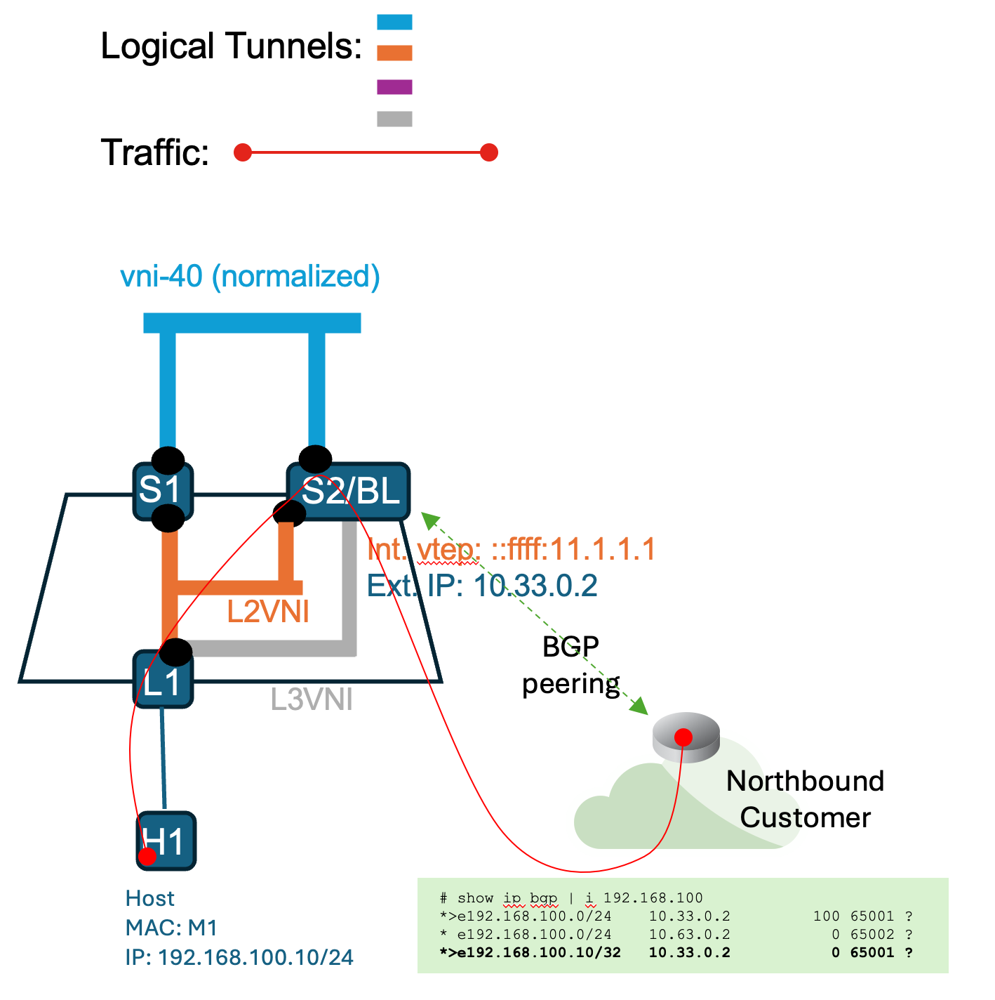
*Figure 18: Combined BGW / BL*

External connectivity in this scenario does not use a VXLAN tunnel; instead, it relies on standard IPv4 or IPv6 routing. The typical approach is VRF-lite. A physical VTEP is configured with an L3VNI to provide Layer 3 connectivity from the data center side. At the BGW, the Layer 3 VXLAN tunnel is removed, and an IP lookup is performed within the relevant VRF. Traffic is then forwarded northbound to the customer through a connected Layer 3 interface (such as Ethernet0).

The BGP peering session is established within the VRF using the IP address of this interface. Any routes advertised to the northbound customer will use this IP address as the next hop. With VRF-lite, each VRF typically has its own local Layer 3 interface, but this can also be achieved using different sub-interfaces with separate VLANs.

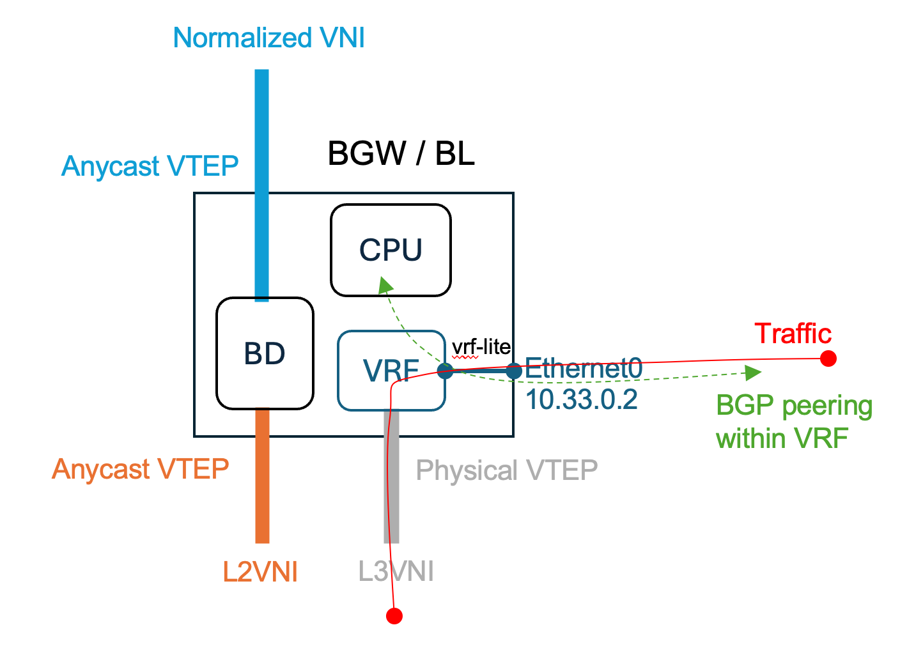
*Figure 19: VRF-lite on BGW*

#### Control Plane
BGP control plane is extended in multiple ways to support the new DCI functionality:

- The concept of domain is introduced in BGP. This provides future proof flexiblity to interconnect any domains together. Moreover, it provides a clear separation between control plane and data plane.
- It maps domain configuration with per tunnel information coming from the linux kernel
- It maintains individual ingress replication list per domain
- It manages the EVPN route redistribution across domain:
  - RT-1, RT-2 and RT-5 are redistributed
  - RT-3 are terminated per domain
  - RT-4 are exchanged between a pair of BGW via DC peering side
- It provides proper information for tunnel establishment
  - VxLAN tunnel between peering BGW from DC side is kept down
- Mobility across sites
- RT-translation across domains
- Policy inforcement and route summarization
- Supports dynamic import/export of route targets for flexible segmentation

#### Failure Scenarios
When deploying a new solution, it is important to analyze five key types of failure, commonly referenced in engineering specifications as Types A, B, C, D, and E:

- Failure A: Local interface failure
- Failure B: Link failure (e.g., fiber cut)
- Failure C: Remote interface failure
- Failure D: Node down
- Failure E: Core/network isolation (access interfaces remain up, but the core-facing network is isolated)

##### Failure Scenarios and Recovery with Anycast VTEP
The following diagram illustrates each failure type and the corresponding recovery process when using anycast VTEP on Border Gateway (BGW) nodes.

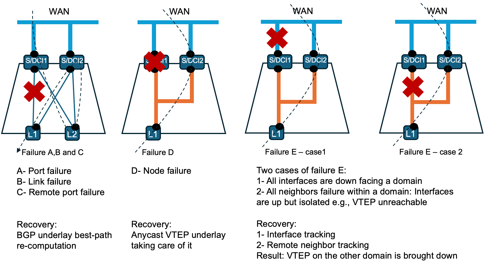
*Figure 20: Failure Scenarios with anycast VTEP*

- Failures A, B, and C (link/interface failures):
These events trigger the IGP (eBGP in this scenario) to recompute the best path and update forwarding chains. Alternate paths are available as the leaf VTEP loopback address remains reachable within the data center underlay. For example, if traffic from the WAN to DCI-1 is impacted, it can be rerouted via L2 and DCI-2 to reach L1, avoiding blackholing, although this is not the optimal route. With anycast VTEP, this non-optimal routing persists until the failure is resolved. The reverse traffic path is optimal, as Leaf1 can send traffic directly to DCI-2.

- Failure D (node down):
Anycast VTEP enables rapid convergence. When a BGW node’s anycast IP becomes unreachable in the underlay, its IP address/nexthop is automatically removed from forwarding tables on all other nodes.

- Failure E (core/network isolation):
This scenario is more complex and can present in two forms:

  - All interfaces to a domain are down: The node still exists in the other domain and continues to attract traffic. Detection relies on interface tracking on the BGW node.
  - All interfaces to a domain are up, but all remote neighbors are unreachable: Neighbor tracking on all remote nodes within the domain is used for detection.
In both cases, the solution is to administratively remove the anycast VTEP from the remaining connected domains to prevent further traffic attraction.

##### Limitations and Future Improvements

Anycast VTEP provides excellent convergence for node failures (Type D) and partial protection for link/interface failures (Types A, B, and C). However, it also introduces some limitations:

- BGP route withdrawal does not always stop traffic attraction, as anycast IPs may continue to be advertised by peering BGW nodes.
- Establishing a backup tunnel between BGWs with the same anycast VTEP is not possible, preventing the use of fast reroute mechanisms.

In future phases, a combination of anycast VTEP (VIP) and physical VTEP will be implemented to enhance resilience across all failure types.

Here is summary table of Failure Types:

| Failure Type | Description              | Detection Method           | Recovery Action                          |
|:------------:|:-------------------------|:---------------------------|:-----------------------------------------|
| A            | Local interface failure  | Link monitoring            | eBGP path re-computation                 |
| B            | Link (e.g., fiber cut)   | Link monitoring            | eBGP path re-computation                 |
| C            | Remote interface failure | Link monitoring            | eBGP path re-computation                 |
| D            | Node down                | Underlay reachability check| Remove anycast IP from routing tables    |
| E            | Core/network isolation   | Interface/neighbor tracking| Remove anycast VTEP from other domains   |

### 7. High-Level Design

#### Feature Implementation
DCI is implemented as a built-in SONiC feature, with modular extensions for future enhancements (e.g., inter-site stitching, advanced segmentation).
The extension and modifications required to support DCI functionality are affecting both control plane and data plane.

#### Control Plane Modules
FRRouting BGPd and Zebra are modified:

1- BGP configuration and show command
  - Add the support of the concept of domain and stitching across domains
  - Add the support for route-target stitching

2- Neighbor based domain support

3- Allow Multiple VNI to map to the same BD
  - Extend access bridge to support a list now of VNI and VxLAN tunnel
  - The Vlan ID is passed to BGP as bridge ID
  - BGP Used the bridge ID to stitch the VNIs
  - bgpevpn_bridge container will contain the stitched VNI list

4- API extension to retrieve domain information from linux kernel

5- Establish the association of BGP domain and its configuration with incoming per domain tunnel information from linux kernel. This allow the establishment of local associativity between VTEP, VNI and domains.

6- EVPN route re-origination: RT-2 and RT-5 along with extended community

7- Extension to support per domain ingress replication list for BUM traffic

8- Auto-generation of domain specific BGP route-target

The linux kernel and iproute2 package are also extended to support the concept of domain per VTEP / VxLAN tunnel

#### Data Plane Modules
Various modules in SONiC are modified:

##### ConfigMgr / VxLANMgr
- Add configuration support for domains
- Add configuration support for multiple VTEPs and tunnel/L2VNI per bridge domain. Each P2MP tunnels are distinct tunnel maps
- Add configuration support for maps per tunnel

#### SWSS

Orchagent is extended to support the following functions required to support DCI feature set.

- Support of multiple P2MP tunnels per bridge domain. SONiC allows only one tunnel configuration per bridge domain.
- Support of attaching distinct tunnel maps. All tunnels are currently assigned to same tunnel mapper.
- Support of per domain filter group

**FDBSYNCD**

- Adding of source VTEP of IMET data into VXLAN_REMOTE_VNI_TABLE. It provides the ability to support multiple ingress replication list per bridge domain.

**VXLANORCH**

- Currently, the source VTEP is managed as a single global object retrieved through the evpn_orch->getEVPNVtep() function. The source VTEP is obtained from the getVxlanTunnel(vtep-name) function, which provides both the source VTEP tunnel and the remote VTEP tunnels. That is required to differentiate different tunnels on the same bridge domain.

---
TBD
	- DB and Schema changes (APP_DB, ASIC_DB, COUNTERS_DB, LOGLEVEL_DB, CONFIG_DB, STATE_DB)
	- Sequence diagram if required
---

#### Sequence Diagram
The following sequence diagram illustrates the operational flow for DCI service creation and notification to dataplane:

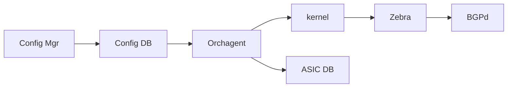
```mermaid
flowchart LR
    cfgmgr["Config Mgr"]
    ConfigDB["Config DB"]
    Orchagent["Orchagent"]
    kernel["kernel"]
    ASICDB["ASIC DB"]
    Zebra["Zebra"]
    bgpd["BGPd"]

    cfgmgr --> ConfigDB
    ConfigDB --> Orchagent
    Orchagent --> kernel
    kernel --> Zebra
    Zebra --> bgpd
    Orchagent --> ASICDB
```
*Figure 18: DCI Service Enablement Sequence Diagram*

The following sequence diagram illustrates the operational flow for remote MAC programming on the DCI:

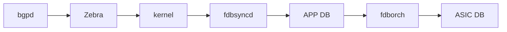
```mermaid
flowchart LR
    bgpd["bgpd"]
    Zebra["Zebra"]
    kernel["kernel"]
    fdbsyncd["fdbsyncd"]
    APPDB["APP DB"]
    fdborch["fdborch"]
    ASICDB["ASIC DB"]

    bgpd --> Zebra
    Zebra --> kernel
    kernel --> fdbsyncd
    fdbsyncd --> APPDB
    APPDB --> fdborch
    fdborch --> ASICDB
```
*Figure 19: Remote MAC programming Sequence Diagram*

### 8. SAI API
Supporting DCI functionality over BGW required SAI extension and modifications:

The codebase originally supported VXLAN and EVPN features without a unified, dynamic mechanism to differentiate classic Multi‑Homing (MH) behavior from Data Center Interconnect (DCI) / Split‑Horizon mode. The goal was to:

- Introduce dynamic DCI vs MH behavior without adding a new public switch attribute
- Enforce correct isolation/filtering semantics (especially around tunnel ingress/egress)

1- Dynamic Mode Logic (DCI vs MH):
  - Mode is inferred (e.g., based on presence/count of P2MP VXLAN tunnels)
  - Tunnel manager gained state and helpers to update split‑horizon behavior centrally

2- Filter / Isolation Semantics:
  - In DCI mode, certain ingress unicast tunnel filter group assignments are deliberately suppressed or altered to enforce correct traffic segmentation.
  - Isolation groups are associated with tunnel bridge ports in MH scenarios; logic ensures they aren’t misapplied in DCI.

3- Tunnel Manager & Headers:
  - sai_tunnel_manager.cpp and sai_tunnel.h were iteratively extended then pruned:
    - Added counters/flags for mode evaluation
    - Introduced (and later refined) helpers for determining default filter groups per tunnel
    - Removed transitional or redundant variables after stabilization

4- Bridge / Isolation Integration:
  - sai_bridge.cpp and sai_isolation_group.cpp adjusted so the bridge layer cooperates with new DCI/MH mode realities.


As part of sai_device.h, the following changes are made:

1- In vrf_entry table, the decap_vni is replaced by a vector of decap_vnis. Each decap_vni is associated with a distinct VTEP / domain.
```
struct vrf_entry {
    sai_object_id_t vrf_oid = SAI_NULL_OBJECT_ID;
    la_obj_wrap<la_vrf> vrf;
    la_obj_wrap<la_vrf_redirect_destination> vrf_redirect_dest = nullptr;
    la_obj_wrap<la_switch> vxlan_switch;
    la_obj_wrap<la_svi_port> vxlan_svi;
    std::set<sai_object_id_t> m_router_interfaces; // router interfaces belonging to this vrf
    uint32_t vxlan_switch_refcount = 0;

    std::vector<uint32_t> decap_vnis;
    ...
}
```
2- New filter groups are added to support DCI functionality:
```

// Ingress Filter Groups for MH
#define FILTER_GRP_ING_TNL_BUM_FROM_OTHER 1
#define FILTER_GRP_ING_TNL_UC 2
#define FILTER_GRP_ING_TNL_BUM_FROM_PEER 3

// Egress Filter Groups for MH
#define FILTER_GRP_EGR_AC_MH_DF 1
#define FILTER_GRP_EGR_AC_MH_NDF 2
#define FILTER_GRP_EGR_TNL 3

// Ingress Filter Groups for DCI
#define FILTER_GRP_ING_TNL_ONE 1
#define FILTER_GRP_ING_TNL_TWO 2

// Egress Filter Groups for DCI
#define FILTER_GRP_EGR_TNL_ONE 1
#define FILTER_GRP_EGR_TNL_TWO 2
```

A new mode is added to the sai_isolation_group identifying either MH or DCI functionality.
```
    if (enable_dci) {
        // ING_TNL_ONE -> EGR_TNL_ONE should be DENY
        // ING_TNL_ONE -> EGR_TNL_TWO should be PERMIT
        // ING_TNL_TWO -> EGR_TNL_ONE should be PERMIT
        // ING_TNL_TWO -> EGR_TNL_TWO should be DENY
        SET_FILTER_GROUP_PERMISSION(FILTER_GRP_ING_TNL_ONE, FILTER_GRP_EGR_TNL_ONE, FILTER_PERMISSION_DENY);
        SET_FILTER_GROUP_PERMISSION(FILTER_GRP_ING_TNL_ONE, FILTER_GRP_EGR_TNL_TWO, FILTER_PERMISSION_PERMIT);
        SET_FILTER_GROUP_PERMISSION(FILTER_GRP_ING_TNL_TWO, FILTER_GRP_EGR_TNL_ONE, FILTER_PERMISSION_PERMIT);
        SET_FILTER_GROUP_PERMISSION(FILTER_GRP_ING_TNL_TWO, FILTER_GRP_EGR_TNL_TWO, FILTER_PERMISSION_DENY);
    } else {
        // Restore to MH baseline
        SET_FILTER_GROUP_PERMISSION(FILTER_GRP_ING_TNL_BUM_FROM_OTHER, FILTER_GRP_EGR_AC_MH_DF, FILTER_PERMISSION_PERMIT);
        SET_FILTER_GROUP_PERMISSION(FILTER_GRP_ING_TNL_BUM_FROM_OTHER, FILTER_GRP_EGR_AC_MH_NDF, FILTER_PERMISSION_DENY);
        SET_FILTER_GROUP_PERMISSION(FILTER_GRP_ING_TNL_UC, FILTER_GRP_EGR_AC_MH_DF, FILTER_PERMISSION_PERMIT);
        SET_FILTER_GROUP_PERMISSION(FILTER_GRP_ING_TNL_UC, FILTER_GRP_EGR_AC_MH_NDF, FILTER_PERMISSION_PERMIT);
    }
```

Basically, the isolation group table is set to allow dynamic switching without reprogramming the entire table. By default, EVPN multi-homing is enabled. When DCI is enabled i.e, when in the presence of 2 or more VxLAN p2mp tunnel per bridge domain, the filter group table is updated to support DCI functionality. This is done by calling update_split_horizon_mode() function.

```
     * SHG Filter/Drop Matrix (MH baseline):
     * Service Port Type to (RX SHG, TX SHG):
     *                      RX  TX
     *     AC SH            0   0
     *     AC DF            0   1
     *     AC NDF           0   2
     *     TNL MC OTHER     1   3   (a.k.a. BUM_FROM_REMOTE_NODE)
     *     TNL UC           2   3
     *     TNL MC PEER      3   3   (a.k.a. BUM_FROM_PEER)
     *  (Rows = Ingress SHG, Columns = Egress SHG)
     *          0   1   2   3 (Egress)
     *      0   F   F   F   F
     *      1   F   F   D   D
     *      2   F   F   F   D
     *      3   F   D   D   D
     * (Ingress)
     *
     * SHG Filter/Drop Matrix (DCI variant):
     * Service Port Type to (RX SHG, TX SHG):
     *                      RX  TX
     *     AC SH            0   0
     *     TNL DC           1   1   (a.k.a. Tunnel towards DCI peer)
     *     TNL WAN          2   2   (a.k.a. Tunnel towards WAN)
     *
     *  (Rows = Ingress SHG, Columns = Egress SHG)
     *
     *          0   1   2   3 (Egress)
     *      0   F   F   F   X
     *      1   F   D   F   X
     *      2   F   F   D   X
     *      3   X   X   X   X
     * (Ingress)
```

The sai_tunnel is extended to support vector of decap_profile, filter_group, number of tunnels and dci_mode. New functions are added to gather and switch the isolation group table mode. 

```
struct tunnel_t {
  ...
   /*
     * filter group number, applicable in DCI mode only
     */
    uint32_t m_filter_group = 0;

    // Common decap mapping profile keyed by source IP address
    std::map<la_ip_addr, tunnel_vxlan_map_decap_profile_t> m_default_common_vxlan_decap_profile;

    // Number of vxlan tunnels created
    uint32_t m_vxlan_tunnel_count = 0;
    // true when DCI variant active for vxlan tunnels
    bool m_dci_mode = false;
  ...
}
```
New functions to set the encap VNI on a tunnel entry is also provided. With DCI, more than 1 VNI is now supported per switch.
```
    // Retrieve the stored filter group value from a tunnel entry (tunnel_t::m_filter_group).
    // Returns LA_STATUS_SUCCESS on success, LA_STATUS_ENOTFOUND if tunnel oid invalid.
    // In EVPN MH mode returns FILTER_GRP_TUNNEL_DEFAULT.
    // In DCI mode returns the per-tunnel stored m_filter_group value.
    la_status get_tunnel_default_filter_group(sai_object_id_t tunnel_oid, uint32_t& filter_group);

    la_status set_encap_vni_on_switch_properties(tunnel_t* tun_entry, uint16_t vlan_id, uint32_t encap_vni);
    la_status clear_encap_vni_on_switch_properties(tunnel_t* tun_entry, uint16_t vlan_id, uint32_t encap_vni);

    // Toggle DCI (split-horizon) mode and adjust ingress filter groups of existing
    // encap/decap VXLAN tunnels. When enabling DCI, all existing ENCAP_DECAP tunnels
    // have their ingress filter group updated to sdev->m_filter_groups[tunnel count].
    // When disabling DCI, they are reset to sdev->m_filter_groups[FILTER_GRP_ING_TNL_UC].
    la_status transition_split_horizon_mode(bool enable_dci);

```


### 9. Configuration and Management

DCI requires new configuration to support the functionality on SONIC. The configuration comes in three parts: the new DCI service enablement using SONiC configuration, the extension to FRRouting BGP configuration and finally an extension to Linux Kernel iproute2 packages allowing the support of domain per VxLAN tunnel.

#### 9.1. Manifest (if the feature is an Application Extension)

N/A

#### 9.2. CLI/YANG model Enhancements

##### SONiC DCI Configuration

Service enablement is accomplished by adding a new VTEP and tunnel for each domain. In the example below, bridge domain 10 is configured with two VXLAN tunnels, using L2VNIs 5010 and 6010. The domain name for each VTEP is specified with the add command; in this case, the domain names are DC-SIDE and WAN-SIDE. These domain names must match those configured in FRRouting BGP. This method creates a direct association between the BGP control plane and the dataplane service configuration, ensuring a clear separation between control plane and dataplane.

```
sudo config interface ipv6 enable use-link-local-only Ethernet1_1
sudo config interface ipv6 enable use-link-local-only Ethernet1_2
sudo config interface ipv6 enable use-link-local-only Ethernet1_5
sudo config hostname SD1

sudo config interface ip add Loopback0 fd27::233:d0c6:fed1/128
sudo config interface ip add Loopback1 10.10.10.10/32

sudo config interface ip add Loopback10 fd27::233:d0c6:feda/128
sudo config vlan add 10

sudo config vxlan add DC-SIDE fd27::233:d0c6:feda
sudo config vxlan evpn_nvo_dc add NVO DC-SIDE
sudo config vxlan map add DC-SIDE 10 5010
sudo counterpoll tunnel enable
sudo counterpoll tunnel interval 2000

sudo config interface ip add Loopback11 101.101.101.101/32
sudo config vlan add 10
sudo config vxlan add WAN-SIDE 101.101.101.101
sudo config vxlan evpn_nvo_wan add NVO WAN-SIDE
sudo config vxlan map add WAN-SIDE 10 5011
sudo counterpoll tunnel enable
sudo counterpoll tunnel interval 2000
```

##### CONFIG_DB
Similarly, CONFIG_DB also is updated with relevant objects and fields:

```
cisco@CSNXHMLRPAZ:$ sudo ifconfig | grep VXLAN
VXLAN-LOCAL-10: flags=4163<UP,BROADCAST,RUNNING,MULTICAST> mtu 1500
VXLAN-REMOTE-10: flags=4163<UP,BROADCAST,RUNNING,MULTICAST> mtu 1500
cisco@CSNXHMLRPAZ:$

CONFIG_DB:
"VLAN|Vlan10": {
"expireat": 1757458746.2829368,
"ttl": -0.001,
"type": "hash",
"value": {
"vlanid": "10"
}
},
"VXLAN_EVPN_NVO|NVO-LOCAL": {
"expireat": 1757458746.2827616,
"ttl": -0.001,
"type": "hash",
"value": {
"source_vtep": "VXLAN-LOCAL"
}
},
"VXLAN_EVPN_NVO|NVO-REMOTE": {
"expireat": 1757458746.2829025,
"ttl": -0.001,
"type": "hash",
"value": {
"source_vtep": "VXLAN-REMOTE"
}
},
"VXLAN_TUNNEL_MAP|VXLAN-LOCAL|map_5010_Vlan10": {
"expireat": 1757458746.282897,
"ttl": -0.001,
"type": "hash",
"value": {
"vlan": "Vlan10",
"vni": "5010"
}
},
"VXLAN_TUNNEL_MAP|VXLAN-REMOTE|map_6010_Vlan10": {
"expireat": 1757458746.2828186,
"ttl": -0.001,
"type": "hash",
"value": {
"vlan": "Vlan10",
"vni": "6010"
}
},
"VXLAN_TUNNEL|VXLAN-LOCAL": {
"expireat": 1757458746.282622,
"ttl": -0.001,
"type": "hash",
"value": {
"src_ip": "fd27::233:d0c6:feda"
}
},
"VXLAN_TUNNEL|VXLAN-REMOTE": {
"expireat": 1757458746.2826405,
"ttl": -0.001,
"type": "hash",
"value": {
"src_ip": "10.10.10.10"
}
}

APPL_DB:
"VLAN_TABLE:Vlan10": {
"expireat": 1757458756.8831203,
"ttl": -0.001,
"type": "hash",
"value": {
"admin_status": "up",
"host_ifname": "",
"mac": "78:68:59:2b:34:00",
"mtu": "9100"
}
},
"VXLAN_EVPN_NVO_TABLE:NVO-LOCAL": {
"expireat": 1757458756.883064,
"ttl": -0.001,
"type": "hash",
"value": {
"source_vtep": "VXLAN-LOCAL"
}
},
"VXLAN_EVPN_NVO_TABLE:NVO-REMOTE": {
"expireat": 1757458756.8831367,
"ttl": -0.001,
"type": "hash",
"value": {
"source_vtep": "VXLAN-REMOTE"
}
},
"VXLAN_TUNNEL_MAP_TABLE:VXLAN-LOCAL:map_5010_Vlan10": {
"expireat": 1757458756.883122,
"ttl": -0.001,
"type": "hash",
"value": {
"vlan": "Vlan10",
"vni": "5010"
}
},
"VXLAN_TUNNEL_MAP_TABLE:VXLAN-REMOTE:map_6010_Vlan10": {
"expireat": 1757458756.8831437,
"ttl": -0.001,
"type": "hash",
"value": {
"vlan": "Vlan10",
"vni": "6010"
}
},
"VXLAN_TUNNEL_TABLE:VXLAN-LOCAL": {
"expireat": 1757458756.8832085,
"ttl": -0.001,
"type": "hash",
"value": {
"src_ip": "fd27::233:d0c6:feda"
}
},
"VXLAN_TUNNEL_TABLE:VXLAN-REMOTE": {
"expireat": 1757458756.8831403,
"ttl": -0.001,
"type": "hash",
"value": {
"src_ip": "10.10.10.10"
}
},

```
##### SONiC Show Commands
The VxLAN show command is extended to display all tunnels connected to a common VLAN.
```
admin@sonic:~$
admin@sonic:~$ show vxlan tunnel
vxlan tunnel name       source ip            destination ip    tunnel map name    tunnel map mapping(vni -> vlan)
-------------------  -------------------  ----------------  -----------------  ---------------------------------
DC-SIDE              fd27::2dc:c1c9:e17c                    map_5010_Vlan10    5010 -> Vlan10
WAN-SIDE             fd27::2dc:c1c9:e17d                    map_5020_Vlan20    5020 -> Vlan20

root@sonic:/home/cisco# show vxlan remotevtep
+--------------------+---------------------+-------------------+--------------+
| SIP                | DIP                 | Creation Source   | OperStatus   |
+====================+=====================+===================+==============+
| 20.200.200.200     | 20.200.200.201      | EVPN              | oper_up      |
+--------------------+---------------------+-------------------+--------------+
| fd27::280:10f1:25f | fd27::22d:b87f:214b | EVPN              | oper_up      |
+--------------------+---------------------+-------------------+--------------+
Total count : 2

root@sonic:/home/cisco# show vxlan counter
                   IFACE    RX_PKTS    RX_BYTES    RX_PPS    TX_PKTS    TX_BYTES    TX_PPS
------------------------  ---------  ----------  --------  ---------  ----------  --------
     EVPN_20.200.200.201          0           0    0.00/s          0           0    0.00/s
EVPN_fd27::22d:b87f:214b          0           0    0.00/s          0           0    0.00/s
                VXLAN-DC          0           0    0.00/s          0           0    0.00/s
               VXLAN-WAN          0           0    0.00/s          0           0    0.00/s
```
##### FRRouting BGP Configuration

```
configure terminal
router bgp 80
bgp router-id 100.100.100.1
no bgp ebgp-requires-policy
no bgp default ipv4-unicast
bgp disable-ebgp-connected-route-check
bgp bestpath as-path multipath-relax
neighbor TRANSIT_DC peer-group
neighbor TRANSIT_DC remote-as external
neighbor TRANSIT_DC ebgp-multihop 1

neighbor OVERLAY_DC peer-group
neighbor OVERLAY_DC remote-as external
neighbor OVERLAY_DC disable-connected-check
neighbor OVERLAY_DC ebgp-multihop 255
neighbor OVERLAY_DC update-source Loopback0
neighbor OVERLAY_DC domain DC-SIDE
neighbor OVERLAY_DC reoriginate WAN-SIDE

neighbor OVERLAY_WAN peer-group
neighbor OVERLAY_WAN remote-as external
neighbor OVERLAY_WAN disable-connected-check
neighbor OVERLAY_WAN ebgp-multihop 255
neighbor OVERLAY_WAN update-source Loopback1
neighbor OVERLAY_WAN domain WAN-SIDE
neighbor OVERLAY_WAN reoriginate DC-SIDE

neighbor TRANSIT_WAN peer-group
neighbor TRANSIT_WAN remote-as external
neighbor TRANSIT_WAN ebgp-multihop 1
neighbor fd27::233:d0c6:fed5 peer-group OVERLAY_DC
neighbor fd27::233:d0c6:fed6 peer-group OVERLAY_DC
neighbor 30.30.30.30 peer-group OVERLAY_WAN

neighbor Ethernet1_1 interface peer-group TRANSIT_DC
neighbor Ethernet1_2 interface peer-group TRANSIT_DC
neighbor Ethernet1_5 interface peer-group TRANSIT_DC
neighbor Ethernet1_6 interface peer-group TRANSIT_DC
address-family ipv4 unicast
redistribute connected
neighbor TRANSIT_WAN activate
exit-address-family
address-family ipv6 unicast
redistribute connected
neighbor TRANSIT_DC activate
exit-address-family
address-family l2vpn evpn
no use-es-l3nhg
neighbor OVERLAY_DC activate
neighbor OVERLAY_WAN activate
advertise-all-vni
advertise ipv4 unicast
advertise ipv6 unicast
exit-address-family
exit
```

##### FRRouting Show Commands 

The output of VxLAN command is extended to display the attached domain name.

```
VNI: 1001 (known to the kernel)
  Type: L2
  Domain: WAN-SIDE <--
  Tenant-Vrf: vrf500
  RD: 192.168.100.11:4
  Originator IP: 192.168.100.101
  Mcast group: 0.0.0.0
  Advertise-gw-macip : Disabled
  Advertise-svi-macip : Disabled
  SVI interface : br1000
  Import Route Target:
    65001:1001
  Export Route Target:
    65001:1001
  Other Stitched VPN Domains: <---
    VNI:1000 (DC-SIDE)  <--
---- VNI 1000 ---
VNI: 1000 (known to the kernel)
  Type: L2
  Domain: DC-SIDE <--
  Tenant-Vrf: vrf500
  RD: 192.168.100.11:3
  Originator IP: 192.168.100.100
  Mcast group: 0.0.0.0
  Advertise-gw-macip : Disabled
  Advertise-svi-macip : Disabled
  SVI interface : br1000
  Import Route Target:
    65001:1000
  Export Route Target:
    65001:1000
  Other Stitched VPN Domains: <---
    VNI:1001 (WAN-SIDE)  <--

Type 3 Advertisement:
    Network          Next Hop            Metric LocPrf Weight Path
Route Distinguisher: 192.168.100.11:4
 *> [3]:[0]:[32]:[192.168.100.101]
                    192.168.100.101(dci1)
                                                       32768 i
                    ET:8 RT:65001:1001
   Network          Next Hop            Metric LocPrf Weight Path
Route Distinguisher: 192.168.100.11:3
 *> [3]:[0]:[32]:[192.168.100.100]
                    192.168.100.100(dci1)
                                                       32768 i
                    ET:8 RT:65001:1000
```

##### IPROUTE2 Configuration
The ip link add command is extended to pass specific domain string:
```
 ip link add vxlan52 type vxlan id 52 dev eth0 local 172.0.2.10 dstport 4789 domain local-dc
```
In this example, "local-dc" domian string is added to ip link add command 

##### IPROUTE2 Show command
The corresponding show command output highlight the added **local-dc** domain:
```
admin@sonic:~$ ip -d link show vxlan52
50: vxlan52: <BROADCAST,MULTICAST> mtu 1450 qdisc noop state DOWN mode DEFAULT group default qlen 1000
    link/ether 2a:f9:23:01:d9:e5 brd ff:ff:ff:ff:ff:ff promiscuity 0  allmulti 0 minmtu 68 maxmtu 65535
    vxlan id 52 local 172.0.2.10 dev eth0 srcport 0 0 dstport 4789 ttl auto ageing 300 domain local-dc #<--- local-dc domain
    udpcsum noudp6zerocsumtx noudp6zerocsumrx addrgenmode eui64 numtxqueues 1 numrxqueues 1 gso_max_size 65536 gso_max_segs 65535 tso_max_size 65536 tso_max_segs 65535 gro_max_size 65536

```

#### 9.3. Config DB Enhancements

### 10. Warmboot and Fastboot Design Impact

### Warmboot and Fastboot Performance Impact
- No additional CPU/IO costs in critical boot chain
- Optimizations applied to minimize boot time impact

### 11. Memory Consumption
- No memory consumption when DCI is disabled
- No growing memory usage when disabled by configuration

### 12. Restrictions/Limitations
- Only P1 features implemented in phase-1
- Normalized L2VNI value must be unique globally
- L3VNI stitching and other P2 features are documented for future work

### 13. Testing Requirements/Design
#### 13.1. Unit Test cases
- EVPN control plane: MAC/IP advertisement, withdrawal, redundancy
- VxLAN data plane: encapsulation, forwarding, segmentation
- BGP RT translation: import/export logic, policy enforcement
- VM mobility (IRO): route update, migration event handling
- Configuration / de-configuration of DCI FRR side
- Configuration / de-configuration of DCI SONIC side
- Send BUM traffic. Ensure it reaches all remote leafs in DC2 and DC3
- Ensure there is no loop happening while sending BUM traffic
- Mobility: move host from DC1 to DC2. Ensure traffic flow works. Ensure traffic is unicast.
- Failures: Single link shut, node failure, domain isolation
- Test with a minimum of 3xL2VNI 
- Test L3VNI termination and the communication with Northbound customer


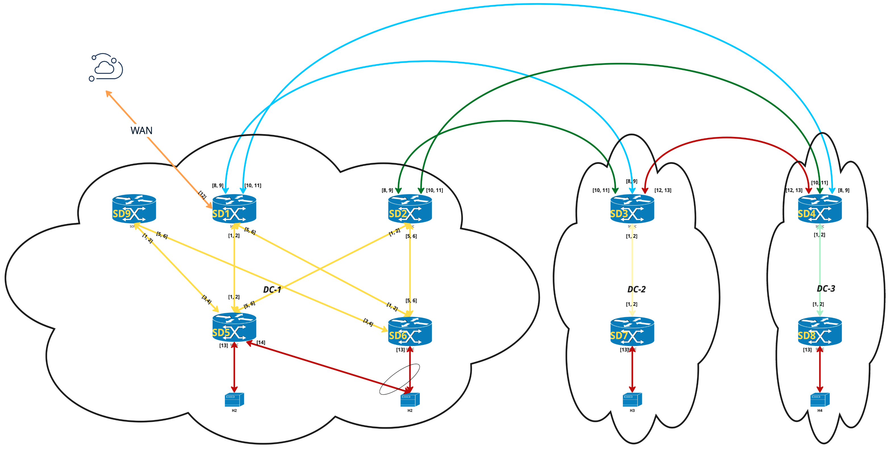
*Figure 21: FRR Topotest*

SAI tests are expanded as follow:
- Expand and clean up the test suite for better coverage (L2, L3, v4, v6, ECN, MH vs SH)
- Reduce test duplication and improve maintainability


#### 13.2 System Test Cases
- End-to-end DCI connectivity between multiple sites
- VM migration scenarios with IRO enabled
- BGP policy enforcement and RT translation validation
- Warmboot/fastboot validation: ensure no disruption during reboot
- Multi-tenancy and segmentation: verify isolation and scalability

##### Migration and Failover Testing
- Simulate VM migration events and validate route updates
- Test failover scenarios for EVPN/BGP sessions
- Validate operational flows for site addition/removal

##### Performance and Scalability Testing
- Measure convergence times during migration and failover
- Test scalability with increasing number of sites, tenants, and endpoints

##### Interoperability Testing
- Validate DCI operation with third-party EVPN/VxLAN implementations
- Ensure compliance with multi-site EVPN and anycast aliasing standards

### 14. Open/Action Items

---

#### Special Sections
##### VMotion with IRO
DCI supports VM mobility using inclusive route origination, enabling seamless migration of virtual machines across data centers. The control plane ensures route updates and minimal disruption during migration.

##### BGP RT Translation In/Out from DC
DCI implements flexible BGP route target translation, allowing dynamic policy enforcement and route advertisement between data centers. The translation logic is modular and supports future extensions.

##### L3VNI Stitching (Future Work)
L3VNI stitching is planned for future phases. The design will enable interconnection of Layer 3 VNIs across data centers, supporting advanced routing and segmentation.

---
